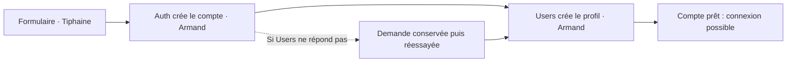
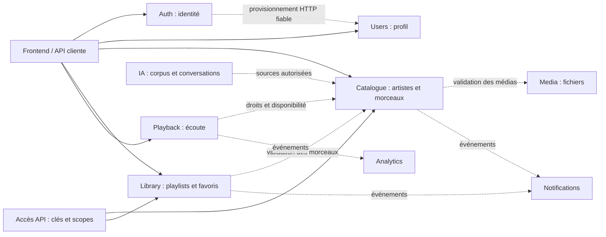
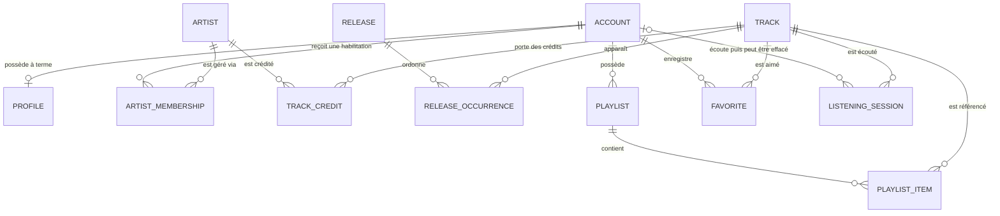
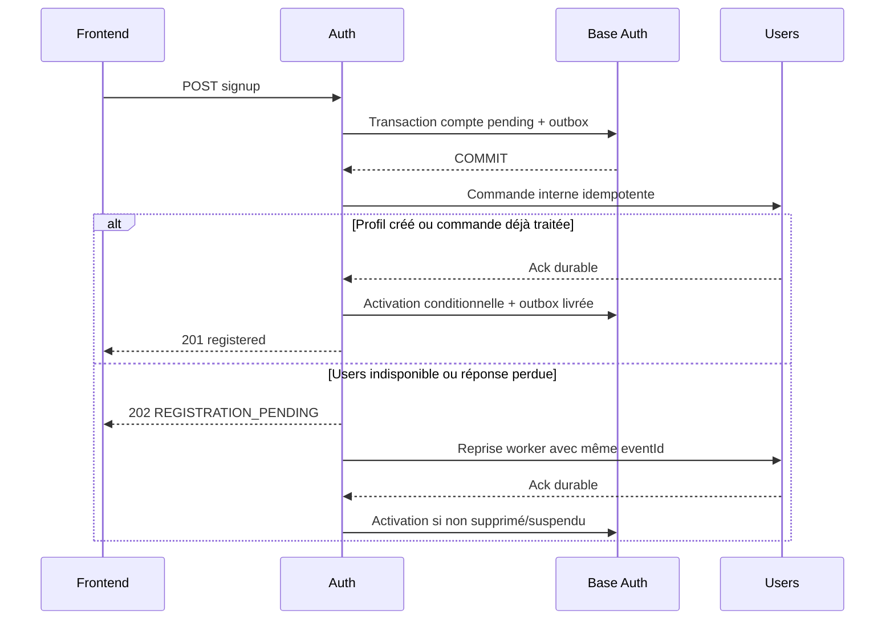
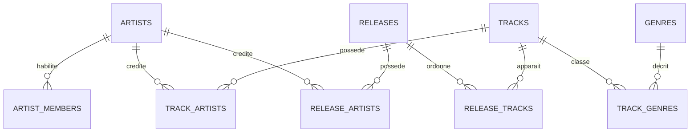

# Transcendence — Comprendre les données et avancer ensemble

> **Document de travail — 9 septembre 2026.** L’architecture décrite est une proposition à discuter. Les rôles actuels sont confirmés par l’équipe ; les choix techniques et les autres attributions restent à valider.
>
> **Premier objectif : une inscription, une connexion et un profil qui fonctionnent ensemble.** Le modèle musical et les modules avancés donnent une direction pour la suite.

Ce fichier rassemble l’explication, les décisions, la todo et la référence technique. Les responsables recommandés indiquent qui devrait porter la discussion ou la réalisation ; ils ne constituent pas une nouvelle attribution imposée.

**Pour une première lecture :** lire les sections 0 à 5, puis les premières actions de M0. Les détails techniques sont repliés à la fin.

- [Comprendre le problème](#pourquoi)
- [Comprendre la proposition](#idee)
- [Qui est concerné](#equipe)
- [Ce qui bloque aujourd’hui](#blocages)
- [L’ordre de travail](#jalons)
- [Les décisions à prendre](#decisions)
- [La todo à tenir à jour](#todo)
- [Comment suivre l’avancement](#suivi)
- [Consignes pour les LLM et les audits](#llm)
- [Référence technique complète et cours](#reference)

<a id="pourquoi"></a>

## 0. Pourquoi ce document existe (le problème de base)

En inspectant le dépôt, plusieurs divergences sont apparues entre les différentes parties du projet :

- Le frontend prévoit un **type de compte** (`listener` ou `artist`).
- Le modèle Prisma impose un **nom d’utilisateur**, alors que celui-ci n’est pas demandé dans le formulaire d’inscription.
- Les services **Auth** et **User** manipulent actuellement des données regroupées dans une même table, sans que la responsabilité de chacun soit clairement définie.

Ces différences sont normales. Nous n’avons pas encore décidé ensemble comment organiser les données du projet. Chacun avance donc avec sa propre compréhension. Les choix peuvent fonctionner séparément, mais ne plus correspondre lorsque l’on relie les différentes parties de l’application.

Ce document nous donne une base commune pour en discuter. Il définit les données importantes de l’application, ce qu’elles contiennent, leurs liens et le service qui en est responsable.

Il doit servir de référence pour aligner le frontend, les services backend et PostgreSQL. Il nous aidera à repérer les différences, à faire des choix ensemble et à faire avancer toutes les parties du projet dans la même direction.

Tout ce qui est écrit ici n’est pas encore décidé. Le document sépare ce qui existe déjà, ce qui est proposé et ce qui doit encore être discuté. Il sera mis à jour au fur et à mesure des décisions prises par l’équipe.

<a id="parcours"></a>

## 1. Ce qu’on va voir dans ce document

Le document suit un chemin volontairement progressif :

**Comprendre le problème → Construire une vision commune → Observer ce qui existe → Identifier les décisions à prendre → Préparer l’implémentation.**

On commence par quelques mots simples et un exemple d’inscription. L’objectif est de comprendre pourquoi les différentes parties du projet doivent se mettre d’accord.

On revient ensuite sur le dépôt : ce qui existe, les écarts observés et ce qu’ils empêchent. Chaque problème mène à une action et aux personnes concernées.

La suite présente les choix à discuter, l’ordre de travail et une todo. Pour chaque action, on sait qui est recommandé, ce qui doit être décidé avant et comment vérifier qu’elle est terminée.

**La partie dense est à la fin.** Elle rassemble le cours complet, les diagrammes, le dictionnaire, les contrats API, le SQL et les scénarios de test. Elle est destinée aux personnes qui implémentent et aux LLM des coéquipiers. On peut la consulter par sujet sans tout lire d’un coup.

<a id="idee"></a>

## 2. La proposition, avec un exemple simple

### Un compte, un profil et un artiste sont trois choses différentes

Imaginons que Léa s’inscrive pour publier de la musique.

- Son **compte** lui permet de se connecter. Auth garde son email et l’empreinte de son mot de passe.
- Son **profil** sert à la présenter dans l’application : nom affiché, bio, avatar. Users en est responsable.
- Un **artiste** représente une personne ou un groupe crédité sur des morceaux. Le futur Catalogue en sera responsable.

Léa peut écouter de la musique et gérer plusieurs projets artistiques. Plusieurs personnes peuvent gérer le même groupe. Cocher « artiste » à l’inscription exprime donc une intention ; cela ne doit pas donner le droit de modifier n’importe quel artiste.

### Qui garde quoi ?

| Information | Proposition | Personnes concernées maintenant |
| --- | --- | --- |
| Identifiant du compte, email, mot de passe protégé, sessions | Auth | Armand ; Emile pour la structure et les accès |
| Nom affiché, pseudo éventuel, préférence auditeur/artiste | Users | Armand ; Tiphaine pour le formulaire ; Emile pour les contraintes |
| Présentation des écrans et des erreurs | Frontend | Tiphaine, avec Armand pour les réponses API |
| Artistes, morceaux et droits de gestion | Futur Catalogue | Responsable à désigner ; équipe pour le besoin |

**Emile, Armand et Tiphaine choisissent ensemble les données échangées : le formulaire, les routes et la base doivent partager le même contrat.** Ici, un contrat est simplement la description des données qu’on envoie, des réponses possibles et des erreurs à afficher.

### Ce qui se passe lors d’une inscription



Si Users tombe en panne, on garde la demande et on la reprend plus tard. L’écran doit pouvoir dire « inscription en cours ». Une nouvelle tentative ne doit pas créer deux profils.

**Les cinq mots utiles pour la suite :**

| Mot | Sens dans notre projet |
| --- | --- |
| Table | Une liste structurée de données, par exemple les comptes. |
| Schéma PostgreSQL | Un espace qui regroupe des tables, comme un dossier. Des permissions doivent en contrôler l’accès. |
| Identifiant / UUID | Le numéro stable d’un objet. Il permet de le retrouver, mais n’accorde aucun droit. |
| Migration | Une modification versionnée de la structure ou des données de la base. |
| Source de vérité | L’endroit responsable de la valeur correcte d’une information. Par exemple, l’email actuel vient d’Auth. |

Le [cours complet](#cours) explique aussi les relations, les clés et les transactions.

<a id="equipe"></a>

## 3. Qui est concerné ?

### Rôles actuels

| Personne | Rôle confirmé | Participation recommandée dans ce document |
| --- | --- | --- |
| **Emile** | Base de données | Modèle, contraintes, migrations, permissions SQL et vérification des données. |
| **Armand** | Backend Users et Auth | Inscription, connexion, profils, sessions, échanges entre services et erreurs backend. |
| **Tiphaine** | Frontend | Formulaires, appels API, affichage des états et parcours réels avec le backend. |

### Rôles annoncés dans le README, à confirmer

Le [README du dépôt](../README.md) suggère aussi :

| Personne suggérée | Domaine annoncé | Ce qu’il reste à confirmer |
| --- | --- | --- |
| Tiphaine | API publique, notifications, RAG, interface LLM, analytics | Périmètre, charge et répartition de la partie backend de ces modules. |
| Armand | Microservices, Prometheus/Grafana, healthchecks, sauvegardes et reprise | Mise en place concrète, charge et partage avec Emile pour PostgreSQL. |
| Emile | Conteneur PostgreSQL | Prolongement du rôle DB déjà confirmé. |

**Catalogue, Media, Library et Playback n’ont pas de responsable nommé dans les informations disponibles.** Ils restent « à désigner ». Le rôle produit/arbitrage revient provisoirement à la discussion d’équipe, sans nommer un nouveau chef de projet.

Les mentions « Tiphaine ? » et « Armand ? » dans la todo signifient **suggestion du README à confirmer**. Un appui ne devient pas automatiquement responsable du module.

<a id="blocages"></a>

## 4. Ce qui bloque aujourd’hui

État observé sur le checkout local `main`, commit `235daa3256eee1e9d1ba7cf52aa380dd2d433d55`. Les constats ci-dessous portent sur les fichiers ; nous n’avons pas inspecté la structure de la base en cours d’utilisation.

| Problème | En clair | Action / personnes recommandées |
| --- | --- | --- |
| **P01 — Les champs ne correspondent pas** | Le formulaire envoie un nom et un type de compte ; Auth ne les enregistre pas. Prisma exige un pseudo que le formulaire ne demande pas. | M0-03, M0-07, M0-08, M0-12 · Tiphaine, Armand, Emile |
| **P02 — Les noms SQL ne correspondent pas** | Les routes utilisent `password_hash` et `display_name` ; la migration crée `passwordHash` et `displayName`. D’autres champs obligatoires manquent aussi dans l’insertion. | M0-04 à M0-08 · Emile et Armand |
| **P03 — L’écran réussit sans contacter le backend** | Inscription et connexion sont simulées. Un écran qui fonctionne ne prouve donc pas que le compte est enregistré. | M0-12, M0-15 · Tiphaine et Armand |
| **P04 — Les services partagent leurs accès** | Auth et Users reçoivent la même configuration de connexion. La séparation des responsabilités n’est pas encore imposée par PostgreSQL. | D01, D05, M0-05 · Emile et Armand |
| **P05 — Le démarrage comporte des incohérences** | L’image Users ne copie pas son code, des scripts et chemins ne correspondent pas, des dépendances doivent être alignées. | M0-01, M0-02, M0-06 · Armand, Emile, Tiphaine |
| **P06 — Le parcours complet reste à prouver** | Validation du mot de passe différente, réponse login incompatible avec le mock, reprise et suppression à construire. | M0-03, M0-09 à M0-15 · Armand, Tiphaine, Emile |

L’[audit détaillé](#audit-detail) conserve les fichiers sources et les autres observations. Une incompatibilité entre route et migration ne prouve pas à elle seule quelle table existe dans une base déjà démarrée.

<a id="jalons"></a>

## 5. Dans quel ordre avancer ?

Un **jalon** est un résultat démontrable, pas seulement une liste de tables créées.

| Jalon | Résultat attendu | Qui mobiliser |
| --- | --- | --- |
| **M0 — Aligner le socle utilisateur** | Inscription → connexion → profil avec le vrai backend ; erreurs cohérentes, reprise après panne, suppression et isolation vérifiées. | Armand, Emile, Tiphaine |
| **M1 — Construire le cœur musical retenu** | Un morceau autorisé et publié peut être écouté, ajouté à une playlist et aux favoris. | Responsables à désigner ; Tiphaine pour les écrans, Emile pour la DB |
| **M2 — Réaliser les modules annoncés** | API publique, notifications, analytics, RAG et interface LLM démontrés selon le périmètre accepté. | Tiphaine suggérée par le README ; répartition à confirmer |
| **Transverse — Pouvoir exploiter et montrer le projet** | HTTPS, démarrage reproductible, état des services, monitoring, restauration et documentation. | Armand suggéré pour l’infra ; Emile pour la DB ; Tiphaine pour le parcours |
| **M3 — Garder les idées futures** | Décider plus tard : abonnements, paroles, collaboration, chat, offline… | Équipe ; aucune implémentation engagée |

M0 se travaille en trois passages :

1. **Pouvoir démarrer et parler des mêmes données.** Corriger les obstacles d’outillage et accepter un contrat commun.
2. **Relier les trois parties.** Préparer les accès et migrations, développer Auth/Users, puis brancher le frontend.
3. **Vérifier ce qui se passe quand ça se passe mal.** Tester doublons, panne Users, suppression, permissions et restauration.

Dans la référence technique, **V1 désigne la cible M0 + M1**. M2 couvre les modules annoncés ; M3 conserve les extensions. Ces jalons restent à confirmer avec D13.

M1 attend le socle nécessaire. M2 peut être cadré dès maintenant, mais son intégration dépend des fonctionnalités qu’il utilise. Les tâches transverses commencent pendant M0.

**Premiers gestes recommandés :**

- **Armand** : traiter M0-01, puis revoir les réponses API avec Tiphaine.
- **Emile** : préparer M0-04, puis proposer les accès et migrations avec Armand.
- **Tiphaine** : traiter M0-02 avec Armand et préparer les exemples du contrat M0-03.
- **Tous les trois** : trancher D01–D03, D05–D09 et la partie M0 de D12/D16. Fixer le périmètre restant avec D13.

Ces gestes sont proposés ; la todo indique leur état réel et leurs conditions de fin.

<a id="decisions"></a>

## 6. Les décisions à prendre

Les statuts ci-dessous distinguent les décisions validées de celles qui restent à
confirmer. Une recommandation décrit une option de départ, pas un accord déjà
obtenu.

« Pilote recommandé » signifie : préparer la proposition et recueillir l’accord des personnes concernées. Pour fermer une décision, ajouter une entrée datée dans le [journal](#journal), avec le choix exact, les participants et ses conséquences. Une modification de code ne constitue pas à elle seule cet accord.

| ID | Question | Option de départ | Pilote et personnes concernées | Actions | Statut |
| --- | --- | --- | --- | --- | --- |
| D01 | Séparer identité et profil ? | Identité et secrets dans Auth ; profil dans Users ; même UUID comme référence logique, sans FK interservice. | Emile + Armand ; Tiphaine consultée | M0-03, M0-05, M0-07, M0-08 | Validée le 2026-09-10 |
| D02 | Le pseudo est-il obligatoire ? | En attendant la validation finale : `username` facultatif, mais unique lorsqu’il est renseigné ; `displayName` obligatoire et non unique. | Tiphaine + Armand ; Emile consulté | M0-03, M0-06, M0-08, M0-12 | À valider — règle provisoire appliquée |
| D03 | Que signifie « artiste » à l’inscription ? | Supprimer `accountType` du contrat et du modèle ; ne pas le remplacer dans le périmètre actuel. Les droits artiste relèvent d’un autre objet métier. | Tiphaine + Armand ; futur Catalogue et équipe | M0-03, M0-08, M0-12, M1-02 | Validée le 2026-09-10 |
| D04 | Qui peut créer et gérer un artiste ? | Compte actif créant un artiste → owner ; publication, modération et import administrateur à préciser. | Équipe + responsable Catalogue à désigner ; Armand consulté | M1-01, M1-02 | Ouverte |
| D05 | Comment séparer les données et les accès ? | Une base par environnement, schémas et rôles privés ; chaque service accède directement uniquement à ses tables. Bases ou instances séparées seulement si nécessaire. | Emile + Armand ; rôle infra à confirmer | M0-05, M0-06, T-02 | Validée le 2026-09-10 |
| D06 | Comment reprendre une inscription interrompue ? | Outbox HTTP : conserver la demande puis réessayer ; un worker actif par service au départ. Broker optionnel. | Armand + Emile ; Tiphaine pour l’attente affichée | M0-07, M0-08, M0-11, M0-12 | Ouverte |
| D07 | Quand peut-on se connecter et faut-il vérifier l’email ? | Pas de token au signup ; login après création du profil. Vérification avant actions sensibles à préciser, avec le circuit d’envoi. | Armand + Tiphaine + équipe | M0-03, M0-09, M0-12, M0-14 | Ouverte |
| D08 | Quelles règles pour mots de passe et sessions ? | Base à discuter : 12–128 caractères, Argon2id calibré, JWT 10 min, refresh 7 jours avec rotation. Documenter révocation, transport et règles communes. | Armand ; Tiphaine et Emile consultés | M0-03, M0-09, M0-14 | Ouverte |
| D09 | Prisma ou SQL brut, et qui gère les migrations ? | Un historique de migrations par propriétaire ; outil runtime explicite. Prisma possible avec SQL complémentaire, sans deux définitions concurrentes. | Emile + Armand | M0-06, M0-07, M0-08 | Ouverte |
| D10 | Où stocker les fichiers musicaux et images ? | Métadonnées dans PostgreSQL ; fichiers sur volume ou stockage objet. Définir upload, validation, limites et effacement. | Responsable Media à désigner ; Emile, Armand et Tiphaine consultés | M1-01, M1-03, T-02 | Ouverte |
| D11 | Qu’est-ce qu’une écoute comptabilisée ? | Session serveur et règle versionnée ; seuil proposé min(30 s, 50 % du morceau). Agrégation UTC et fraîcheur affichée ; aucune règle de royalties. | Responsables Playback/Analytics à confirmer + équipe ; Tiphaine consultée | M1-06, M2-04 | Ouverte |
| D12 | Que supprimer, conserver et pendant combien de temps ? | Définir dès M0 la suppression et la fenêtre de rejeu. Hypothèses : outbox livrée 7 j, inbox 30 j, heartbeats 7 j, historique 90 j, conversations/notifications 30 j. Tombstones au-delà de tout rejeu possible ; backups à inclure. | Équipe ; Armand + Emile pour M0, puis chaque propriétaire | M0-08, M0-11, M0-13, M0-18, T-02, M2-06 | Ouverte |
| D13 | Quels modules livrer et avec quels responsables ? | Confirmer jalons, répartition et démonstrations : API CRUD ≥5 endpoints, notifications C/U/D, corpus RAG, usages LLM, analytics ; une table créée ne termine pas un module. | Équipe ; Tiphaine et Armand suggérés par le README pour leurs modules | M1-01, M2-01, T-05, M3-01 | Ouverte |
| D14 | Quel corpus, modèle et stockage pour le RAG ? | Choisir sources autorisées, modèle/version, dimensions, droits, citations et effacement. pgvector conditionnel ; aucun modèle ou nombre de dimensions imposé. | Tiphaine ? ; responsable IA et appui infra à confirmer, Emile consulté | M2-01, M2-05, M2-06 | Ouverte |
| D15 | Que devient un groupe lorsqu’un gestionnaire part ? | Transfert à un co-owner ou retrait/modération explicite ; pas de suppression automatique des œuvres partagées. | Équipe + responsable Catalogue à désigner ; Armand consulté | M1-02, M1-07, M0-13 | Ouverte |
| D16 | Comment migrer les données existantes ? | Inventorier la base réelle et les collisions. Préférer une courte maintenance si le contexte le permet ; stratégie de copie, bascule et retour à définir avant exécution. | Emile + Armand ; Tiphaine pour la bascule du front | M0-04, M0-16, M0-17, M0-18 | Ouverte |


**Ordre recommandé :** D01–D03 et D05–D09 pour le contrat M0 ; D12 pour la suppression/rétention de M0 ; D16 avant toute copie ou bascule de données. D04/D10/D11/D15 précèdent les fonctions M1 concernées. D13 peut être discutée dès maintenant ; D12/D14 s’appliquent ensuite aux modules M2 concernés.

Les valeurs proposées, comme les durées de session ou de conservation, restent à discuter. Si une décision change, mettre à jour ses actions, les contrats, le dictionnaire et les tests concernés dans le même changement documentaire.

<a id="todo"></a>

## 7. La todo commune

**C’est ici que l’état des actions fait foi.** Les critères détaillés sont accessibles en cliquant sur l’identifiant de chaque action ; selon le lecteur Markdown, déplier ensuite le groupe de critères correspondant. Les preuves sont consignées dans le [journal des audits](#journal) sous le même identifiant.

- **À faire** : travail identifié, aucune réalisation complète vérifiée.
- **En cours** : travail engagé avec une trace explicite.
- **À vérifier** : réalisation repérée, critères de fin pas encore tous prouvés.
- **Bloqué** : un obstacle concret empêche de continuer ; le journal doit dire lequel.
- **Terminé** : tous les critères sont prouvés sur un périmètre et une révision identifiés.
- **À cadrer** : périmètre ou responsable encore à définir.
- **Hors périmètre** : idée conservée, aucun travail engagé.

La colonne « Après / décisions » décrit l’ordre proposé. Elle ne signifie pas qu’une tâche dépendante est déjà en cours. Un travail de lecture ou de préparation peut commencer avant l’accord ; l’implémentation d’un choix attend sa validation.

### M0 — Socle utilisateur

| Action | Pilote recommandé | Après / décisions | Statut |
| --- | --- | --- | --- |
| [M0-01](#crit-m0-01) — Rendre Auth et Users démarrables depuis une installation propre | Armand | — | À faire |
| [M0-02](#crit-m0-02) — Aligner le port frontend et les routes du proxy | Tiphaine | — | À faire |
| [M0-03](#crit-m0-03) — Accepter un contrat commun inscription / login / me | Tiphaine + Armand | D01, D02, D03, D07, D08 | À faire |
| [M0-04](#crit-m0-04) — Photographier la structure et les données existantes | Emile | — | À faire |
| [M0-05](#crit-m0-05) — Séparer les accès SQL Auth et Users | Emile | D01, D05 ; M0-04 | À faire |
| [M0-06](#crit-m0-06) — Fiabiliser la configuration et les migrations par propriétaire | Emile | D02, D05, D09 ; M0-03, M0-04 | À faire |
| [M0-07](#crit-m0-07) — Créer le compte Auth avec une demande de profil durable | Armand | D06 ; M0-03, M0-05, M0-06 | À faire |
| [M0-08](#crit-m0-08) — Créer et modifier le profil chez Users | Armand | D06, D12 ; M0-03, M0-05, M0-06 | À faire |
| [M0-09](#crit-m0-09) — Implémenter connexion et gestion des sessions | Armand | D07, D08 ; M0-07, M0-08 | À faire |
| [M0-10](#crit-m0-10) — Servir les bonnes vues identité et profil | Armand | M0-08, M0-09 | À faire |
| [M0-11](#crit-m0-11) — Livrer et reprendre les commandes entre Auth et Users | Armand | D06, D12 ; M0-07, M0-08 | À faire |
| [M0-12](#crit-m0-12) — Brancher le frontend sur les vraies routes | Tiphaine | M0-02, M0-03, M0-09, M0-10, M0-11 | À faire |
| [M0-13](#crit-m0-13) — Supprimer un compte sans le faire réapparaître | Armand | D12 ; M0-09, M0-11 | À faire |
| [M0-14](#crit-m0-14) — Cadrer et implémenter les preuves email et la récupération | Armand | D07, D08, D12 ; M0-09 | À faire |
| [M0-15](#crit-m0-15) — Démontrer M0 avec les tests de bout en bout et de panne | Armand | M0-01 à M0-14 ; T-01, T-04 | À faire |
| [M0-16](#crit-m0-16) — Préparer et répéter la reprise des données | Emile | D12, D16 ; M0-04, M0-06, M0-15, T-02 | À faire |
| [M0-17](#crit-m0-17) — Basculer ensemble backend, frontend et connexions | Armand | D16 ; M0-15, M0-16, T-02 | À faire |
| [M0-18](#crit-m0-18) — Retirer proprement l’ancien chemin de données | Emile | D12 ; M0-17 | À faire |

### M1 — Cœur musical

<details>
<summary>Voir les actions M1</summary>

| Action | Pilote recommandé | Après / décisions | Statut |
| --- | --- | --- | --- |
| [M1-01](#crit-m1-01) — Choisir la tranche musicale et ses responsables | Équipe | D04, D10, D11, D13, D15 | À cadrer |
| [M1-02](#crit-m1-02) — Construire artistes, droits, crédits et sorties | À désigner — Catalogue | M1-01 ; M0-15 | À cadrer |
| [M1-03](#crit-m1-03) — Gérer upload, validation et stockage des médias | À désigner — Media | M1-01 ; M0-15 | À cadrer |
| [M1-04](#crit-m1-04) — Créer playlists, occurrences et favoris | À désigner — Library | M1-01, M1-02 ; M0-15 | À cadrer |
| [M1-05](#crit-m1-05) — Gérer le réordonnancement concurrent des playlists | À désigner — Library | M1-04 | À cadrer |
| [M1-06](#crit-m1-06) — Mesurer une session d’écoute une seule fois | À désigner — Playback | D11 ; M1-02, M1-03 ; M0-15 | À cadrer |
| [M1-07](#crit-m1-07) — Vérifier le parcours musical et l’effacement partagé | Équipe + pilotes M1 à nommer | M1-02 à M1-06 ; M0-13 | À cadrer |

</details>

### M2 — Modules annoncés

<details>
<summary>Voir les actions M2</summary>

| Action | Pilote recommandé | Après / décisions | Statut |
| --- | --- | --- | --- |
| [M2-01](#crit-m2-01) — Cadrer les modules README et leurs démonstrations | Tiphaine ? | D12, D13, D14 | À cadrer |
| [M2-02](#crit-m2-02) — Livrer l’API publique sécurisée et documentée | Tiphaine ? — API publique | M2-01 ; M1-02, M1-04 | À cadrer |
| [M2-03](#crit-m2-03) — Livrer les notifications du périmètre accepté | Tiphaine ? — Notifications | M2-01 ; domaines producteurs concernés disponibles | À cadrer |
| [M2-04](#crit-m2-04) — Livrer un dashboard d’analytics vérifiable | Tiphaine ? — Analytics | M2-01 ; M1-06 | À cadrer |
| [M2-05](#crit-m2-05) — Livrer le RAG et son corpus autorisé | Tiphaine ? — RAG | D14 ; M2-01 ; sources du corpus disponibles | À cadrer |
| [M2-06](#crit-m2-06) — Livrer l’interface LLM et le cycle de vie des données IA | Tiphaine ? — Interface LLM | D12, D14 ; M2-05 ; M0-13 | À cadrer |

</details>

### Transverse — Exploitation et collaboration

<details>
<summary>Voir les actions T</summary>

| Action | Pilote recommandé | Après / décisions | Statut |
| --- | --- | --- | --- |
| [T-01](#crit-t-01) — Distinguer processus vivant et service prêt | Armand | M0-01, M0-02, M0-06 | À faire |
| [T-02](#crit-t-02) — Prouver une sauvegarde et une restauration | Armand ? — Infra | D05, D12 ; M0-04 | À cadrer |
| [T-03](#crit-t-03) — Installer monitoring et alertes utiles | Armand ? — Infra | T-01 ; M0-11 | À cadrer |
| [T-04](#crit-t-04) — Rendre les vérifications reproductibles | Armand | M0-01, M0-02 | À faire |
| [T-05](#crit-t-05) — Préparer la documentation de livraison | Équipe | D13 ; M0-15 | À cadrer |
| [T-06](#crit-t-06) — Configurer les audits récurrents du fichier | À confirmer — coordination | Cadence, branche et environnement choisis | À cadrer |

</details>

### M3 — Extensions

<details>
<summary>Voir les actions M3</summary>

| Action | Pilote recommandé | Après / décisions | Statut |
| --- | --- | --- | --- |
| [M3-01](#crit-m3-01) — Conserver les extensions hors du périmètre engagé | Équipe | D13 | Hors périmètre |

</details>


<a id="suivi"></a>

## 8. Comment tenir ce fichier à jour

À chaque action finie, le responsable ajoute une preuve : commit ou PR, scénario vérifié, commande et résultat, ou décision datée. Un audit peut ensuite comparer le dépôt à cette todo et mettre à jour les statuts.

**Exemple fictif :** le frontend contient maintenant de vrais appels réseau, mais aucun parcours complet n’a été testé. M0-12 passe à « À vérifier ». Il passe à « Terminé » seulement quand ses critères sont démontrés ; M0-15 garde ses propres tests d’intégration.

Rythme proposé : une vérification après chaque PR qui touche un contrat, et un audit de M0 à chaque point d’équipe. **La récurrence n’est pas configurée : un fichier Markdown ne déclenche pas d’audit tout seul.** Le prompt ci-dessous peut être lancé à la demande, puis raccordé à une automatisation lorsque la cadence et la branche à suivre auront été choisies.

Les audits distinguent toujours :

- **Ce que l’équipe a décidé.**
- **Ce que le code contient.**
- **Ce que les tests ont prouvé.**
- **Ce que l’environnement permet réellement de vérifier.**

Une dépendance inaccessible est un manque de vérification. Ce n’est pas une preuve de panne du produit. Un test qui échoue sur un cas attendu révèle en revanche un écart à rattacher à une action.

<a id="journal"></a>

### Journal des décisions et des audits

| Entrée | Date | Périmètre / preuve | Effet sur le suivi |
| --- | --- | --- | --- |
| AUD-2026-09-08 | 2026-09-08 | Audit et tests SQL rapportés dans la rédaction initiale ; résultats conservés dans la référence technique. Sorties d’exécution originales non jointes à ce fichier. | Historique documentaire ; ne ferme aucune tâche applicative. |
| AUD-2026-09-09 | 2026-09-09 | Lecture du checkout `main` à `235daa3256eee1e9d1ba7cf52aa380dd2d433d55` : README, conventions, routes Auth/Users, Prisma/migration/configuration, Docker, types/mocks/formulaire frontend et proxy. | P01–P06 toujours présents dans les fichiers. Initialisation de la todo ; aucun parcours applicatif ni SQL rejoué aujourd’hui. |
| DOC-2026-09-09 | 2026-09-09 | Réorganisation en un fichier autonome ; rôles actuels issus de la clarification d’équipe du jour. | Conservation du fond technique ; aucune décision D01–D16 acceptée par cette réécriture. |
| DEC-2026-09-10-1 | 2026-09-10 | Confirmation d’équipe transmise après échanges avec Armand et Tiphaine : séparation Auth/Users et UUID de liaison validés (D01) ; séparation par schémas et accès SQL privés validée (D05) ; `accountType` supprimé sans remplacement dans le périmètre actuel (D03). Pour D02, la décision finale reste attendue ; la règle provisoire est `username` facultatif et unique lorsqu’il est présent. | Ferme D01, D03 et D05. Maintient D02 à valider et aligne PRI-1 sur la règle provisoire existante. Les références à `onboardingIntent` plus loin dans ce document sont désormais des propositions historiques à corriger lors de la mise à jour du contrat M0-03 ; elles ne font pas foi contre D03. |

Les décisions D01, D03 et D05 sont enregistrées. D02 reste à valider.

Format à reprendre pour les prochaines entrées :

```text
AUD-AAAA-MM-JJ-N
Révision et branche réellement auditées :
État du checkout : propre / modifications locales décrites
Actions concernées :
Preuves : fichiers, commit/PR, commande, environnement et résultat
Transitions : ID | ancien statut -> nouveau statut | raison
Non vérifié / blocages :
Décisions humaines attendues :
```

```text
DEC-AAAA-MM-JJ-N
Décision : Dxx
Choix retenu :
Participants ayant validé :
Raison et alternatives écartées :
Conséquences : actions, contrats, SQL et tests concernés
Preuve de l’accord :
```

<a id="llm"></a>

## 9. Pour les LLM des coéquipiers : lire avant d’implémenter ou d’auditer

**Cette partie devient volontairement plus précise.** Elle sert aux assistants qui travaillent sur le dépôt et aux personnes qui vérifient leur travail. Pour la première lecture humaine, les sections précédentes suffisent.

### 9.1 Contrat de lecture

- Ce fichier est un **document de proposition et de suivi**. Le registre des décisions indique ce qui est accepté ; le code et les migrations indiquent ce qui est implémenté ; une inspection de l’environnement indique ce qui est appliqué.
- Préserver les identifiants P01–P06, D01–D16, R01–R21 et les identifiants d’actions. Ne pas les recycler. Une nouvelle action prend un nouvel identifiant dans son jalon.
- La section 7 est l’unique état courant des tâches. La section 6 est l’unique registre courant des décisions. Le journal garde les preuves et l’historique des transitions.
- Les critères d’acceptation ci-dessous doivent être lus avec les décisions concernées. Une autre solution acceptée en équipe remplace la proposition correspondante et ses critères ; la consigner explicitement.
- Ne pas attribuer de travail sur la seule base d’un auteur Git. Emile = DB, Armand = Auth/Users, Tiphaine = frontend. Les suggestions du README et les domaines non attribués restent signalés comme tels.
- Ne pas déployer les 65 tables de la référence comme une migration unique. Implémenter seulement la tranche retenue, avec un propriétaire et des migrations adaptées à l’existant.
- Ne pas transformer les résultats SQL historiques en résultats de l’audit courant. L’annexe SQL ne prouve ni les workflows ni le frontend.
- Les sources externes servent à vérifier un point technique. Ce fichier contient les informations nécessaires sans dépendre d’autres pages de notes.

### 9.2 Prompt d’audit à réutiliser

```text
Lis docs/CONCEPTION_DONNEES.md et les instructions applicables du dépôt.
Effectue un audit du code et mets à jour ce document à partir de preuves.

Périmètre par défaut : M0 et les tâches transverses déjà engagées.
Si un périmètre précis est fourni, utilise-le.
1. Identifie la racine Git, la branche, le SHA exact et les modifications locales.
   Compare au dernier audit. Ne change pas de branche et ne réinitialise pas le travail.
   Signale si les travaux des autres branches ou le dépôt distant ne sont pas disponibles.
2. Lis les décisions et actions concernées. Relis les fichiers qui peuvent justifier
   une évolution. Un commentaire TODO, un mock ou un CREATE TABLE ne prouve pas
   qu'un parcours fonctionne. Ne déduis pas d'accord collectif à partir du code.
3. Réutilise les tests pertinents existants dans un environnement de test isolé.
   N'installe pas, ne migre pas et ne modifie pas une base existante pour ce seul audit.
   Ne lance pas les cibles de nettoyage global. Ne publie aucun secret ni donnée réelle.
   Si une vérification manque d'environnement ou d'autorisation, indique NON VÉRIFIÉ.
4. Mets à jour uniquement les lignes dont l'état est étayé :
   - code présent mais critères incomplets -> À vérifier ;
   - tous les critères applicables prouvés -> Terminé ;
   - régression reproduite -> rouvrir l'action et noter la preuve ;
   - obstacle concret -> Bloqué, avec cause et condition de reprise.
   Un test non exécuté n'est jamais un test réussi.
5. Ne change pas les responsables, choix ouverts ou critères métier sans accord
   explicite. Note les écarts code/proposition et les décisions à demander à l'équipe.
6. Ajoute une entrée datée au journal : SHA, branche, checkout, commandes, résultats,
   IDs modifiés, ancien/nouveau statut et limites. Lien de preuve versionné si disponible.
   Préserve les décisions et commentaires ajoutés par des humains.
7. Pour un nouveau problème, recherche d'abord l'action correspondante.
   Sinon crée une action stable avec jalon, pilote recommandé, dépendances,
   critère de fin et preuve attendue. Ne duplique pas les actions.
8. Vérifie que les identifiants, liens internes, décisions, statuts et résumés datés
   restent cohérents. Actualise les phrases de synthèse devenues obsolètes.
   Ne modifie aucun fichier applicatif et ne commit/push pas pendant cet audit.
   Présente le diff documentaire et les seules évolutions utiles.

Livrable : ce même fichier actualisé, avec ce qui a changé, les blocages et
les prochaines actions recommandées. S'il n'y a aucun changement pertinent,
n'invente pas d'avancement et indique simplement le périmètre vérifié.
```

### 9.3 Critères de fin des actions

Chaque fiche précise le pilote, les personnes à associer, le résultat attendu et la preuve nécessaire. Les statuts sont exclusivement dans la todo pour éviter les divergences.

<details>
<summary>M0 — Socle utilisateur — critères et preuves attendues</summary>

<a id="crit-m0-01"></a>

#### M0-01 — Rendre Auth et Users démarrables depuis une installation propre

**Pilote recommandé :** Armand. **À associer :** Emile pour l’environnement.

**Fini quand :** Les images contiennent leur code ; les points d’entrée existent ; les dépendances importées sont déclarées et compatibles. Installation/build et démarrage de chaque service avec sa seule dépendance DB prouvés, sans s’appuyer sur un montage local caché. Corriger l’ébauche login Users et son identité health.

**À consulter :** P05 ; audit détaillé : Démarrage Users, Plugins, Exploitation ; services/*/Dockerfile et package.json.

**Preuve à consigner :** choix daté pour un arbitrage ; sinon révision, fichiers et résultats des scénarios ou commandes démontrant les critères. État actuel dans la [todo](#todo).

<a id="crit-m0-02"></a>

#### M0-02 — Aligner le port frontend et les routes du proxy

**Pilote recommandé :** Tiphaine. **À associer :** Armand pour Nginx.

**Fini quand :** Le port effectivement écouté par le frontend correspond au proxy ; HTTPS atteint les écrans et les routes Auth/Users. Les routes provisoires, dont websocket, sont corrigées ou documentées comme hors parcours. Une commande de démarrage propre permet de reproduire le résultat.

**À consulter :** P05 ; nginx/nginx.conf ; frontend/Dockerfile ; frontend/vite.config.ts.

**Preuve à consigner :** choix daté pour un arbitrage ; sinon révision, fichiers et résultats des scénarios ou commandes démontrant les critères. État actuel dans la [todo](#todo).

<a id="crit-m0-03"></a>

#### M0-03 — Accepter un contrat commun inscription / login / me

**Pilote recommandé :** Tiphaine + Armand. **À associer :** Emile.

**Fini quand :** Exemples de requêtes/réponses et validations acceptés et datés : displayName, username, email canonique (R02), onboardingIntent, mots de passe, IDs, erreurs 201/202/409 et login. Transition depuis accountType choisie, aucun droit artiste implicite. Contrat de /auth/me et /users/me explicite ; aucune donnée sensible exposée.

**À consulter :** P01, P03, P06 ; contrats ; R01–R05, R20.

**Preuve à consigner :** choix daté pour un arbitrage ; sinon révision, fichiers et résultats des scénarios ou commandes démontrant les critères. État actuel dans la [todo](#todo).

<a id="crit-m0-04"></a>

#### M0-04 — Photographier la structure et les données existantes

**Pilote recommandé :** Emile. **À associer :** Armand.

**Fini quand :** Environnement identifié et inspection en lecture seule documentée : schéma réel, migrations appliquées, volume, UUID, NULL, noms SQL, collisions d’emails et algorithmes de hash. Seuls résultats agrégés/expurgés sont consignés. Dire explicitement si aucune donnée ne doit être reprise ; ne pas déduire la structure réelle de Prisma.

**À consulter :** P02 ; D16 ; migration détaillée, étape 1.

**Preuve à consigner :** choix daté pour un arbitrage ; sinon révision, fichiers et résultats des scénarios ou commandes démontrant les critères. État actuel dans la [todo](#todo).

<a id="crit-m0-05"></a>

#### M0-05 — Séparer les accès SQL Auth et Users

**Pilote recommandé :** Emile. **À associer :** Armand.

**Fini quand :** Rôles owner/migration et runtime distincts, identités de connexion et secrets distincts. Chaque runtime accède à son seul schéma et ne peut ni lire les secrets de l’autre ni créer de table. Vérifier séparément SELECT, INSERT, UPDATE et DELETE sur les tables autorisées. Tests avec les identités runtime réelles dans l’environnement de test, pas seulement avec l’administrateur.

**À consulter :** P04 ; R20 ; infrastructure ; SQL de référence.

**Preuve à consigner :** choix daté pour un arbitrage ; sinon révision, fichiers et résultats des scénarios ou commandes démontrant les critères. État actuel dans la [todo](#todo).

<a id="crit-m0-06"></a>

#### M0-06 — Fiabiliser la configuration et les migrations par propriétaire

**Pilote recommandé :** Emile. **À associer :** Armand.

**Fini quand :** Noms SQL/JSON mappés, UUID/defaults/updated_at et champs obligatoires cohérents. Configuration Prisma explicitement chargée, bon chemin d’environnement, URL migration distincte du runtime. Génération, migration et démarrage séparés et testés sur base de test vide ; aucune migration déjà appliquée réécrite.

**À consulter :** P02, P05 ; schema.prisma ; prisma7.config.ts ; migration init ; contrats Prisma.

**Preuve à consigner :** choix daté pour un arbitrage ; sinon révision, fichiers et résultats des scénarios ou commandes démontrant les critères. État actuel dans la [todo](#todo).

<a id="crit-m0-07"></a>

#### M0-07 — Créer le compte Auth avec une demande de profil durable

**Pilote recommandé :** Armand. **À associer :** Emile.

**Fini quand :** Validation backend puis transaction compte pending_profile + outbox. Hash uniquement chez Auth ; refus des IDs/rôles fournis par le client. Un email concurrent ne crée pas deux comptes. L’activation est conditionnelle à l’ACK et à l’état courant ; aucun token opérationnel pour un compte pending.

**À consulter :** P01, P02 ; R01–R03, R21 ; parcours inscription ; contrats signup.

**Preuve à consigner :** choix daté pour un arbitrage ; sinon révision, fichiers et résultats des scénarios ou commandes démontrant les critères. État actuel dans la [todo](#todo).

<a id="crit-m0-08"></a>

#### M0-08 — Créer et modifier le profil chez Users

**Pilote recommandé :** Armand. **À associer :** Emile ; Tiphaine pour les champs.

**Fini quand :** Profil sous UUID Auth, pseudo facultatif selon D02, nom non unique. Commande interne authentifiée, inbox et profil dans une transaction. Rejeu sans duplication ni écrasement ; tombstone/version et sérialisation par userId pris en compte. PATCH privé avec contrôle de propriétaire et de version.

**À consulter :** P01, P02 ; R03, R04, R20 ; dictionnaire Users ; contrats profil.

**Preuve à consigner :** choix daté pour un arbitrage ; sinon révision, fichiers et résultats des scénarios ou commandes démontrant les critères. État actuel dans la [todo](#todo).

<a id="crit-m0-09"></a>

#### M0-09 — Implémenter connexion et gestion des sessions

**Pilote recommandé :** Armand. **À associer :** Emile ; Tiphaine pour l’intégration.

**Fini quand :** Login, refresh, logout et révocation utilisent les règles acceptées ; mauvais identifiants donnent une erreur cohérente. Rotation et rejeu testés ; état pending/suspended/deleting refusé pour usage normal. Signature/issuer/audience/expiration vérifiés. Limite de révocation des JWT et protections cookie/CSRF documentées et vérifiées.

**À consulter :** P06 ; dictionnaire Auth ; contrats sessions/JWT.

**Preuve à consigner :** choix daté pour un arbitrage ; sinon révision, fichiers et résultats des scénarios ou commandes démontrant les critères. État actuel dans la [todo](#todo).

<a id="crit-m0-10"></a>

#### M0-10 — Servir les bonnes vues identité et profil

**Pilote recommandé :** Armand. **À associer :** Tiphaine.

**Fini quand :** /auth/me donne l’identité privée actuelle, /users/me le profil ; aucune lecture SQL de l’autre schéma. Un ancien JWT ne réintroduit pas un ancien email. Vues publiques filtrées, contrôle de propriété, erreurs d’absence et de dépendance distinguées.

**À consulter :** P01, P06 ; R20 ; contrats AuthIdentity/UserProfile.

**Preuve à consigner :** choix daté pour un arbitrage ; sinon révision, fichiers et résultats des scénarios ou commandes démontrant les critères. État actuel dans la [todo](#todo).

<a id="crit-m0-11"></a>

#### M0-11 — Livrer et reprendre les commandes entre Auth et Users

**Pilote recommandé :** Armand. **À associer :** Emile ; Tiphaine pour l’attente.

**Fini quand :** Transport HTTP interne authentifié ; mono-worker documenté ou lease multi-worker testé. Panne, timeout et ACK perdu entraînent une reprise bornée sans doublon. Inbox et effet atomiques, activation après ACK durable, backoff/alertes et purge compatibles avec la fenêtre de rejeu. Aucun secret dans le payload ou les logs.

**À consulter :** P06 ; R03, R21 ; outbox/inbox ; parcours inscription.

**Preuve à consigner :** choix daté pour un arbitrage ; sinon révision, fichiers et résultats des scénarios ou commandes démontrant les critères. État actuel dans la [todo](#todo).

<a id="crit-m0-12"></a>

#### M0-12 — Brancher le frontend sur les vraies routes

**Pilote recommandé :** Tiphaine. **À associer :** Armand.

**Fini quand :** Inscription/login/me utilisent le backend réel dans le parcours livré ; aucun UUID fabriqué par le client ni succès mock caché. Affichage de validation, erreur, attente 202 et reprise. Identité et profil composés ; état d’authentification et logout cohérents. Scénarios réalisés depuis le navigateur.

**À consulter :** P03, P06 ; frontend/src/services/auth.ts ; contrats.

**Preuve à consigner :** choix daté pour un arbitrage ; sinon révision, fichiers et résultats des scénarios ou commandes démontrant les critères. État actuel dans la [todo](#todo).

<a id="crit-m0-13"></a>

#### M0-13 — Supprimer un compte sans le faire réapparaître

**Pilote recommandé :** Armand. **À associer :** Emile ; Tiphaine pour confirmation et attente ; futurs propriétaires ensuite.

**Fini quand :** Demande authentifiée et confirmée dans le produit ; sessions révoquées ; une étape par service déployé ; données effacées/minimisées selon accord ; tombstones et versions sérialisés. Test suppression concurrente avec provisionnement et message tardif : aucune résurrection ni activation. Affichage de l’état pending/terminé ; D15 appliquée quand Catalogue existe.

**À consulter :** P06 ; R18, R19 ; dictionnaire suppression ; parcours critiques.

**Preuve à consigner :** choix daté pour un arbitrage ; sinon révision, fichiers et résultats des scénarios ou commandes démontrant les critères. État actuel dans la [todo](#todo).

<a id="crit-m0-14"></a>

#### M0-14 — Cadrer et implémenter les preuves email et la récupération

**Pilote recommandé :** Armand. **À associer :** Tiphaine ; Emile.

**Fini quand :** Périmètre de vérification email, récupération et changement d’email accepté. Pour les routes retenues : fournisseur configuré, preuve à usage unique et expiration testées, changement d’email avec UNIQUE, révocation selon politique, réponses de récupération sans révélation d’existence. Tout report est décidé et met à jour le périmètre M0, pas marqué Terminé sur un mock.

**À consulter :** Contrats sessions/récupération ; auth.action_tokens.

**Preuve à consigner :** choix daté pour un arbitrage ; sinon révision, fichiers et résultats des scénarios ou commandes démontrant les critères. État actuel dans la [todo](#todo).

<a id="crit-m0-15"></a>

#### M0-15 — Démontrer M0 avec les tests de bout en bout et de panne

**Pilote recommandé :** Armand. **À associer :** Tiphaine pour navigateur ; Emile pour DB.

**Fini quand :** Sur la même révision testée : signup listener/artist sans pseudo, homonymes, email concurrent, validation contournant le front, connexion/me/logout, panne Users, ACK perdu, suppression tardive, rejeu refresh et refus SQL transversal. Tous les scénarios M0 de la matrice de tests sont rattachés à un résultat reproductible ; aucun échec essentiel ignoré.

**À consulter :** Scénarios de test ; P01–P06 ; R01–R05, R18, R20, R21.

**Preuve à consigner :** choix daté pour un arbitrage ; sinon révision, fichiers et résultats des scénarios ou commandes démontrant les critères. État actuel dans la [todo](#todo).

<a id="crit-m0-16"></a>

#### M0-16 — Préparer et répéter la reprise des données

**Pilote recommandé :** Emile. **À associer :** Armand.

**Fini quand :** Sur copie isolée : mapping approuvé, UUID et hashes conservés sans re-hachage, collisions résolues explicitement, profils incomplets traités sans publier d’email. Counts et règles vérifiés, stratégie de retour avant/après nouvelles écritures documentée. Si pas de données à reprendre, preuve de cette situation et procédure d’initialisation conservées.

**À consulter :** Migration détaillée : photographie, backfill et rollback.

**Preuve à consigner :** choix daté pour un arbitrage ; sinon révision, fichiers et résultats des scénarios ou commandes démontrant les critères. État actuel dans la [todo](#todo).

<a id="crit-m0-17"></a>

#### M0-17 — Basculer ensemble backend, frontend et connexions

**Pilote recommandé :** Armand. **À associer :** Emile ; Tiphaine.

**Fini quand :** Plan de bascule relu avec fenêtre et critères d’arrêt ; si nécessaire pause des écritures et copie du delta. Après bascule, comptages et parcours représentatifs réussis ; configuration/runtime et version des migrations enregistrés. La simple présence d’un script de cutover ne suffit pas.

**À consulter :** Migration détaillée : cutover et vérification.

**Preuve à consigner :** choix daté pour un arbitrage ; sinon révision, fichiers et résultats des scénarios ou commandes démontrant les critères. État actuel dans la [todo](#todo).

<a id="crit-m0-18"></a>

#### M0-18 — Retirer proprement l’ancien chemin de données

**Pilote recommandé :** Emile. **À associer :** Armand.

**Fini quand :** Accès à l’ancienne table retirés après validation, absence de lectures/écritures résiduelles prouvée. Conservation puis nettoyage selon politique et preuve de récupération approuvées. Aucun DROP aveugle. Si aucune ancienne table n’existe, non-applicabilité démontrée dans le journal.

**À consulter :** Migration détaillée : contract ; P04 ; D12.

**Preuve à consigner :** choix daté pour un arbitrage ; sinon révision, fichiers et résultats des scénarios ou commandes démontrant les critères. État actuel dans la [todo](#todo).

</details>

<details>
<summary>M1 — Cœur musical — critères et preuves attendues</summary>

<a id="crit-m1-01"></a>

#### M1-01 — Choisir la tranche musicale et ses responsables

**Pilote recommandé :** Équipe. **À associer :** Emile, Armand, Tiphaine.

**Fini quand :** Périmètre démontrable choisi ; responsables Catalogue/Media/Library/Playback nommés explicitement ; critères M1 acceptés et charge répartie. Déploiement en modules ou services précisé, sans créer dix services par défaut.

**À consulter :** Jalons ; README ; responsabilités.

**Preuve à consigner :** choix daté pour un arbitrage ; sinon révision, fichiers et résultats des scénarios ou commandes démontrant les critères. État actuel dans la [todo](#todo).

<a id="crit-m1-02"></a>

#### M1-02 — Construire artistes, droits, crédits et sorties

**Pilote recommandé :** À désigner — Catalogue. **À associer :** Emile ; Armand pour identité ; Tiphaine pour écrans.

**Fini quand :** Règles R05–R09 appliquées : droits de gestion distincts des crédits, dernier owner protégé, même artiste dans plusieurs rôles, brouillon/publication distincts, occurrences d’un morceau dans plusieurs positions. Publication sans média prêt/crédits refusée une fois M1-03 intégré. API et migrations privées testées.

**À consulter :** Dictionnaire Catalogue ; R05–R09 ; contrats Catalogue.

**Preuve à consigner :** choix daté pour un arbitrage ; sinon révision, fichiers et résultats des scénarios ou commandes démontrant les critères. État actuel dans la [todo](#todo).

<a id="crit-m1-03"></a>

#### M1-03 — Gérer upload, validation et stockage des médias

**Pilote recommandé :** À désigner — Media. **À associer :** Emile ; Armand ? pour infra ; Tiphaine pour upload.

**Fini quand :** Formats/tailles/droits vérifiés serveur, états pending/processing/ready/failed gérés ; métadonnées PG et fichiers séparés. Seuls médias prêts utilisables ; URL temporaire limitée et durée de retrait connue ; nettoyage des objets et métadonnées avec reprise et références partagées contrôlées.

**À consulter :** D10, D12 ; dictionnaire Media ; contrats upload.

**Preuve à consigner :** choix daté pour un arbitrage ; sinon révision, fichiers et résultats des scénarios ou commandes démontrant les critères. État actuel dans la [todo](#todo).

<a id="crit-m1-04"></a>

#### M1-04 — Créer playlists, occurrences et favoris

**Pilote recommandé :** À désigner — Library. **À associer :** Emile ; Tiphaine.

**Fini quand :** Playlist vide autorisée ; double morceau avec deux itemId ; favori unique et PUT/DELETE idempotents. Propriétaire vérifié, public/private/unlisted distincts. Suppression playlist ne supprime aucun morceau ; morceau retiré affiché indisponible.

**À consulter :** R10–R13, R20 ; dictionnaire Library ; contrats.

**Preuve à consigner :** choix daté pour un arbitrage ; sinon révision, fichiers et résultats des scénarios ou commandes démontrant les critères. État actuel dans la [todo](#todo).

<a id="crit-m1-05"></a>

#### M1-05 — Gérer le réordonnancement concurrent des playlists

**Pilote recommandé :** À désigner — Library. **À associer :** Emile ; Tiphaine pour conflit.

**Fini quand :** Liste exacte d’itemId et propriétaire contrôlés ; verrou/version et unicité différable cohérents. Deux clients réordonnent simultanément : un résultat ordonné valide, l’autre reçoit le conflit prévu (412 si version périmée, 428 si précondition absente).

**À consulter :** R11 ; contrats réordonnancement ; SQL.

**Preuve à consigner :** choix daté pour un arbitrage ; sinon révision, fichiers et résultats des scénarios ou commandes démontrant les critères. État actuel dans la [todo](#todo).

<a id="crit-m1-06"></a>

#### M1-06 — Mesurer une session d’écoute une seule fois

**Pilote recommandé :** À désigner — Playback. **À associer :** Emile ; Tiphaine ; responsable Analytics à confirmer.

**Fini quand :** Lecture autorisée, durée capturée côté serveur, progression bornée. Doublons, désordre, pause, seek, heartbeat perdu et clôture répétée testés ; événement de clôture unique par session. Règle de qualification versionnée et limites d’expiration des URL explicites.

**À consulter :** R14–R16 ; dictionnaire Playback ; contrats lecture.

**Preuve à consigner :** choix daté pour un arbitrage ; sinon révision, fichiers et résultats des scénarios ou commandes démontrant les critères. État actuel dans la [todo](#todo).

<a id="crit-m1-07"></a>

#### M1-07 — Vérifier le parcours musical et l’effacement partagé

**Pilote recommandé :** Équipe + pilotes M1 à nommer. **À associer :** Tiphaine, Emile, Armand.

**Fini quand :** Depuis le navigateur : publier, écouter, playlist/favori, réordonner, retirer. Un autre utilisateur ne modifie pas les objets privés. Départ d’un gestionnaire respecte D15 ; suppression compte et contenus partagés testée avec tous les domaines M1 déployés.

**À consulter :** Matrice des scénarios ; R05–R20.

**Preuve à consigner :** choix daté pour un arbitrage ; sinon révision, fichiers et résultats des scénarios ou commandes démontrant les critères. État actuel dans la [todo](#todo).

</details>

<details>
<summary>M2 — Modules annoncés — critères et preuves attendues</summary>

<a id="crit-m2-01"></a>

#### M2-01 — Cadrer les modules README et leurs démonstrations

**Pilote recommandé :** Tiphaine ?. **À associer :** Équipe ; Armand ? pour infra ; Emile.

**Fini quand :** Responsables et périmètre acceptés pour API/notifications/analytics/RAG/LLM. Chaque module possède ses scénarios et dépendances ; les cinq modules ne sont pas implicitement attribués en plus du frontend sans revue de charge.

**À consulter :** README ; contrats modules ; D13.

**Preuve à consigner :** choix daté pour un arbitrage ; sinon révision, fichiers et résultats des scénarios ou commandes démontrant les critères. État actuel dans la [todo](#todo).

<a id="crit-m2-02"></a>

#### M2-02 — Livrer l’API publique sécurisée et documentée

**Pilote recommandé :** Tiphaine ? — API publique. **À associer :** Responsables Catalogue/Library ; Armand pour auth ; Emile.

**Fini quand :** Au moins cinq endpoints et opérations C/R/U/D selon D13 ; proposition à six routes conservée. Clés hachées, scopes, expiration/révocation, propriété contrôlée par les services métier, rate limit et limites de déploiement prouvés. OpenAPI, exemples et cas 403/429 fournis.

**À consulter :** Contrats API publique ; api_access ; R20.

**Preuve à consigner :** choix daté pour un arbitrage ; sinon révision, fichiers et résultats des scénarios ou commandes démontrant les critères. État actuel dans la [todo](#todo).

<a id="crit-m2-03"></a>

#### M2-03 — Livrer les notifications du périmètre accepté

**Pilote recommandé :** Tiphaine ? — Notifications. **À associer :** Propriétaires des événements ; Emile.

**Fini quand :** Matrice exhaustive des actions C/U/D retenues, destinataires et rendu validés ; aucun secret divulgué. Un événement doublé ne crée qu’une notification par destinataire ; lecture, préférences, purge et effacement testés.

**À consulter :** R17 ; contrats notifications ; dictionnaire.

**Preuve à consigner :** choix daté pour un arbitrage ; sinon révision, fichiers et résultats des scénarios ou commandes démontrant les critères. État actuel dans la [todo](#todo).

<a id="crit-m2-04"></a>

#### M2-04 — Livrer un dashboard d’analytics vérifiable

**Pilote recommandé :** Tiphaine ? — Analytics. **À associer :** Responsable Playback ; Emile.

**Fini quand :** Écoutes et minutes concordent avec un jeu connu ; périodes UTC et fraîcheur affichées ; rejeu ne double pas les chiffres ; correction/effacement répercutés. Pas d’historique nominatif diffusé par défaut ni somme trompeuse d’utilisateurs uniques quotidiens.

**À consulter :** R14–R17 ; dictionnaire Analytics ; contrats lecture.

**Preuve à consigner :** choix daté pour un arbitrage ; sinon révision, fichiers et résultats des scénarios ou commandes démontrant les critères. État actuel dans la [todo](#todo).

<a id="crit-m2-05"></a>

#### M2-05 — Livrer le RAG et son corpus autorisé

**Pilote recommandé :** Tiphaine ? — RAG. **À associer :** Emile ; appui infra à confirmer.

**Fini quand :** Pipeline extraction/chunks/recherche/génération citée évalué sur questions connues. Modèle/version/dimensions et coûts/latence tracés ; droits filtrés, citations exactes, abstention et injection de texte source testées. Aucun accès implicite aux comptes ou données privées.

**À consulter :** Contrats RAG ; dictionnaire IA ; SQL vectoriel conditionnel.

**Preuve à consigner :** choix daté pour un arbitrage ; sinon révision, fichiers et résultats des scénarios ou commandes démontrant les critères. État actuel dans la [todo](#todo).

<a id="crit-m2-06"></a>

#### M2-06 — Livrer l’interface LLM et le cycle de vie des données IA

**Pilote recommandé :** Tiphaine ? — Interface LLM. **À associer :** Pilote RAG ; Emile ; Armand pour identité.

**Fini quand :** Interface conversationnelle avec erreurs/attente et citations utilisables ; accès réservé au propriétaire. Suppression de conversation/source privée purge messages, citations et index concernés sans restitution ultérieure. Réindexation préserve la provenance des réponses ; coûts/limites affichés si nécessaires à l’usage.

**À consulter :** Contrats RAG/LLM ; dictionnaire IA ; R18, R20.

**Preuve à consigner :** choix daté pour un arbitrage ; sinon révision, fichiers et résultats des scénarios ou commandes démontrant les critères. État actuel dans la [todo](#todo).

</details>

<details>
<summary>Transverse — Exploitation et collaboration — critères et preuves attendues</summary>

<a id="crit-t-01"></a>

#### T-01 — Distinguer processus vivant et service prêt

**Pilote recommandé :** Armand. **À associer :** Emile ; Tiphaine pour le parcours.

**Fini quand :** Makefile utilise les vrais chemins ; démarrage documenté sans nettoyage destructif global. Health identifie le bon service ; readiness vérifie connexion et migrations attendues. TLS et absence d’exposition publique /internal vérifiés ; panne DB ou migration manquante ne renvoie pas faussement prêt.

**À consulter :** P05 ; HEALTHCHECK.md ; conventions ; infrastructure.

**Preuve à consigner :** choix daté pour un arbitrage ; sinon révision, fichiers et résultats des scénarios ou commandes démontrant les critères. État actuel dans la [todo](#todo).

<a id="crit-t-02"></a>

#### T-02 — Prouver une sauvegarde et une restauration

**Pilote recommandé :** Armand ? — Infra. **À associer :** Emile pour PostgreSQL ; futurs responsables Media.

**Fini quand :** Responsable confirmé, objectifs RPO/RTO acceptés (hypothèses 24 h/2 h à mesurer), procédure restaurée en environnement isolé avec rôles et données. Médias et secrets traités dans leurs circuits dès introduction de Media ; compte effacé non ressuscité. Résultat et durée mesurés.

**À consulter :** Infrastructure ; dictionnaire rétention ; D16.

**Preuve à consigner :** choix daté pour un arbitrage ; sinon révision, fichiers et résultats des scénarios ou commandes démontrant les critères. État actuel dans la [todo](#todo).

<a id="crit-t-03"></a>

#### T-03 — Installer monitoring et alertes utiles

**Pilote recommandé :** Armand ? — Infra. **À associer :** Emile ; propriétaires des services.

**Fini quand :** Responsable confirmé, métriques et tableaux Prometheus/Grafana opérationnels : services, erreurs, readiness, retard/retries outbox. Une panne simulée produit une alerte observable ; aucun token/hash/email inutile dans les logs.

**À consulter :** README DevOps ; conventions ; infrastructure.

**Preuve à consigner :** choix daté pour un arbitrage ; sinon révision, fichiers et résultats des scénarios ou commandes démontrant les critères. État actuel dans la [todo](#todo).

<a id="crit-t-04"></a>

#### T-04 — Rendre les vérifications reproductibles

**Pilote recommandé :** Armand. **À associer :** Emile pour tests SQL ; Tiphaine pour frontend.

**Fini quand :** Commandes d’installation/build/contrats/tests documentées et exécutables sur environnement isolé ; versions et lockfiles cohérents. CI si retenue ; absence de migrations automatiques sur base partagée. Un coéquipier peut reproduire la validation sans état local caché.

**À consulter :** Audit dépendances et démarrage ; scénarios de test.

**Preuve à consigner :** choix daté pour un arbitrage ; sinon révision, fichiers et résultats des scénarios ou commandes démontrant les critères. État actuel dans la [todo](#todo).

<a id="crit-t-05"></a>

#### T-05 — Préparer la documentation de livraison

**Pilote recommandé :** Équipe. **À associer :** Emile pour schéma ; Armand pour services ; Tiphaine pour parcours.

**Fini quand :** README attendu en anglais, rôles réels, installation, fonctionnalités livrées et schéma/relations/champs/types cohérents avec le code. Ce document reste la référence de conception/suivi ; aucune fonctionnalité simplement proposée n’est présentée comme livrée.

**À consulter :** Sujet du projet ; README ; sources.

**Preuve à consigner :** choix daté pour un arbitrage ; sinon révision, fichiers et résultats des scénarios ou commandes démontrant les critères. État actuel dans la [todo](#todo).

<a id="crit-t-06"></a>

#### T-06 — Configurer les audits récurrents du fichier

**Pilote recommandé :** À confirmer — coordination. **À associer :** Équipe.

**Fini quand :** Déclencheur installé et premier audit observé. SHA/branche, permissions et environnement définis ; mise à jour du seul suivi sur preuves, sans accepter de choix ni toucher la base. Notification sur changement utile/blocage uniquement ; fréquence et arrêt documentés.

**À consulter :** Prompt d’audit ; suivi ; journal.

**Preuve à consigner :** choix daté pour un arbitrage ; sinon révision, fichiers et résultats des scénarios ou commandes démontrant les critères. État actuel dans la [todo](#todo).

</details>

<details>
<summary>M3 — Extensions — critères et preuves attendues</summary>

<a id="crit-m3-01"></a>

#### M3-01 — Conserver les extensions hors du périmètre engagé

**Pilote recommandé :** Équipe. **À associer :** Responsables futurs à désigner.

**Fini quand :** Aucune réalisation exigée actuellement. Une idée n’entre dans la todo active qu’avec décision explicite, responsable, périmètre et critères. Conserver les modèles potentiels : OAuth, abonnements/paiements, paroles, collaboration, social/chat, droits musicaux, recherche, recommandations, offline/DRM.

**À consulter :** Dictionnaire : extensions hors périmètre.

**Preuve à consigner :** choix daté pour un arbitrage ; sinon révision, fichiers et résultats des scénarios ou commandes démontrant les critères. État actuel dans la [todo](#todo).

</details>


<a id="reference"></a>

## 10. Référence technique pour l’implémentation et les LLM

**Lecture facultative pour la première prise en main.** Les sections repliées suivantes conservent les détails de la proposition : cours, modèles, règles, contrats, SQL et limites. Elles ne sont pas un ordre d’implémenter tout le périmètre.

Les termes « recommandé », « proposé » et les valeurs par défaut ci-dessous restent soumis aux décisions D01–D16. En cas d’écart avec une décision acceptée plus récente, la décision fait foi et la référence doit être corrigée.

- [Audit détaillé des fichiers](#audit-detail)
- [Propriétaires, règles R01–R21 et diagrammes](#architecture)
- [Infrastructure, parcours, migration et scénarios de test](#processus)
- [Dictionnaire complet, extensions et rétention](#dictionnaire)
- [Contrats API, messages et intégration Prisma](#contrats)
- [SQL de référence et tests historiques](#sql)
- [Cours complet et repères vidéo](#cours)
- [Sources, portée des vérifications et glossaire](#sources)


<a id="audit-detail"></a>

### 10.1 Audit détaillé des fichiers

Emile et Armand pour SQL/backend ; Tiphaine pour champs, mocks et proxy. Constats du 8 septembre ; points principaux relus le 9 septembre sur le même SHA.

<details>
<summary>Déplier la référence détaillée</summary>

#### Audit du dépôt : divergences établies

| Sujet | CONSTAT sourcé | Conséquence / recommandation |
| --- | --- | --- |
| Formulaire | Le frontend transmet displayName, email, password, accountType ; aucun username. [Types](https://github.com/Jotarooo78/ft_transcendance/blob/235daa3256eee1e9d1ba7cf52aa380dd2d433d55/frontend/src/types/auth.ts) | Contrat explicite à remplacer/versionner ; ne pas ajouter un champ obligatoire uniquement pour satisfaire une migration. |
| Inscription | Auth ne lit que email/password, insère dans users(email,password_hash). [Route](https://github.com/Jotarooo78/ft_transcendance/blob/235daa3256eee1e9d1ba7cf52aa380dd2d433d55/services/auth-service/index.js#L20) | displayName/accountType ne sont pas persistés par cette route. |
| Modèle User | username et passwordHash obligatoires ; identité et profil mélangés. [Modèle](https://github.com/Jotarooo78/ft_transcendance/blob/235daa3256eee1e9d1ba7cf52aa380dd2d433d55/services/user-service/prisma/schema.prisma#L10) | Propriété Auth/Users non matérialisée. |
| Noms physiques | Migration en camelCase : passwordHash, displayName, createdAt ; routes en snake_case. [Migration](https://github.com/Jotarooo78/ft_transcendance/blob/235daa3256eee1e9d1ba7cf52aa380dd2d433d55/services/user-service/prisma/migrations/20260905155209_init/migration.sql#L2) | Incompatibilité statique certaine si cette migration est la structure utilisée par ces routes. |
| Defaults SQL | id et updatedAt sans default SQL, username obligatoire ; la route signup ne les fournit pas. [Même migration](https://github.com/Jotarooo78/ft_transcendance/blob/235daa3256eee1e9d1ba7cf52aa380dd2d433d55/services/user-service/prisma/migrations/20260905155209_init/migration.sql#L3) | Corriger seulement password_hash ne suffirait pas. |
| /me | Users lit email et profil dans la table users et vérifie le même secret JWT. [Route](https://github.com/Jotarooo78/ft_transcendance/blob/235daa3256eee1e9d1ba7cf52aa380dd2d433d55/services/user-service/index.js#L24) | /users/me doit devenir un objet profil ; email lu chez Auth ou composition API. |
| Intégration front | registerUser/loginUser sont simulés ; UUID client aléatoire et utilisateur mock. [Service front](https://github.com/Jotarooo78/ft_transcendance/blob/235daa3256eee1e9d1ba7cf52aa380dd2d433d55/frontend/src/services/auth.ts) | Aucun contrat bout-en-bout vérifié ; réponse login backend token vs objet utilisateur simulé. |
| Mot de passe | Front min. 12 caractères, Auth min. 8. [Formulaire](https://github.com/Jotarooo78/ft_transcendance/blob/235daa3256eee1e9d1ba7cf52aa380dd2d433d55/frontend/src/components/RegisterForm.tsx) | Unifier validation frontend/backend ; backend reste autorité. |
| Isolation | Un conteneur PostgreSQL, même DATABASE_URL pour les deux services, pas de rôles privés déclarés. [Compose](https://github.com/Jotarooo78/ft_transcendance/blob/235daa3256eee1e9d1ba7cf52aa380dd2d433d55/docker-compose.yml) | La séparation voulue est documentaire, pas encore imposée. |
| Conventions | Interdiction écrite du SQL entre services même sur un même serveur. [Conventions](https://github.com/Jotarooo78/ft_transcendance/blob/235daa3256eee1e9d1ba7cf52aa380dd2d433d55/services/CONVENTIONS.md#L27) | La cible proposée suit cette convention, mais demande des credentials différents. |
| Démarrage Users | Dockerfile ne copie que les package files, puis démarre index.js ; script dev pointe src/index.ts absent. [Dockerfile](https://github.com/Jotarooo78/ft_transcendance/blob/235daa3256eee1e9d1ba7cf52aa380dd2d433d55/services/user-service/Dockerfile), [package](https://github.com/Jotarooo78/ft_transcendance/blob/235daa3256eee1e9d1ba7cf52aa380dd2d433d55/services/user-service/package.json) | Image construite proprement incohérente ; à traiter dans l’implémentation, pas corrigé ici. |
| Plugins | Users importe rate-limit non déclaré ; Auth combine Fastify 4 et JWT 10. [Auth package](https://github.com/Jotarooo78/ft_transcendance/blob/235daa3256eee1e9d1ba7cf52aa380dd2d433d55/services/auth-service/package.json) | Compatibilité à corriger ; JWT ≥9 vise Fastify 5 selon sa [documentation officielle](https://github.com/fastify/fastify-jwt). |
| Prisma config | Fichier prisma7.config.ts personnalisé, scripts sans --config ; chemin ../../.env depuis services/user-service vise services/.env. [Config](https://github.com/Jotarooo78/ft_transcendance/blob/235daa3256eee1e9d1ba7cf52aa380dd2d433d55/services/user-service/prisma7.config.ts) | Rendre chargement/chemin explicites ; ne pas présumer que cette configuration est active. |
| Exploitation | Health Users se nomme auth-service ; POST login Users est une ébauche ; Makefile vise srcs/docker-compose.yml absent. [Users](https://github.com/Jotarooo78/ft_transcendance/blob/235daa3256eee1e9d1ba7cf52aa380dd2d433d55/services/user-service/index.js), [Makefile](https://github.com/Jotarooo78/ft_transcendance/blob/235daa3256eee1e9d1ba7cf52aa380dd2d433d55/Makefile) | Les contrôles de readiness et le parcours reproductible devront être testés. |
| Musique/modules | Pas encore de code catalogue, playlists, lecture, notifications, analytics ou RAG ; modules décrits dans le README. [README](https://github.com/Jotarooo78/ft_transcendance/blob/235daa3256eee1e9d1ba7cf52aa380dd2d433d55/README.md) | Les tables correspondantes sont proposées, pas découvertes. |

Autres points relevés : proxy frontend vers 3000 alors que la configuration Vite inspectée ne fixe pas ce port ; route websocket encore provisoire ; aucun broker ni stockage média dédié dans Compose ; le healthcheck PostgreSQL vérifie la disponibilité, pas la présence des bonnes migrations. À confirmer par tests de démarrage lors de l’implémentation.

**Conclusion d’audit :** il serait prématuré de générer une nouvelle migration unique User puis de demander à chacun de s’adapter. Il faut d’abord verrouiller les champs publics, les propriétaires et les états de processus.

*Rappel : un ORM décrit une intention ; la migration décrit du SQL ; seule une inspection de la base réelle révèle ce qui y est effectivement appliqué. Cette dernière n’a pas été réalisée ici.*

</details>

<a id="architecture"></a>

### 10.2 Propriétaires, règles et modèles

Toute l’équipe pour les choix ; chaque propriétaire pour ses règles. R01–R21 sont les règles de la cible proposée.

<details>
<summary>Déplier la référence détaillée</summary>

#### Propriétaires : qui a le droit de décider quoi ?

| Domaine / schéma | Source de vérité | Références externes autorisées |
| --- | --- | --- |
| Auth / auth | Identité, email, hash, sessions, état, rôle plateforme ; orchestration suppression | UUID profil uniquement pour confirmer le provisionnement ; jamais de profil canonique durable. |
| Users / users | Profil, pseudo, préférences, suivi entre profils | user_id d’Auth ; avatar_asset_id de Media. |
| Catalogue / catalog | Artistes, habilitations de gestion, crédits, morceaux, sorties, genres | user_id gestionnaire/créateur ; identifiants de médias prêts. |
| Media / media | Objets binaires et métadonnées techniques vérifiées, rendus | uploader_user_id ; pas d’autorité sur les droits éditoriaux. |
| Bibliothèque / library | Playlists, occurrences, favoris | propriétaires Users/Auth, morceaux Catalogue. |
| Lecture / playback | Sessions d’écoute, progression validée, règle de comptage | user_id et track_id ; durée snapshot. |
| Notifications / notifications | Boîte de réception et préférences de notification | destinataire, événements métier expurgés. |
| Accès API / api_access | Clients API, clés hachées, scopes et révocation | propriétaire du client ; délégation vers services métier. |
| Analytics / analytics | Projections statistiques recalculables | événements d’écoute ; identifiants minimisés. |
| IA / ai | Corpus autorisé, chunks, conversations, citations, embeddings conditionnels | utilisateur, URI sources et droits de consultation. |

Une frontière de domaine n’oblige pas à un conteneur distinct au premier jour. Si Catalogue héberge initialement le module Media, son service devient l’unique propriétaire des deux schémas ; les interfaces du module restent explicites. En cas d’extraction ultérieure, on retire l’accès SQL au service précédent. La proposition de référence utilise des permissions séparées afin de montrer la cible d’isolation.



Ce dessin représente les interfaces métier principales, pas un graphe exhaustif de chaque appel ni un réseau SQL partagé. Notifications reçoit également les événements pertinents des autres domaines ; la liste exacte est contractuelle.

###### Matrice de propriétés qui résout le désaccord initial

| Propriété | Autorité | Vue API / règle |
| --- | --- | --- |
| id / userId | Auth | Même UUID pour compte et profil ; différent de artistId. |
| email | Auth | Privé, unique canonique ; accessible seulement à soi/administration autorisée. |
| password | Aucun stockage en clair | Entrée transitoire Auth uniquement ; jamais événement, log ou réponse. |
| passwordHash | Auth | Jamais envoyé au frontend, Users, analytics ou RAG. |
| displayName | Users | Obligatoire, non unique, 2–100 caractères après trim. |
| username | Users | Facultatif, unique si présent, minuscules ASCII 3–30 ; pas d’identifiant de connexion. |
| accountType actuel | Champ de transition | Remplacé par onboardingIntent après accord ; aucun droit implicite. |
| onboardingIntent | Users | Préférence listener/artist ; modifiable, sans effet de sécurité. |
| platformRole | Auth | member/admin ; attribution privilégiée, jamais acceptée du signup public. |
| artist membership | Catalogue | Relation artistId + userId + owner/editor ; contrôlée sur chaque écriture catalogue. |
| avatarAssetId | Users → Media | Users choisit la référence ; Media connaît le fichier et son état. |

*Rappel : la propriété de donnée est le droit de la faire évoluer et d’en définir la vérité, pas l’interdiction de transporter temporairement un champ dans une commande.*

#### Règles métier proposées

| ID | Règle | Où l’imposer |
| --- | --- | --- |
| R01 | Un compte possède un UUID stable créé par Auth. | Default SQL Auth ; contrat interservice. |
| R02 | L’email canonique est unique ; trim + lowercase est une politique produit explicitement assumée. | Backend puis UNIQUE/CHECK ; pas seulement frontend. |
| R03 | Un compte opérationnel possède un profil ; pending_profile n’autorise pas l’usage normal. | Workflow Auth/Users et réconciliation. |
| R04 | displayName n’est pas unique ; username peut être absent. | Users, contraintes locales. |
| R05 | L’intention artiste n’octroie pas de droits ; un compte peut gérer N artistes. | Autorisation Catalogue, artist_members. |
| R06 | Un artiste éditable par des utilisateurs doit garder au moins un owner ; artistes de catalogue administrés sans membre possibles. | Transaction Catalogue ; règle non garantie par la seule PK. |
| R07 | Publier un morceau exige un média audio prêt et au moins un crédit primary. | Contrôle Media puis transaction Catalogue/verrou ; CHECK local partiel. |
| R08 | Un brouillon de sortie peut être vide ; publier exige au moins un morceau publié et des crédits de sortie. | Transaction Catalogue ; contrôle sur modifications ultérieures également. |
| R09 | Le même enregistrement peut apparaître sur plusieurs sorties, voire à deux positions d’une sortie. | release_tracks identifie une occurrence, pas le couple unique release/track. |
| R10 | Deux occurrences du même morceau dans une playlist sont autorisées ; deux favoris identiques ne le sont pas. | UUID occurrence ; PK(user_id,track_id) favori. |
| R11 | Une playlist peut être vide ; une position est positive et unique dans sa playlist. | CHECK/UNIQUE différable + transaction. |
| R12 | Seul le propriétaire modifie une playlist en V1 ; unlisted n’est pas private. | Autorisation Library sur chaque route. |
| R13 | Un morceau retiré devient indisponible ; les références historiques ne déclenchent pas une cascade destructive. | Statut Catalogue, résolution API, purge explicite. |
| R14 | Une écoute est une session, pas chaque heartbeat ; un événement rejoué ne double pas son effet. | Playback, clés de séquence, inbox, événement de clôture. |
| R15 | Proposer une écoute qualifiée après min(30 secondes, 50 % de la durée), version de règle enregistrée. | Playback serveur ; seuil produit OUVERT, pas standard universel. |
| R16 | L’ordre et les durées déclarés par le client sont bornés par le serveur ; pause/seek ne créent pas du temps écouté. | Logique Playback, tests de concurrence et abus. |
| R17 | Les projections analytics et notifications peuvent être en retard, sans changer l’autorité métier. | Événements, déduplication, indicateur de fraîcheur. |
| R18 | Supprimer un compte déclenche une procédure multi-domaines, pas un DELETE CASCADE global. | Auth coordonne ; chaque service efface ses propres données et accuse réception. |
| R19 | Les contenus/musicaux partagés ne disparaissent pas automatiquement avec un gestionnaire. | Politique transfert/retrait Catalogue à arbitrer. |
| R20 | Chaque lecture/écriture privée est autorisée dans le service métier ; connaître un UUID ne donne aucun droit. | Backend, y compris API keys et RAG. |
| R21 | Les événements métier utiles sont écrits dans la même transaction que la mutation locale. | Outbox privée ; pas de publication fiable supposée après COMMIT. |

La normalisation d’email est une politique applicative simple, pas une affirmation sur tous les serveurs email existants. Ne pas retirer les points ni les suffixes « + » de façon globale. Validation syntaxique et vérification de possession sont distinctes.

*Rappel : les règles de présence « au moins un enfant » et les règles d’autorisation ne sont généralement pas couvertes par une FK seule.*

#### Modèle conceptuel ER

Le diagramme ci-dessous montre les relations métier, y compris celles qui ne deviennent pas des FK. Les minimas de publication sont des règles conditionnelles R07/R08 ; le diagramme représente aussi les brouillons.



Précisions indispensables :

- ACCOUNT et ARTIST ne sont pas deux sous-types exclusifs de USER.
- PLAYLIST_ITEM et RELEASE_OCCURRENCE portent l’ordre et l’identité d’une occurrence.
- Un profil ne peut pas appartenir à deux comptes ; son user_id est sa PK.
- La relation ACCOUNT/PROFILE est interservice : son caractère attendu est contrôlé par le workflow, pas par une FK SQL.
- Les crédits release_artists et track_genres, ainsi que les sous-domaines techniques, sont détaillés dans l’annexe logique pour préserver la lisibilité.

###### Ce qui change par rapport à la première conception

On conserve la séparation morceaux/artistes/sorties, les associations enrichies, les favoris distincts des occurrences et les exemples d’entités faibles. On corrige cinq raccourcis : profil 1:1 présenté comme instantané ; minimum un morceau sans distinguer brouillon/publication ; clé de crédit oubliant le rôle ; couple sortie/morceau empêchant des répétitions ; abonnement confondu avec chaque période de renouvellement. Facturation et paroles deviennent des extensions explicites, pas des exigences silencieuses.

Repères vidéo : [conversion des relations 1:1 — 4:11:21](https://www.youtube.com/watch?v=HXV3zeQKqGY&t=15081s), [1:N — 4:12:42](https://www.youtube.com/watch?v=HXV3zeQKqGY&t=15162s). En SQL, une FK sans UNIQUE ne suffit pas à garantir un maximum de un du côté dépendant.

#### Modèle logique et dictionnaire

Le dictionnaire en annexe donne la fonction de chaque table, ses clés, les champs, les références externes, le cycle de vie et la sensibilité. Le SQL associé est la définition physique précise : types, NULL, defaults, CHECK, UNIQUE, FK et index.

Les conventions sont cohérentes : tables/colonnes en snake_case, objets JSON en camelCase ; UUID PostgreSQL pour les nouvelles entités ; PK composée pour une association sans identité autonome ; `timestamptz` pour un instant et `date` pour un jour de sortie. `timestamptz` ne conserve pas le fuseau original : si une fonctionnalité doit mémoriser « Europe/Paris », il faut un champ dédié. [Dates PostgreSQL](https://www.postgresql.org/docs/16/datatype-datetime.html).

Ne pas dupliquer la relation artiste dans un tableau JSON du morceau, ni les identifiants des favoris dans le profil. `jsonb` est réservé ici aux enveloppes de messages et aux données de présentation versionnées. Les scopes API sont une petite collection de capacités bornées ; s’ils deviennent un catalogue administrable, ils seront normalisés dans des tables dédiées.

Le dictionnaire, les contrats, le SQL et les sources figurent tous dans ce fichier.

*Rappel : le dictionnaire explique le sens ; le DDL impose ce qu’il peut imposer ; les tests de service couvrent les règles restantes.*

</details>

<a id="processus"></a>

### 10.3 Infrastructure, parcours, migration et tests

Armand pour Auth/Users ; Emile pour DB/migrations ; Tiphaine pour états et erreurs ; infra à confirmer. Les scénarios sont des critères à vérifier.

<details>
<summary>Déplier la référence détaillée</summary>

#### Déploiement physique, isolation et exploitation

| Option | Avantages | Coûts / risques | Avis |
| --- | --- | --- | --- |
| Une base, schémas privés | Simple pour Docker/42 ; une sauvegarde cohérente ; migration progressive | CPU, panne et administration partagés ; nécessite permissions sérieuses | Recommandée au départ. |
| Une instance, une base par service | Frontière SQL plus nette ; configurations et restores locaux possibles | Pas de transaction interbase standard ; réconciliation des snapshots et plus de connexions | Étape possible, non exigée pour la propriété. |
| Une instance par service | Isolation d’exploitation et dimensionnement distinct | Coût RAM/ops, sauvegardes coordonnées plus complexes | Disproportionné tant que le besoin n’est pas démontré. |

Une base par environnement : développement, test/CI et évaluation/déploiement ne doivent jamais partager leurs données. Pour la cible recommandée : base `transcendence`, schémas propriétaires ; volume Docker persistant pour PG ; objets audio/images hors tables SQL. Stockage objet de type S3/MinIO ou volume de fichiers servi par Media : choix OUVERT. Stocker une clé d’objet, pas une URL signée expirante ni les octets audio dans `tracks`.

L’administrateur crée les schémas/roles. Chaque domaine possède un rôle **owner de migration** et un rôle **runtime CRUD** ; le runtime n’est ni superuser ni propriétaire et ne peut pas créer de tables métier dans ces schémas. Les éventuelles permissions de tables temporaires doivent être gérées séparément au niveau de la base. Le SQL annexe crée des rôles NOLOGIN sans secrets. Au déploiement, des identités LOGIN dédiées reçoivent uniquement le rôle nécessaire, avec des secrets distincts. Un service ne reçoit jamais le compte POSTGRES_USER d’administration.

Les migrations doivent s’exécuter **comme le owner ciblé**, car les privilèges par défaut dépendent du rôle créateur. Pas de `GRANT ALL` global ni d’accès des services à `public.users` après bascule. Requêtes qualifiées `schema.table`, search_path restreint, accès aux routes internes authentifié. [Privilèges par défaut PostgreSQL](https://www.postgresql.org/docs/16/sql-alterdefaultprivileges.html).

Les index suivent les accès : email/username uniques, bibliothèque par propriétaire/date, occurrences par playlist/position, historique par utilisateur/date, notifications par destinataire/date, outbox sur travail à reprendre. Les FK locales ne créent pas toutes automatiquement l’index utile côté référençant ; l’annexe ajoute ceux correspondant aux parcours attendus. Les index de recherche plein texte, le partitionnement des écoutes et le vectoriel avancé attendent des mesures.

Sauvegarde : dump de la base et des rôles nécessaires, sauvegarde des médias et des secrets selon leur circuit propre, chiffrement/contrôle d’accès, puis **test de restauration** dans une instance isolée. Un dump PG seul ne restaure pas les fichiers audio. Objectifs proposés à discuter : RPO 24 h, RTO 2 h pour le projet pédagogique ; aucune garantie annoncée sans exercice mesuré. [Sauvegarde par dump](https://www.postgresql.org/docs/16/backup-dump.html).

Liveness vérifie le processus ; readiness vérifie la capacité à servir, dont connexion, migrations attendues et dépendances indispensables. Prometheus/Grafana peuvent conserver leurs données dans leurs stockages dédiés : pas de table `metrics` ajoutée arbitrairement au domaine utilisateurs.

*Rappel : l’ownership est une frontière de responsabilité ; l’isolation physique est un choix d’exploitation. Les deux ne sont pas synonymes.*

#### Cohérence entre services et parcours critiques

##### Inscription et reprise

1. Auth valide email/password et les champs profil de la commande publique, sans accepter id, rôle admin ou hash fourni par le client.
2. Transaction Auth : créer le compte `pending_profile` et une commande outbox `ProfileProvisionRequested.v1` destinée à Users, avec userId, displayName, username éventuel et onboardingIntent. Jamais de mot de passe dans le message.
3. Après COMMIT, tentative HTTP interne ; Users traite la commande avec inbox et crée le profil dans sa propre transaction. Un doublon de la même commande n’écrase pas un profil modifié depuis.
4. Auth enregistre l’accusé de réception, puis active le compte si son état/version permettent encore l’activation. Si l’appel échoue ou sa réponse est perdue, le worker reprend.
5. Réponse publique 201 si le provisionnement est achevé ; sinon 202 `REGISTRATION_PENDING`. Le client réessaie la connexion avec ses identifiants pour connaître l’état : pas d’endpoint public révélant l’existence d’un compte via un simple UUID.

L’email UNIQUE empêche deux comptes lors de requêtes concurrentes. Une répétition de signup peut retourner 409 ; l’idempotence forte est garantie sur la commande interne, pas prétendue sur toutes les requêtes publiques. Une nouvelle tentative ne modifie jamais le mot de passe d’un compte existant.



Il faut distinguer une panne de l’incohérence durable. Backoff borné, métrique de retard, tentatives, code d’erreur expurgé et alerte sont prévus. Un compte provisoire n’est pas supprimé aveuglément après un timeout : une création de profil a pu réussir malgré la perte de réponse.

##### Messages : pas besoin de broker pour commencer

Chaque service garde sa propre outbox. Une ligne représente un message pour une destination ; plusieurs destinataires demandent plusieurs lignes partageant le même eventId. Inbox et mutation métier sont validées dans **la même transaction du destinataire**. Livraison au moins une fois ; effet local dédupliqué, sans promesse globale « exactly once ».

Les workers ne maintiennent pas une transaction SQL ouverte pendant un long appel réseau : ils réclament un lot via mécanisme de lease/claim à implémenter, ou démarrent avec un seul worker par service ; ils utilisent délais et reprise. Le DDL minimal outbox ne contient pas de lease : le protocole mono-worker est la configuration initiale proposée, le multi-worker nécessitera les colonnes et tests correspondants.

Les commandes durables de provisionnement sont supprimées après livraison et délai de diagnostic, car leur payload contient du profil transitoire. Un futur broker remplace le transport, pas l’ownership. Ce choix reprend les enjeux du [pattern outbox](https://docs.aws.amazon.com/prescriptive-guidance/latest/cloud-design-patterns/transactional-outbox.html), appliqués ici au HTTP existant.

##### Lecture /me, email et autorisation

`GET /api/auth/me` donne l’identité privée actuelle ; `GET /api/users/me` donne le profil. Le frontend les compose. Un endpoint agrégateur peut être ajouté plus tard sans accès SQL transversal. L’email contenu dans un ancien JWT ne doit pas devenir la source de vérité pour un email modifié.

Les services valident signature, exp, issuer, audience et algorithme accepté. Recommandation : signature asymétrique, clé privée détenue seulement par Auth ; les autres services reçoivent les clés publiques. Un secret HMAC partagé permet à tout détenteur de signer, pas seulement de vérifier. Les droits artiste se lisent chez Catalogue ; ils ne sont pas figés dans un `accountType` du token.

Accès proposé : JWT court de 10 minutes, refresh opaque en cookie HttpOnly Secure avec rotation, session persistée ; valeurs OUVERTES. Une révocation bloque refresh immédiatement. Un JWT déjà émis reste potentiellement accepté jusqu’à son expiration si les services ne consultent pas l’état de révocation. Pour suppression, suspension et opérations sensibles, utiliser une vérification Auth en ligne ou un mécanisme de révocation propagé avec politique de fraîcheur explicite. Ne pas promettre de révocation instantanée avec un JWT purement stateless.

##### Suppression et messages en retard

Auth verrouille l’identité, passe à deleting, révoque les sessions et ouvre une demande avec une étape par service actif. Chaque service retire ses propres données ou applique la politique de conservation approuvée, inscrit un tombstone local et accuse réception. Les commandes tardives de création doivent consulter ce tombstone sous le même verrou logique userId que la suppression, pour éviter une résurrection.

Un simple test « tombstone absent » hors transaction ne suffit pas : création et suppression concurrentes doivent être sérialisées, par exemple par verrou transactionnel dérivé du userId. Les consommateurs traitent les versions et l’ordre des événements ; l’inbox seule évite les doublons mais ne corrige pas un message ancien différent.

Le compte final peut conserver uniquement UUID/état deleted pour une période définie, sans email ni hash. L’effacement physique final et la purge des tombstones demandent une borne sur la rétention/rejouabilité des messages. Si l’on conserve des identifiants ou historiques réidentifiables, on parle de **pseudonymisation**, pas d’anonymisation garantie.

*Rappel : entre services, la cohérence se conçoit aussi dans le temps. Les états intermédiaires font partie du modèle, ce ne sont pas seulement des « erreurs réseau ».*

#### Scénarios limites et vérification

| Scénario | Résultat attendu / invariant |
| --- | --- |
| Inscription listener sans username | Compte + profil, pseudo NULL, aucun artiste créé. |
| Inscription artist | Même identité ; onboardingIntent artist ; aucun droit implicite avant création/attribution autorisée d’un artiste. |
| Deux personnes avec le même displayName | Autorisé. |
| Même email après normalisation, simultanément | Une seule ligne Auth ; réponse de conflit pour l’autre requête. |
| Mot de passe invalide envoyé sans frontend | Rejet backend, rien stocké. |
| Users tombe après COMMIT Auth | 202, outbox conservée, reprise ; pas de token opérationnel prématuré. |
| Users a créé le profil mais l’ACK est perdu | Rejeu sans doublon ni écrasement du profil. |
| Suppression puis vieille commande de création | Tombstone/version et sérialisation empêchent la résurrection. |
| Changement d’email avec JWT ancien | /auth/me renvoie l’email actuel ; pas de mise à jour de la table profil. |
| Réutilisation d’un refresh consommé | Session/famille révoquée ; alerte adaptée, aucun token en log. |
| Deux gestionnaires d’un groupe | Deux memberships ; rôle contrôlé indépendamment du profil. |
| Même artiste interprète et compositeur | Deux crédits de rôles différents autorisés. |
| Deux insertions du même favori | Un seul favori ; route PUT idempotente. |
| Même morceau deux fois dans la playlist | Deux itemId, positions distinctes. |
| Réordonnancements concurrents | Un commit cohérent ; conflit de version/retry contrôlé pour l’autre. |
| Suppression playlist | Occurrences locales supprimées ; aucun morceau supprimé. |
| Morceau retiré | Lecture refusée, occurrence affichée indisponible ; historique cohérent. |
| Heartbeat rejoué ou hors ordre | Pas de double écoute ni de temps négatif ; session clôturée une fois. |
| Notification reçue deux fois | Une seule notification par destinataire/eventId. |
| Clé API valide mais mauvais scope/propriétaire | 403 ; aucune mutation métier. |
| RAG sur document privé d’un autre utilisateur | Aucun chunk, embedding ou citation de ce document restitué. |
| Users tente SELECT auth.accounts ou CREATE TABLE | Refus PostgreSQL avec son rôle runtime. |
| Restauration | Base + médias réconciliés ; migrations et parcours représentatif testés. |

**Validation historique rapportée le 8 septembre 2026 :** le statut exact, la version PostgreSQL et les limites des contrôles figurent dans la section SQL ; aucun test SQL n’a été réexécuté le 9 septembre. Le test isolé de DDL ne vaut pas test du frontend, des routes, des workers ni du comportement distribué. Les scénarios applicatifs ci-dessus constituent le plan d’acceptation restant.

*Rappel : un scénario métier devient utile lorsqu’il indique l’invariant observable, pas seulement « ça doit marcher ».*

#### Migration proposée — ne pas exécuter maintenant

1. **Photographier la réalité.** Sauvegarde et restauration d’essai ; compter comptes, emails après normalisation, usernames, NULL et hashes ; inspecter tables/contraintes/migrations effectivement appliquées. Le commit seul ne prouve pas le contenu de la base.
2. **Verrouiller les contrats.** Accepter D01–D03 et D05–D09, les exemples JSON, états et erreurs ; arrêter D12/D16 pour la suppression et la reprise de données. Frontend et backend approuvent la même fixture d’inscription/login/me.
3. **Expand.** Créer auth/users privés et permissions via nouvelles migrations. Ne pas éditer une migration déjà appliquée. Installer les routes et workflows derrière une bascule contrôlée.
4. **Backfill déterministe.** Conserver les UUID existants. Copier email/passwordHash vers Auth, username/displayName/avatar vers Users selon les mappings approuvés. Ne pas ré-hacher un hash existant ; vérifier son algorithme. Un conflit d’emails après normalisation doit être résolu, jamais fusionné arbitrairement.
5. **Traiter les informations manquantes.** accountType n’existe pas dans la migration actuelle : aucune valeur historique ne peut être « retrouvée ». Proposer onboardingIntent listener comme valeur technique provisoire, révisable ; signaler cette hypothèse. displayName manquant : règle de complétion à décider, ne pas publier automatiquement la partie locale de l’email.
6. **Cutover.** Si pas de production active, suspendre brièvement les écritures, appliquer le delta final, comparer comptes/profils et basculer les connexions/routes ensemble. Si disponibilité continue indispensable, concevoir un seul chemin d’écriture et une réplication/CDC dédiée ; ne pas improviser un dual-write best effort.
7. **Vérifier.** Parcours réels, erreurs, panne Users, reprise outbox, suppression, permissions négatives, build propre et restauration. Absence de SELECT interschema dans les services.
8. **Contract.** Retirer l’accès à l’ancienne table ; conserver un filet de restauration limité et protégé, puis supprimer la copie des secrets selon politique approuvée. Aucune suppression automatique de public.users dans cette proposition.

**Rollback.** Avant nouvelles écritures sur la cible, revenir au routage précédent est relativement simple. Après nouvelles écritures, un retour nécessite de réconcilier les deltas : un rollback de code ne suffit pas. Définir un point de non-retour, arrêter les écritures si nécessaire, et préférer un correctif en avant si la synchronisation inverse n’a pas été préparée. Les opérations d’effacement de données personnelles ne se « réparent » pas en restaurant aveuglément une vieille sauvegarde.

Répartition actuelle : Emile pilote la DB et les migrations ; Armand les changements Auth/Users ; Tiphaine la bascule frontend. Le rôle infra issu du README reste à confirmer. Les actions M0-04 à M0-18 et T-02 explicitent les prérequis et preuves.

*Rappel : expand → backfill → cutover → contract permet de séparer préparation, copie, bascule et nettoyage. Chaque étape a un critère de passage et un risque différent.*

</details>

<a id="dictionnaire"></a>

### 10.4 Dictionnaire complet, extensions et rétention

Emile avec chaque propriétaire. Auth/Users : Armand ; frontend : Tiphaine ; domaines musicaux à attribuer ; modules M2 selon D13.

<details>
<summary>Déplier la référence détaillée</summary>

Cette annexe décrit le modèle logique recommandé, pas les tables actuellement présentes dans le projet. Ce fichier porte les règles R01–R21 et les décisions D01–D16. Le DDL associé tranche la syntaxe physique ; une référence marquée **EXT** n’est volontairement pas une FK SQL.

#### Mode d’emploi du dictionnaire

`?` signifie NULL autorisé ; sans `?`, le champ est NOT NULL, explicitement ou via sa PK. `= valeur` indique le default SQL ; en l’absence de default, le service doit fournir la valeur. `PK` désigne la clé primaire ; `UQ` l’unicité. Les types et noms ci-dessous sont ceux du SQL, pas les propriétés camelCase des DTO.

Conventions communes, uniquement lorsqu’un champ est mentionné :

- `id uuid = gen_random_uuid()` : identité locale, PK ; aucun default sur les références externes ni sur user_id d’un profil.
- `created_at timestamptz = now()` et `updated_at timestamptz = now()` : NOT NULL ; les tables dotées de updated_at ont un trigger SQL qui le renouvelle lors d’un UPDATE.
- `version bigint = 1` : strictement positif ; **le service l’incrémente**, aucun trigger ne le fait automatiquement.
- Une UUID ne confère pas un droit ; toutes les routes privées vérifient le sujet et l’autorisation métier.
- Toutes les FK listées sont locales au même schéma. `ON DELETE CASCADE` ne traverse jamais une frontière de service.

Sensibilité : **S0** publiable après contrôle ; **S1** données personnelles/activité privée ; **S2** secrets ou données de sécurité. La classification s’applique aussi aux sauvegardes, logs, exports et événements.

Le SQL principal contient **35 tables métier et 30 tables techniques** : les trois tables techniques privées outbox/inbox/identity_tombstones sont répétées pour dix propriétaires. Deux tables vectorielles supplémentaires sont conditionnelles. Ce décompte décrit la cible de référence, pas une obligation de créer 65 tables dès M0. Les propriétaires et schémas inutilisés ne doivent pas être déployés par anticipation.

#### Auth — M0 — identité et sécurité

##### auth.accounts

Identité de connexion faisant autorité. Ne contient ni display_name ni avatar ni account_type.

**Champs :** `id uuid PK = UUID` ; `email text? UQ` ; `password_hash text?` ; `state text = pending_profile` ; `platform_role text = member` ; `email_verified_at timestamptz?` ; `provisioned_at timestamptz?` ; `version bigint = 1` ; `created_at` ; `updated_at`.

**Contraintes :** email canonique trim/minuscules, 3–254 caractères ; états pending_profile/active/suspended/deleting/deleted ; rôles member/admin. Email et hash obligatoires hors état deleted ; tous deux NULL en deleted. Active exige provisioned_at. L’unicité autorise plusieurs NULL pour les comptes effacés.

**Liens :** compte → 0..N sessions/tokens ; compte → 0..1 demande de suppression ; profil EXT 0..1 par le même UUID. **Cycle :** provisionnement, activation, suspension éventuelle, suppression orchestrée, tombstone. **Sensibilité :** S2 pour hash ; S1 pour email et états. Ne pas changer l’UUID en cas de changement d’email.

##### auth.sessions

Famille de session permettant de révoquer tous ses refresh tokens.

**Champs :** `id uuid PK = UUID` ; `account_id uuid FK accounts CASCADE` ; `created_at` ; `expires_at timestamptz` ; `revoked_at timestamptz?`.

**Contraintes :** expires_at \> created_at. **Accès :** sessions par account_id. **Cycle :** création au login, expiration/révocation ; purge après fenêtre de diagnostic. **S1/S2.** Pas d’IP/user-agent complet stocké par défaut : ces données nécessitent une justification et une rétention.

##### auth.refresh_tokens

Historique de rotation, nécessaire pour reconnaître la réutilisation d’un token déjà consommé.

**Champs :** `id uuid PK = UUID` ; `session_id uuid FK sessions CASCADE` ; `token_hash text UQ` ; `created_at` ; `expires_at timestamptz` ; `used_at timestamptz?`.

**Contraintes :** expiration après création ; index session_id. **Cycle :** transaction de rotation : verrouiller session puis token, vérifier état/expiration, marquer used_at et créer le successeur. Tous les tokens d’une session partagent sa borne d’expiration ; le service empêche un token de la dépasser. Un token utilisé à nouveau révoque sa famille selon politique anti-rejeu. Garder son hash jusqu’à l’expiration utile de la famille, pas seulement jusqu’à son usage. **S2**, jamais de token brut en base.

##### auth.action_tokens

Preuves opaques à usage unique pour email et récupération.

**Champs :** `id uuid PK = UUID` ; `account_id uuid FK accounts CASCADE` ; `purpose text` ; `token_hash text UQ` ; `target_email text?` ; `expires_at timestamptz` ; `consumed_at timestamptz?` ; `created_at`.

**Contraintes :** purpose verify_email/reset_password/change_email ; target_email obligatoire pour change_email et canonique lorsqu’il existe ; expiration \> création. **Cycle :** consommer atomiquement une seule fois ; changement d’email avec contrôle final UNIQUE ; révocation des preuves devenues obsolètes. **S2/S1.** Les réponses de récupération ne révèlent pas si l’adresse existe.

##### auth.deletion_requests et auth.deletion_steps

Coordination explicite de l’effacement, pas stockage central des données des autres domaines.

**deletion_requests :** `id uuid PK = UUID` ; `account_id uuid UQ FK accounts RESTRICT` ; `state text = pending` parmi pending/running/completed/blocked ; `requested_at timestamptz = now()` ; `completed_at timestamptz?`.

**deletion_steps :** `request_id uuid FK deletion_requests CASCADE` + `target_service text` constituent la PK ; `state text = pending` parmi pending/done/failed ; `attempts integer = 0` positif ou nul ; `last_error_code text?` ; `updated_at`.

Une demande concerne exactement un compte ; une étape concerne exactement une destination réellement déployée. Completed signifie toutes les étapes requises terminées, condition applicative. Les erreurs restent des codes, pas des traces contenant des secrets. **S1.** La politique doit distinguer nettoyage opérationnel, médias partagés et sauvegardes.

*Rappel : token court, session et profil répondent à des besoins différents. Une unique table User les mélange sans rendre le modèle plus simple.*

#### Users — M0, suivi optionnel M2

##### users.profiles

Profil de l’utilisateur ; sa PK est l’UUID fourni par Auth, sans FK et sans génération locale.

**Champs :** `user_id uuid PK EXT Auth` ; `username text? UQ` ; `display_name text` ; `onboarding_intent text = listener` ; `bio text?` ; `avatar_asset_id uuid? EXT Media` ; `visibility text = public` ; `locale text = fr` ; `version bigint = 1` ; `created_at` ; `updated_at`.

**Contraintes :** username ASCII minuscules/chiffres/underscore 3–30 ; display_name trim 2–100 ; bio ≤500 ; intention listener/artist ; visibilité public/private. La liste de locales réellement supportées relève du contrat frontend/backend.

**Cycle :** création idempotente, mises à jour par le propriétaire, suppression locale avec tombstone. Username peut être NULL pour plusieurs personnes. Un nom d’affichage n’est jamais généré publiquement à partir de l’email sans accord. **S0** pour vue publique filtrée ; **S1** pour intention/préférences et profil privé.

##### users.follows — option sociale, pas obligatoire pour M0

Relation dirigée : A suit B ne signifie pas B suit A, ni « amis ».

**Champs :** `follower_id uuid FK profiles CASCADE` + `followed_id uuid FK profiles CASCADE` constituent la PK ; `created_at`.

**Contraintes :** pas de suivi de soi ; index inverse followed_id. **Cycle :** ajout/retrait idempotent ; suppression avec le profil local. **S1** ; affichage selon politique de visibilité. Le DDL n’implémente pas les demandes d’amitié, le blocage ni le chat ; ne pas revendiquer ce module avec cette seule table.

*Rappel : une relation dirigée et une relation symétrique sont des règles métier différentes, même si elles comportent toutes deux deux user_id.*

#### Catalogue — M1

##### catalog.artists

Personne ou groupe crédité artistiquement ; distinct d’un compte.

**Champs :** `id uuid PK = UUID` ; `name text` ; `slug text UQ` ; `bio text?` ; `image_asset_id uuid? EXT Media` ; `created_at` ; `updated_at`.

**Contraintes :** nom trim 1–150 ; slug minuscules alphanumériques séparées par tirets. Homonymes autorisés sur name, slugs distincts. **Cycle :** création/import, édition autorisée, retrait administratif explicite ; références de crédits protègent contre une suppression physique accidentelle. **S0**, avec attention aux données personnelles et droits sur images/biographies.

##### catalog.artist_members

Habilitation de gestion, pas crédit artistique.

**Champs :** `artist_id uuid FK artists CASCADE` + `user_id uuid EXT Auth/Users` constituent la PK ; `role text` owner/editor ; `created_at`.

**Règles :** un utilisateur a un rôle de gestion par artiste ; plusieurs owners autorisés. Empêcher le retrait du dernier owner d’un artiste géré par utilisateurs, sous transaction verrouillant l’artiste. Un catalogue importé peut contenir des artistes gérés seulement par administration sans membres. **Cycle :** attribution, changement, transfert lors d’effacement. **S1**, non publié par défaut.

##### catalog.tracks

Un enregistrement musical identifié, indépendamment de ses apparitions sur albums/compilations.

**Champs :** `id uuid PK = UUID` ; `title text` ; `audio_asset_id uuid? EXT Media` ; `duration_ms bigint?` ; `explicit boolean = false` ; `status text = draft` ; `published_at timestamptz?` ; `created_by_user_id uuid? EXT Auth` ; `version bigint = 1` ; `created_at` ; `updated_at`.

**Contraintes :** titre trim 1–200 ; durée \>0 si présente ; état draft/published/withdrawn ; published impose audio_asset_id, durée et published_at. Le média prêt et le crédit principal exigent des contrôles de service supplémentaires.

**Autorité de durée :** Media mesure ; Catalogue conserve la durée validée de la version audio publiée. Un remplacement audio déclenche une nouvelle validation et version ; Playback conserve un snapshot propre à la session. Un remaster/enregistrement distinct doit généralement devenir un autre trackId, règle éditoriale à confirmer. **S0 après publication**, brouillons privés.

##### catalog.track_artists

Crédits M:N enrichis.

**Champs :** `track_id uuid FK tracks CASCADE`, `artist_id uuid FK artists RESTRICT`, `role text` forment la PK ; `credit_order integer`.

**Contraintes :** rôle primary/featured/composer/producer ; ordre \>0 ; UQ(track_id, role, credit_order). Les ordres sont définis **à l’intérieur de chaque rôle**, pas globalement entre rôles. Même artiste dans deux rôles permis. Publication exige ≥1 primary, contrôlé aussi lors du retrait de crédits. **S0**, corrections par Catalogue.

##### catalog.releases

Une sortie éditoriale : single, EP, album ou compilation.

**Champs :** `id uuid PK = UUID` ; `title text` ; `release_type text` ; `release_date date?` ; `cover_asset_id uuid? EXT Media` ; `status text = draft` ; `created_at` ; `updated_at`.

**Contraintes :** titre trim 1–200 ; types single/ep/album/compilation ; états draft/published/withdrawn ; date obligatoire si published. **Règles de service :** crédits et au moins une occurrence publiée ; single n’impose pas artificiellement une seule ligne SQL, certains produits ayant plusieurs versions. **S0 après publication**. Dates historiques inconnues/partielles : amélioration future si besoin d’import réel.

##### catalog.release_artists

Artistes crédités au niveau de la sortie ; peuvent différer du détail de chaque morceau.

**Champs :** `release_id uuid FK releases CASCADE` + `artist_id uuid FK artists RESTRICT` constituent la PK ; `credit_order integer >0` ; UQ(release_id,credit_order). **S0.** Un nom « Various Artists » ne doit pas remplacer les crédits individuels des morceaux.

##### catalog.release_tracks

Occurrence ordonnée dans une sortie.

**Champs :** `id uuid PK = UUID` ; `release_id uuid FK releases CASCADE` ; `track_id uuid FK tracks RESTRICT` ; `disc_number integer = 1` ; `track_number integer`.

**Contraintes :** numéros \>0 ; UQ(release_id,disc_number,track_number) différable. Le même track peut occuper deux positions. **S0.** Supprimer une sortie supprime ses occurrences, pas les morceaux ; supprimer un morceau encore référencé est interdit physiquement.

##### catalog.genres et catalog.track_genres

Vocabulaire musical simple, sans hiérarchie anticipée.

**genres :** `id uuid PK = UUID` ; `name text UQ`, trim 1–80. L’API normalise le vocabulaire éditorial pour éviter les quasi-doublons ; la contrainte actuelle est sensible à la casse.

**track_genres :** `track_id uuid FK tracks CASCADE` + `genre_id uuid FK genres RESTRICT`, PK composée. **S0.** Un morceau peut avoir 0..N genres, un genre 0..N morceaux.

*Rappel : la position appartient à l’occurrence, le rôle au crédit, la durée à l’enregistrement/version audio. Déplacer un attribut vers sa vraie relation évite beaucoup de colonnes ambiguës.*

#### Media — M1

##### media.assets

Métadonnées du fichier original ; les octets résident dans un stockage dédié.

**Champs :** `id uuid PK = UUID` ; `uploader_user_id uuid? EXT Auth` ; `purpose text` ; `state text = pending` ; `storage_key text UQ` ; `mime_type text` ; `byte_size bigint?` ; `duration_ms bigint?` ; `checksum_sha256 text?` ; `created_at` ; `updated_at`.

**Contraintes :** purpose audio/cover/avatar ; états pending/processing/ready/failed/deleting/deleted ; octets ≥0 ; durée \>0 ; ready exige une taille connue et, pour audio, une durée connue. Le MIME et les dimensions/taille réels sont vérifiés côté serveur ; ne pas faire confiance au Content-Type client.

**Cycle :** réservation clé → upload → validation/transcodage → prêt ou échec → nettoyage. La clé inclut si besoin le namespace/bucket de stockage dans une convention privée stable. Un éventuel checksum identique n’impose pas l’unicité ni le partage automatique des droits. **S1** pour objets privés ; publier seulement via une route qui vérifie le contenu et les droits.

##### media.variants

Rendus d’un même média, par exemple MP3 192 kbps ou miniature.

**Champs :** `id uuid PK = UUID` ; `asset_id uuid FK assets CASCADE` ; `rendition_key text` ; `storage_key text UQ` ; `mime_type text` ; `bitrate_kbps integer?` ; `byte_size bigint` ; `created_at`.

**Contraintes :** UQ(asset_id,rendition_key), débit \>0 si présent, octets ≥0. **Cycle :** créées lorsque disponibles ; la cascade SQL retire les métadonnées, **pas les fichiers physiques**. Le service doit organiser l’effacement du stockage et ses reprises. Ne pas ajouter HLS/DRM/offline sans besoin confirmé.

Un média ne se supprime pas sur la seule demande de son uploader s’il reste référencé par une œuvre partagée. Le service propriétaire du contenu autorise le retrait, les références sont réconciliées, puis Media purge après délai. L’absence de FK interservice exige ce protocole.

#### Library — M1

##### library.playlists

**Champs :** `id uuid PK = UUID` ; `owner_user_id uuid EXT Auth` ; `name text` ; `description text?` ; `visibility text = private` ; `version bigint = 1` ; `created_at` ; `updated_at`.

**Contraintes :** nom trim 1–100 ; description ≤2000 ; private/unlisted/public. **Liens :** 0..N playlist_items. **Accès :** propriétaire + date, pagination par curseur. **Cycle :** création vide, modifications versionnées, suppression locale. **S1**, ou vue S0 explicitement publique. Un nom n’est pas unique, même pour un propriétaire.

##### library.playlist_items

**Champs :** `id uuid PK = UUID` ; `playlist_id uuid FK playlists CASCADE` ; `track_id uuid EXT Catalogue` ; `position integer` ; `added_by_user_id uuid? EXT Auth` ; `added_at timestamptz = now()`.

**Contraintes :** position \>0 ; UQ(playlist_id,position) différable. **Règles :** doublons track_id autorisés ; l’auteur d’ajout est un contexte historique, pas le propriétaire de playlist. Un réordonnancement incrémente playlist.version une fois et touche updated_at. Les positions contiguës sont une convention de service, pas un CHECK ; le SQL autorise des trous. **S1/S0 selon playlist.**

##### library.track_favorites

**Champs :** `user_id uuid EXT Auth` + `track_id uuid EXT Catalogue`, PK composée ; `created_at`. Un favori ne représente ni un téléchargement ni un droit d’accès permanent.

**Cycle :** PUT/DELETE idempotents, nettoyage lors de suppression utilisateur, track retiré affiché indisponible jusqu’à politique de purge. **S1** ; publicité des favoris à décider, pas héritée silencieusement d’un profil public.

*Rappel : PK(playlist_id,track_id) aurait interdit les répétitions ; PK(user_id,track_id) est exactement ce que l’on veut pour un favori.*

#### Playback — M1

##### playback.sessions

**Champs :** `id uuid PK = UUID` ; `user_id uuid? EXT Auth` ; `track_id uuid EXT Catalogue` ; `track_duration_ms bigint` ; `started_at timestamptz = now()` ; `ended_at timestamptz?` ; `listened_ms bigint = 0` ; `last_sequence integer = 0` ; `qualified boolean = false` ; `counting_rule_version integer = 1`.

**Contraintes :** durée de référence \>0, compteur/sequence ≥0, version \>0, fin ≥ début. user_id est nullable pour l’effacement/politique historique, **pas une activation implicite du mode invité**. Le service impose un sujet authentifié dans la V1 proposée.

**Cycle :** ouverture autorisée, progression, clôture idempotente ou timeout serveur, émission unique d’un fait final. La durée écoutée mesure du temps réellement accepté, pas la dernière position après un seek. **S1.**

##### `playback.events`

**Champs :** `session_id uuid FK sessions CASCADE` + `sequence integer >0`, PK composée ; `listened_ms_total bigint ≥0` ; `position_ms bigint ≥0` ; `received_at timestamptz = now()`.

**Règles :** payload cumulatif, numéro croissant par session ; rejeter incohérences, borner progression par temps serveur et état pause/lecture. Transaction verrouillant la session pour valider puis mettre à jour le compteur. Les événements arrivés après clôture ne modifient pas un fait déjà émis ; politique de grâce explicite si souhaitée. **Cycle :** courte rétention après consolidation ; pas un journal éternel de chaque seconde.

#### Notifications — M2, module annoncé

##### notifications.preferences

`user_id uuid PK EXT Auth` ; `in_app_enabled boolean = true` ; `updated_at`. Préférence propre au canal notification ; ne duplique pas les préférences de profil. **S1.** Une notification de sécurité indispensable peut suivre un circuit Auth distinct ; sa politique n’est pas annulée arbitrairement par ce booléen.

##### notifications.notifications

`id uuid PK = UUID` ; `recipient_user_id uuid EXT Auth` ; `source_event_id uuid` ; `kind text` ; `payload jsonb` objet ; `read_at timestamptz?` ; `created_at`.

**Contraintes :** UQ(recipient_user_id,source_event_id), liste des kinds validée par schéma événement. **Cycle :** création depuis événement pertinent, consultation paginée, marquer lu, purge. Payload minimal de présentation, aucun secret ni contenu privé d’un tiers. **S1.** La matrice d’actions de l’annexe Contrats doit couvrir les créations/modifications/suppressions du périmètre retenu ; présence de cette table ≠ module terminé.

#### Accès API — M2, module annoncé

##### api_access.clients

`id uuid PK = UUID` ; `owner_user_id uuid EXT Auth` ; `name text` trim 1–100 ; `created_at`. Un client représente un usage/intégration au nom de son propriétaire, pas une identité administrateur autonome. **S1.**

##### api_access.keys

`id uuid PK = UUID` ; `client_id uuid FK clients CASCADE` ; `key_prefix text` ; `key_hash text UQ` ; `scopes text[]` ; `expires_at timestamptz?` ; `revoked_at timestamptz?` ; `created_at`.

**Contraintes :** scopes non vide, sans NULL, sous-ensemble de catalog:read/library:read/library:write ; expiration \> création si présente. Préfixe d’affichage non secret ; clé brute montrée une seule fois. La validation de clé doit aussi contrôler le propriétaire et la ressource dans le service métier.

**Cycle :** émission, utilisation avec rate limit, révocation/expiration/rotation ; révocation sur suppression/suspension propriétaire. **S2** pour hash. Un tableau scopes ne donne pas d’accès SQL aux autres schémas. L’API appelle les services métier.

#### Analytics — M2, module annoncé

##### analytics.listen_facts

Projection d’un événement final d’écoute.

`source_event_id uuid PK` ; `session_id uuid UQ EXT Playback` ; `user_id uuid? EXT Auth` ; `track_id uuid EXT Catalogue` ; `started_at timestamptz` ; `listened_ms bigint ≥0` ; `qualified boolean` ; `counting_rule_version integer >0`. Aucun default pour les données du fait : elles viennent du message validé, pas de l’heure d’ingestion.

**Cycle :** insertion dédupliquée ; suppression/minimisation selon politique ; reconstruction depuis source disponible, pas promesse de reconstruction infinie après purge de celle-ci. **S1**, même sans email. Une UUID stable reste potentiellement réidentifiante.

##### analytics.daily_track_stats

`day date` + `track_id uuid EXT Catalogue`, PK composée ; `qualified_listens bigint = 0` ; `listened_ms bigint = 0` ; `refreshed_at timestamptz = now()`. Compteurs ≥0.

**Règle :** journée UTC proposée ; recalcul depuis faits ou mise à jour transactionnelle après déduplication. Une correction doit invalider/recalculer les agrégats affectés. **S0 potentiel**, soumis au périmètre et aux seuils de confidentialité. Pas de colonne unique_listeners_daily : sommer des uniques quotidiens ne donne pas des uniques mensuels. Le dashboard utilise une requête sur les faits autorisés ou un sketch explicitement conçu, hors première version.

#### IA — M2, modules RAG/LLM annoncés

##### ai.documents

`id uuid PK = UUID` ; `source_uri text UQ` ; `title text` ; `visibility text = public` ; `owner_user_id uuid? EXT Auth` ; `content_hash text` ; `created_at` ; `updated_at`.

Visibilité public/private ; privé exige un propriétaire. V1 RAG proposée sur corpus public/autorisé du produit, pas les comptes, mots de passe, emails ou playlists privées aspirés automatiquement. Le modèle prévoit le privé pour une extension contrôlée. URI source/version et droits d’exploitation à documenter. **S0/S1 selon corpus.**

##### ai.chunks

`id uuid PK = UUID` ; `document_id uuid FK documents CASCADE` ; `ordinal integer >0` ; `content text` ; `source_locator text?` ; UQ(document_id,ordinal).

Le locator permet une citation précise : section, ancre ou timecode. Lors d’une réindexation, ne pas réécrire silencieusement un chunk déjà cité : versionner la source/chunk ou conserver un snapshot de citation selon D14. La version simple bloque la suppression d’un chunk cité grâce à RESTRICT. Pour un effacement requis, supprimer d’abord les citations/conversations concernées et purger l’index dans un workflow dédié. **S0/S1 hérité du document.**

##### ai.conversations et ai.messages

**conversations :** `id uuid PK = UUID` ; `user_id uuid EXT Auth` ; `created_at`.

**messages :** `id uuid PK = UUID` ; `conversation_id uuid FK conversations CASCADE` ; `sequence integer >0` ; `role text` user/assistant ; `content text` ; `model_id text?` ; `created_at` ; UQ(conversation_id,sequence).

Seul le propriétaire lit sa conversation. Instructions système, secrets fournisseur et traces de raisonnement internes ne sont pas stockés comme messages utilisateur. Rétention limitée ; effacement en cascade locale. **S1**, potentiellement sensible selon ce que l’utilisateur écrit.

##### ai.message_citations

`message_id uuid FK messages CASCADE` + `chunk_id uuid FK chunks RESTRICT`, PK composée. Association entre réponse et éléments consultés. Le service vérifie que le message est une réponse assistant et que les sources étaient autorisées ; les FK seules ne le prouvent pas.

##### ai.embedding_models et ai.chunk_embeddings — extension SQL conditionnelle

Le serveur doit disposer de pgvector ; le SQL séparé n’a pas été testé sur l’image PostgreSQL standard.

**embedding_models :** `id uuid PK = UUID` ; `model_key text UQ` (fournisseur/modèle/version) ; `dimensions integer >0` ; `created_at` ; UQ(id,dimensions).

**chunk_embeddings :** `chunk_id uuid FK chunks CASCADE` + `model_id uuid`, PK composée ; `dimensions integer` ; `embedding ai.vector` ; `created_at` ; FK(model_id,dimensions) → embedding_models(id,dimensions), RESTRICT ; CHECK vector_dims(embedding)=dimensions.

Le type vector sans dimension fixe permet de documenter plusieurs modèles sans inventer 1536 ou 768. Chaque recherche doit filtrer un seul modèle compatible. Une recherche exacte est possible ; un index ANN performant demandera dimension, métrique, index partiel/expression et évaluation de rappel. Ne pas mélanger des espaces vectoriels de modèles différents. [Documentation pgvector](https://github.com/pgvector/pgvector).

*Rappel : un embedding est une représentation dérivée, pas une preuve de droit d’accès. Les ACL de la source restent applicables au moment de la recherche et de la citation.*

#### Tables techniques privées — patron commun à chaque propriétaire

##### SCHÉMA.outbox

**Champs :** `event_id uuid` + `destination text`, PK composée ; `event_type text` ; `schema_version integer = 1` ; `aggregate_id uuid` ; `aggregate_version bigint` ; `payload jsonb` objet ; `occurred_at timestamptz = now()` ; `attempts integer = 0` ; `next_attempt_at timestamptz = now()` ; `delivered_at timestamptz?` ; `last_error_code text?`.

Versions \>0, attempts ≥0 ; index partiel sur next_attempt_at où delivered_at IS NULL. eventId généré une fois par le service et partagé entre destinations. Le payload a un schéma contractuel ; JSONB ne signifie pas absence de validation. **S1 au maximum selon payload**, secrets proscrits. Suppression après livraison selon politique, avec fenêtre de diagnostic bornée.

**Protocole initial :** un worker actif par service, timeout réseau, backoff exponentiel plafonné, nombre de tentatives observé, alerte et reprise manuelle pour erreurs persistantes. Pour plusieurs workers, ajouter un vrai claim/lease et ses tests ; le DDL minimal ne fournit pas cette coordination. Une panne après livraison avant delivered_at produit un doublon toléré par le destinataire.

##### SCHÉMA.inbox

`consumer text` + `event_id uuid`, PK composée ; `processed_at timestamptz = now()`.

L’insertion inbox et l’effet métier sont dans la même transaction. Si une commande échoue, ni l’effet ni son accusé durable ne sont validés. Inbox ne corrige pas le désordre entre deux eventId différents : agrégat/version et règles métier restent nécessaires. La rétention doit couvrir la fenêtre maximale de rejeu ; un ancien événement après purge doit être filtré autrement ou exclu du protocole.

##### SCHÉMA.identity_tombstones

`user_id uuid PK EXT Auth` ; `deletion_version bigint >0` ; `deleted_at timestamptz = now()`.

Marque minimale empêchant un message tardif de recréer des données d’une identité supprimée. Usage particulièrement important chez Users, Library, Notifications, Analytics et IA. Auth peut utiliser son état deleted comme information redondante de sécurité ; le patron uniforme n’impose pas de déployer les deux représentations si une seule suffit localement.

**Attention concurrence :** tombstone et mutations userId doivent partager une sérialisation transactionnelle. **Attention rétention :** supprimer le tombstone avant que tous les anciens messages soient devenus non rejouables permet une résurrection. **S1**, et non « donnée anonyme » par simple absence d’email.

#### Relations locales et références distribuées

##### Zoom logique : FK locales du Catalogue

Les liens de ce diagramme sont des FK SQL locales. Les références user_id et asset_id vers d’autres domaines n’y sont pas dessinées : elles sont explicitées dans la matrice suivante. Les états brouillon autorisent zéro crédit/occurrence ; la publication ajoute les obligations R07/R08.



##### Matrice des liens

| Relation | Cardinalité métier | Mécanisme physique |
| --- | --- | --- |
| Account → Profile | 0..1 transitoire, 1 attendu actif | EXT ; UUID commun, provisionnement et réconciliation. |
| Account → Session → RefreshToken | 1:N puis 1:N | FK locales Auth ; cascade de métadonnées. |
| Profile → Profile via Follow | M:N dirigée | Deux FK locales Users ; pas de self-follow. |
| Account ↔ Artist via Membership | M:N | FK locale artiste ; user_id EXT, droits Catalogue. |
| Track ↔ Artist via Credit | M:N avec rôle | Deux FK locales Catalogue, PK incluant rôle. |
| Release ↔ Track via Occurrence | M:N avec répétitions | Deux FK locales Catalogue, UUID occurrence. |
| Playlist → Item → Track | 1:N puis N:1 | FK playlist locale ; track EXT ; item UUID. |
| User ↔ Track via Favorite | M:N sans doublon | PK composée de références EXT. |
| Track → Audio Asset | 0..1 en brouillon, 1 publié | EXT ; contrôle d’état Media et version catalogue. |
| Asset → Variant | 1:N | FK locale Media ; fichiers effacés par workflow. |
| Session → Analytics Fact | 0..1 projection finale | EXT + UQ session_id et eventId. |
| Document → Chunk → Embedding | 1:N puis 1:N par modèle | FK locales IA ; extension conditionnelle. |
| Conversation → Message ↔ Chunk | 1:N puis M:N citations | FK locales IA ; droits et version des sources hors FK. |

Le fait qu’une référence UUID non nulle existe dans une table distribuée n’établit pas l’existence actuelle de l’objet distant. La route résout « indisponible/supprimé », les événements nettoient ou rendent indisponible, et un job de réconciliation recherche les anomalies. L’indisponibilité réseau doit être distinguée d’un 404 définitif.

#### Extensions hors périmètre — modèle logique potentiel

Ces pistes répondent à la demande de vue d’ensemble ; elles ne sont ni des obligations du sujet ni des migrations prêtes à appliquer.

| Domaine futur | Tables et propriétés structurantes | Liens / décision préalable |
| --- | --- | --- |
| OAuth / SSO | auth.external_identities(provider,provider_subject PK,account_id FK,created_at) | Liaison après preuve explicite ; pas de fusion sur email non vérifié. Le CHECK password obligatoire du DDL principal doit évoluer pour les comptes sans mot de passe. |
| Abonnements | billing.plans(id,code,name,features) ; plan_prices(id,plan_id,currency,amount_minor,interval,active_from,active_to) ; subscriptions(id,user_id,price_id,provider_ref,state,started_at,cancel_at) ; subscription_periods(id,subscription_id,period_start,period_end,state) | Prix monétaires entiers en unité mineure, devise explicite ; plan 1:N prix, abonnement 1:N périodes. Un renouvellement n’exige pas un nouveau subscriptionId. |
| Paiements | billing.payments(id,subscription_id,provider_payment_ref UQ,amount_minor,currency,state,paid_at) ; webhook_inbox(provider,event_id PK,payload_hash,processed_at) | Idempotence fournisseur ; aucune donnée de carte brute ; paiement ≠ autorisation de gestion d’artiste. Contraintes réglementaires à étudier avant lancement réel. |
| Paroles | lyrics.versions(id,track_id,language,source,rights,state) ; lines(version_id,line_number PK,start_ms?,end_ms?,text) | Exemple d’identité dépendante ; clé partielle line_number ; licences et synchronisation à valider. |
| Collaboration playlist | library.playlist_members(playlist_id,user_id PK,role,joined_at) ; invitations(id,playlist_id,invited_user_id,state,expires_at) | Autorisations owner/editor/viewer, invitation et audit ; ne pas utiliser ajouté_par comme habilitation. |
| Amitié / blocage / chat | social.friend_requests(id,sender_id,recipient_id,state) ; friendships(user_low_id,user_high_id PK) ; blocks(blocker_id,blocked_id PK) ; conversations/members/messages | Paires canoniques et symétrie explicites ; impact du blocage sur recherche, notifications et chat ; service propriétaire à choisir. |
| Droits musicaux | catalog.rights_grants(id,track_id,territory,valid_from,valid_to,holder_ref,usage) | Streaming commercial, territoires et licences non modélisés dans V1 ; ne pas supposer que uploader = détenteur de droits. |
| Recherche avancée | Projections search.tracks/artists ou index externe | Reconstructible depuis Catalogue ; pg_trgm/full-text puis moteur externe seulement si besoin mesuré. |
| Recommandations | recommendation.interactions/model_versions/results | Séparer recommandation musicale, dashboard analytics et RAG ; consentement, métriques et biais à traiter selon usage. |
| Offline / DRM / rémunération | Licences appareil, téléchargement, ledger de répartition | Hors périmètre important ; aucun droit commercial garanti par le modèle pédagogique. |

Le projet doit utiliser des fichiers musicaux/images dont l’usage est autorisé. La conception ne constitue pas une analyse juridique et ne conclut pas à la conformité d’un service de streaming commercial.

#### Rétention et effacement : matrice proposée

| Donnée | Proposition de travail | Effacement / dépendances |
| --- | --- | --- |
| Identité, profil | Durée du compte ; pending inactif à surveiller | Demande authentifiée, révocation, étapes distribuées ; pas de suppression aveugle d’un pending après timeout. |
| Refresh/action tokens | Jusqu’à expiration utile + diagnostic minimal | Rotation conserve les hashes consommés nécessaires à détecter le rejeu ; purger régulièrement. |
| Outbox livrée / inbox | 7 jours / 30 jours proposés | Condition : rejeu borné et pas de conservation indéfinie d’un payload profil. |
| Tombstones | Au-delà de toute fenêtre de rejeu/backup réinjectable | Purge après preuve de non-résurrection ; politique encore à fixer. |
| Heartbeats / historique | 7 jours / 90 jours proposés | Agréger puis purger ; permettre effacement personnel selon décision. |
| Analytics | Faits minimisés et agrégats selon besoin validé | Recalcul après correction/effacement ; user_id NULL ne garantit pas anonymisation. |
| Conversations IA | 30 jours proposés | Purger messages/citations et sources privées dérivées si concernées. |
| Notifications | 30 jours proposés | Purge par destinataire ; données de tiers minimisées. |
| Médias orphelins | Délai de grâce à fixer après réconciliation | Supprimer objet ET métadonnées ; jamais en cascade aveugle sur un compte gestionnaire. |
| Sauvegardes | Durée/rotation à définir avec RPO/RTO | Accès protégé ; procédure pour ne pas réintroduire des identités effacées lors d’une restauration. |

Toutes ces durées restent **OUVERTES (D12)**. Elles sont des hypothèses d’ingénierie pour dimensionner les traitements, pas des durées légales universelles.

</details>

<a id="contrats"></a>

### 10.5 Contrats API, objets, événements et Prisma

Tiphaine et Armand pour M0, Emile pour la correspondance SQL. Pour M1/M2, associer les propriétaires confirmés avant mise en œuvre.

<details>
<summary>Déplier la référence détaillée</summary>

##### Contrats d’objets et d’API

La présente section fournit les exemples complets, endpoints, erreurs, événements et règles de sécurité. La séparation minimale à retenir :

- `SignUpRequest` : email, password, displayName, onboardingIntent, username optionnel.
- `AuthIdentity` : userId, email, emailVerified, state ; aucun profil ni hash.
- `UserProfile` : userId, displayName, username nullable, onboardingIntent, avatarAssetId, bio, visibility, version.
- `Artist` : artistId, name, slug, imageAssetId ; aucune obligation de compte de connexion.
- `ArtistMembership` : artistId, userId, role.
- `Track` : trackId, title, audioAssetId, durationMs, explicit, status, credits.
- `PlaylistItem` : itemId, playlistId, trackId, position, addedAt ; pas seulement un trackId.

Les données de session sont privées. Les objets publics ne sont pas des `SELECT *` sérialisés : la route publique d’un profil ne renvoie pas email, onboardingIntent ou paramètres privés sans besoin.

Un package de schémas API versionné/OpenAPI peut être partagé. Pas un client Prisma global ni une classe User géante utilisée par tous les services. Les migrations restent privées ; les contrats sont communs.

*Rappel : DTO, modèle de domaine et table peuvent avoir des formes différentes. Les rendre identiques par commodité est souvent l’origine du couplage.*

Cette section propose les contrats à faire approuver au frontend et aux propriétaires backend. Aucun endpoint nouveau ci-dessous n’a été implémenté dans le dépôt pendant cette rédaction. Les identifiants d’exemple sont fictifs.

#### Conventions communes

JSON camelCase ; SQL snake_case ; dates ISO 8601 UTC ; UUID sous forme de chaîne. Schémas JSON/OpenAPI versionnés, champs inattendus rejetés sur les commandes sensibles. La réponse publique est une liste blanche de propriétés, jamais la sérialisation d’une ligne contenant password_hash.

Les validations de présentation frontend sont répétées côté backend. Pour chaque commande, définir type, longueur, caractère facultatif, règle de normalisation et autorisation. Recommandation de travail : mot de passe 12–128 caractères, aucune transformation silencieuse, aucun trim, pas de troncature ; vérifier la même convention de comptage Unicode sur les deux côtés. Cette politique doit être confirmée avec les exigences de sécurité retenues.

Email : trim/lowercase selon R02, à confirmer dans M0-03, limite 254, validation syntaxique backend puis preuve de possession séparée. DisplayName : trim, 2–100 ; username absent ou NULL, sinon lowercase ASCII 3–30 et caractères \[a-z0-9_\]. Une chaîne vide ne remplace pas automatiquement NULL sans règle contractuelle.

Pour les ressources versionnées, le serveur renvoie `ETag: "7"` et une propriété version=7 ; les mutations exigent `If-Match: "7"`. Une précondition absente donne 428 ; une version périmée donne 412. Les collisions métier distinctes restent 409. Le service applique `UPDATE ... WHERE id = ? AND version = ?`, vérifie la ligne modifiée et incrémente la version.

Pagination par curseur opaque avec ordre stable, limite par défaut 20, maximum proposé 100 ; pas de liste non bornée. Le curseur n’accorde aucun droit. Les limites quantitatives sont des valeurs proposées à mesurer.

#### Inscription, connexion et identité

##### POST /api/auth/signup

Requête cible :

```json
{
  "email": "lea@example.invalid",
  "password": "<mot de passe saisi, jamais journalisé>",
  "displayName": "Léa",
  "onboardingIntent": "artist",
  "username": null
}
```

Les champs id, userId, platformRole, passwordHash, emailVerified et artistId sont interdits en entrée. `confirmPassword` est un contrôle du formulaire, pas une donnée persistée. `onboardingIntent` remplace le `accountType` actuel après bascule coordonnée.

201, une fois compte et profil disponibles :

```json
{
  "status": "registered",
  "userId": "11111111-1111-4111-8111-111111111111",
  "nextAction": "login"
}
```

202 si le provisionnement est durablement engagé mais pas achevé :

```json
{
  "status": "pending",
  "code": "REGISTRATION_PENDING",
  "retryAfterSeconds": 3,
  "nextAction": "login"
}
```

Pas de JWT utilisable tant que le profil n’est pas prêt. Une tentative répétée de signup sur le même email peut renvoyer 409 ACCOUNT_ALREADY_EXISTS ; le frontend propose alors login/récupération. Cette réponse révèle une existence de compte : arbitrage de confidentialité à considérer pour le produit ; le présent choix reprend le comportement actuel de conflit explicite, il ne prétend pas empêcher l’énumération. Rate limit et message utilisateur sobre requis.

En transition, soit frontend et API changent ensemble, soit l’API accepte temporairement `accountType` comme alias **exclusif** de onboardingIntent, avec métrique et date de retrait. Ne jamais accepter deux valeurs contradictoires ni faire d’un alias une permission.

##### POST /api/auth/login

```json
{
  "email": "lea@example.invalid",
  "password": "<mot de passe saisi>"
}
```

200 :

```json
{
  "accessToken": "<JWT signé>",
  "tokenType": "Bearer",
  "expiresIn": 600
}
```

Le refresh token opaque est envoyé par cookie, pas dans cet objet. Cookie proposé : HttpOnly, Secure, SameSite=Lax, Path=/api/auth ; origine unique derrière Nginx. Prévoir contrôle Origin/CSRF sur les routes utilisant automatiquement le cookie, surtout si l’architecture d’origines change. Access token conservé en mémoire frontend de préférence ; aucune clé privée dans le navigateur.

401 INVALID_CREDENTIALS ne distingue pas email inconnu et mauvais mot de passe. Si les identifiants sont valides mais le profil pending, 202 REGISTRATION_PENDING sans session opérationnelle. Suspension/suppression : refus cohérent, pas révélation d’informations supplémentaires à un appelant non authentifié.

Argon2id recommandé, paramètres explicites et calibrés sur la machine ; ne pas dépendre d’un default de bibliothèque non documenté. Les hashes de mots de passe sont différents des hashes de tokens aléatoires : un token de haute entropie peut être indexé par empreinte cryptographique, alors qu’un mot de passe nécessite une fonction de dérivation coûteuse. [OWASP Password Storage](https://cheatsheetseries.owasp.org/cheatsheets/Password_Storage_Cheat_Sheet.html).

##### Sessions et récupération

| Route proposée | Effet |
| --- | --- |
| POST /api/auth/refresh | Vérifie cookie/session/token sous transaction ; rotation ; détection du rejeu. |
| POST /api/auth/logout | Révoque la session concernée et efface le cookie ; 204 idempotent. |
| GET /api/auth/sessions | Liste les sessions de soi, données minimales ; pas de hash/token. |
| DELETE /api/auth/sessions/\{sessionId\} | Révoque une session de soi ; vérifier propriétaire. |
| POST /api/auth/password-reset/request | Réponse générique, preuve hors bande ; rate limit. |
| POST /api/auth/password-reset/confirm | Consomme preuve, remplace hash, révoque sessions selon politique. |
| POST /api/auth/email-change/request | Réauthentification récente, nouveau mail canonique, preuve envoyée à la cible. |
| POST /api/auth/email-change/confirm | Consomme preuve et applique UNIQUE dans transaction ; efface email_verified_at puis le définit selon preuve. |
| DELETE /api/auth/me | Réauthentification/confirmation explicite côté produit ; démarre demande d’effacement, 202. |

Le fournisseur d’email, les délais de preuve et la politique de vérification sont des décisions ouvertes. Les tables ne constituent pas à elles seules un système d’envoi opérationnel.

##### GET /api/auth/me

```json
{
  "userId": "11111111-1111-4111-8111-111111111111",
  "email": "lea@example.invalid",
  "emailVerified": false,
  "state": "active"
}
```

L’état actif signifie ici profil provisionné, pas nécessairement email vérifié. La publication peut exiger emailVerified=true selon D07. Réponse exclusivement privée à soi ; rôle admin non exposé par défaut si le frontend n’en a pas besoin.

#### Profil

##### GET /api/users/me

```json
{
  "userId": "11111111-1111-4111-8111-111111111111",
  "displayName": "Léa",
  "username": null,
  "onboardingIntent": "artist",
  "bio": null,
  "avatarAssetId": null,
  "visibility": "public",
  "locale": "fr",
  "version": 1
}
```

Pas d’email ni de hash, même si le frontend veut présenter identité et profil sur le même écran. Il compose cette réponse avec /auth/me. Un écran incomplet en cas de panne distante doit présenter l’état d’erreur, pas effacer les données locales.

##### PATCH /api/users/me

`If-Match: "1"`

```json
{
  "displayName": "Léa Martin",
  "username": "lea_music",
  "bio": "Mes découvertes musicales."
}
```

200 avec profil version 2. 409 USERNAME_TAKEN si UNIQUE échoue. Aucun email/password/role dans cette route. avatarAssetId exige un média avatar prêt et un droit d’utilisation validé.

##### GET /api/users/\{userId\}

Vue publique distincte : userId, displayName, username, bio et représentation d’avatar autorisée. Profil privé : politique de réponse 404/accès limité à définir sans fuite. Ne pas rendre publics onboardingIntent, locale, email ou activité simplement parce que le DTO privé les contient.

#### Commandes internes et événements

Le proxy public ne doit pas exposer /internal. Le réseau Docker seul ne suffit pas comme authentification : identités de service, audience dédiée, secret/token court ou mTLS selon infra. Une clé API publique n’est pas un credential interne.

##### PUT /internal/profiles/\{userId\}

Commande Auth → Users, transmise depuis outbox :

```json
{
  "eventId": "22222222-2222-4222-8222-222222222222",
  "type": "ProfileProvisionRequested.v1",
  "schemaVersion": 1,
  "aggregateId": "11111111-1111-4111-8111-111111111111",
  "aggregateVersion": 1,
  "occurredAt": "2026-09-08T12:00:00Z",
  "data": {
    "displayName": "Léa",
    "username": null,
    "onboardingIntent": "artist"
  }
}
```

Le userId du chemin doit égaler aggregateId. Sous sérialisation userId : vérifier tombstone/version, vérifier inbox, créer le profil s’il n’existe pas, enregistrer inbox, COMMIT. Un ACK réussi n’arrive qu’après ce COMMIT. Un rejeu de ce même eventId renvoie le même statut traité ; il ne met pas à jour un displayName déjà modifié. Un conflit logique d’un autre message pour un profil existant exige réconciliation, pas overwrite.

Après ACK, Auth vérifie encore que le compte n’a pas été supprimé/suspendu et que l’ACK correspond à la bonne génération. L’activation et le marquage livré se font dans une transaction Auth ; un compte déjà deleting ne redevient pas active.

##### Enveloppe commune

eventId UUID, type versionné, schemaVersion positif, aggregateId stable, aggregateVersion monotone pour les états concernés, occurredAt UTC, data objet validé. Ajouter traceId/correlationId dans les métadonnées de transport si utile ; ne pas y placer des secrets. Les commandes expriment une demande ; les événements décrivent un fait déjà validé.

| Message proposé | Source → destinataires | Payload minimal / usage |
| --- | --- | --- |
| ProfileProvisionRequested.v1 | Auth → Users | UUID + données initiales de profil transitoires. |
| AccountDeletionRequested.v1 | Auth → chaque propriétaire actif | userId, deletionRequestId, version ; pas d’email/hash. |
| AccountSuspended.v1 | Auth → services autorisant actions | userId, version ; adapter cache/révocation. |
| ProfileUpdated.v1 | Users → consommateurs justifiés | userId, version, champs publics nécessaires seulement. |
| MediaReady.v1 / MediaFailed.v1 | Media → Catalogue/Users selon usage | assetId, purpose, métadonnées validées ou code erreur. |
| TrackPublished.v1 / TrackWithdrawn.v1 | Catalogue → Library/Playback/Notifications/IA selon besoin | trackId, version, état ; pas de fichier binaire. |
| PlaylistCreated/Updated/Deleted.v1 | Library → Notifications | playlistId, ownerUserId, visibilité, nature action ; contenu privé minimisé. |
| ListeningSessionClosed.v1 | Playback → Analytics | sessionId, userId nullable, trackId, startedAt, listenedMs, qualified, ruleVersion. |

Les changements de type sont additifs tant que possible ; version majeure nouvelle si sens/obligation change. Tolérance au champ inconnu pour événements compatibles à distinguer du rejet strict des commandes publiques. Les consommateurs enregistrent un curseur/version utile lorsqu’ils matérialisent un état ; pas seulement une liste d’eventId.

La suppression doit être diffusée aussi aux projections et aux clés API ; les services non déployés ne deviennent pas des étapes bloquantes. Une nouvelle instance reconstruisant ses projections applique l’historique de suppression avant d’accepter les anciens événements.

#### Catalogue, médias et bibliothèque

##### Représentations

```json
{
  "artistId": "33333333-3333-4333-8333-333333333333",
  "name": "Les Ondes",
  "slug": "les-ondes",
  "imageAssetId": null
}
```

```json
{
  "trackId": "44444444-4444-4444-8444-444444444444",
  "title": "Premier signal",
  "status": "published",
  "durationMs": 210000,
  "explicit": false,
  "credits": [
    {
      "artistId": "33333333-3333-4333-8333-333333333333",
      "role": "primary",
      "creditOrder": 1
    }
  ],
  "version": 1
}
```

La vue publique d’un morceau ne fournit pas la clé privée de stockage. La lecture obtient une URL/capacité courte après contrôle Catalogue/Playback/Media. Les anciennes URLs signées peuvent rester utilisables jusqu’à expiration : la politique de retrait doit annoncer cette limite ou passer par un proxy qui revalide.

| Route proposée | Autorisation / invariants |
| --- | --- |
| POST /api/catalog/artists | Compte actif selon D04 ; transaction artiste + membership owner. |
| PATCH /api/catalog/artists/\{artistId\} | Owner/editor de cet artiste ; pas n’importe quel compte onboarding artist. |
| POST /api/catalog/tracks | Brouillon ; créateur autorisé ; crédits contrôlés. |
| POST /api/catalog/tracks/\{trackId\}/publish | Vérification propriétaire, crédits et média prêt ; email vérifié si D07. |
| POST /api/media/uploads | Réserve objet pour usage autorisé ; limites format/taille ; finalisation validée serveur. |
| GET /api/catalog/tracks / artists / releases | Seulement objets visibles ; pagination et filtres validés. |
| POST /api/library/playlists | Propriétaire déduit du sujet, pas du body. |
| POST /api/library/playlists/\{playlistId\}/items | Vérifier propriétaire, morceau accessible, version ; UUID occurrence serveur. |
| DELETE /api/library/playlists/\{playlistId\}/items/\{itemId\} | Supprime une occurrence précise, pas toutes celles du trackId. |
| PUT /api/library/favorites/tracks/\{trackId\} | Insertion idempotente ; 204 si déjà présent. |
| DELETE /api/library/favorites/tracks/\{trackId\} | Retrait idempotent ; 204 si absent. |

##### Réordonner une playlist

Route `PUT /api/library/playlists/{playlistId}/order`, If-Match obligatoire.

```json
{
  "itemIds": [
    "66666666-6666-4666-8666-666666666666",
    "55555555-5555-4555-8555-555555555555"
  ]
}
```

Le tableau doit contenir chaque itemId actuel exactement une fois, sans élément d’une autre playlist. Transaction : vérifier propriétaire, verrouiller playlist FOR UPDATE, vérifier version, vérifier ensemble, différer contrainte de position, attribuer positions, incrémenter version, outbox, COMMIT. Le nom exact de contrainte doit être stable dans la migration ; `SET CONSTRAINTS ALL DEFERRED` n’est utilisé que dans l’exemple de test isolé.

#### Lecture et statistiques

POST /api/playback/sessions avec trackId autorisé → sessionId et métadonnées/capacité de lecture. Le serveur capture la durée de référence ; le client ne peut pas la déclarer arbitrairement.

PUT /api/playback/sessions/\{sessionId\}/progress :

```json
{
  "sequence": 3,
  "positionMs": 22000,
  "listenedMsTotal": 17000
}
```

Séquence et total sont des déclarations, pas une preuve d’écoute. Vérifier propriétaire, session ouverte, monotonie, bornes temporelles et fréquence. La progression cumulative permet de tolérer un heartbeat perdu ; le temps ajouté reste plafonné par les observations serveur. Des tentatives multiples avec même sequence n’incrémentent rien deux fois.

POST /api/playback/sessions/\{sessionId\}/close clôture une fois ; un worker clôture les sessions abandonnées selon délai proposé et documenté. L’événement final unique alimente Analytics. R15 est une règle produit provisoire, pas un mode de calcul de royalties.

Dashboard proposé : écoutes qualifiées et minutes par période, top morceaux, évolution quotidienne ; filtres dates, actualisation affichée, export des données autorisées. La projection indique refreshedAt. Les administrateurs/artistes n’obtiennent pas l’historique nominatif d’un auditeur par défaut.

#### API publique : cinq endpoints CRUD réellement utiles

Le module annoncé réclame davantage qu’une clé et cinq routes en lecture. Proposition de surface versionnée :

| Endpoint API publique v1 | Scope | Limite métier |
| --- | --- | --- |
| GET /api/public/v1/tracks | catalog:read | Catalogue publié, pagination. |
| GET /api/public/v1/tracks/\{trackId\} | catalog:read | Métadonnées autorisées, pas de secret de stockage. |
| GET /api/public/v1/playlists/\{playlistId\} | library:read | Visibilité ou propriété du client. |
| POST /api/public/v1/playlists | library:write | Crée pour le propriétaire de la clé. |
| PATCH /api/public/v1/playlists/\{playlistId\} | library:write | Propriétaire + If-Match. |
| DELETE /api/public/v1/playlists/\{playlistId\} | library:write | Propriétaire ; 204 idempotent selon visibilité. |

Cette proposition couvre C/R/U/D avec six endpoints. API Access valide clé/expiration/révocation/scopes et limite le débit ; le service Library valide encore l’utilisateur propriétaire et la ressource. L’identité propagée est authentifiée entre services ; un header userId envoyé par le client ne fait pas foi.

Le rate limit distribué demande un stockage partagé ou une configuration à instance unique explicitement annoncée. Il ne doit pas être présenté comme global si chaque réplique a son compteur mémoire indépendant. Journal d’usage agrégé et minimisé ; pas de clé en logs. Documentation OpenAPI, exemples et erreurs sont des livrables distincts.

#### Notifications et IA : critères de complétude

##### Matrice de notifications à confirmer

| Action métier | Destinataire proposé | Notification |
| --- | --- | --- |
| Création/modification/suppression d’une playlist | Propriétaire ; collaborateurs seulement si extension retenue | Confirmation durable cohérente avec le périmètre du module. |
| Publication/retrait/modification visible d’un morceau | Gestionnaires concernés et abonnés si cette fonction existe | Ne pas notifier tous les utilisateurs sans abonnement explicite. |
| Attribution/retrait de gestion artiste | Personne concernée + owners | Données minimales, sans divulgation de secrets. |
| Suivi social, si retenu | Personne suivie selon préférences | Pas de message si la visibilité/interdiction l’empêche. |
| Actions de compte sensibles | Utilisateur via circuit de sécurité Auth | Message de sécurité, éventuellement email ; jamais mot de passe/token dans l’in-app. |

Établir la liste exhaustive des actions C/U/D de l’application effectivement retenue et associer chacune à un résultat visible, même si la décision est « pas de notification car opération technique interne ». Le sujet du module et la validation pédagogique feront foi ; ne pas présenter quelques exemples comme couverture complète.

##### RAG / LLM

Définir une question utile avant le modèle : assistant de découverte basé sur le catalogue et un corpus éditorial autorisé, avec citations ; pas chatbot ayant accès implicitement à toutes les données utilisateurs.

Pipeline proposé : source autorisée/versionnée → extraction → chunks avec locator → embeddings du modèle choisi → recherche filtrée par droits → réponse citée. Les sources sont des données non fiables : leur texte ne doit pas modifier les instructions du système, déclencher des actions privilégiées ou révéler des secrets. La génération n’écrit pas directement dans les schémas métier.

Critères d’acceptation : jeux de questions avec réponses attendues, présence de sources exactes, abstention si source insuffisante, tests d’ACL, suppression/réindexation, limites coût/latence, provenance du modèle, aucune fuite de corpus privé. Le choix pgvector et du modèle est conditionnel ; la présence des tables ne valide pas le module.

#### Catalogue d’erreurs

| HTTP | Code exemple | Interprétation |
| --- | --- | --- |
| 202 | REGISTRATION_PENDING / DELETION_PENDING | Travail durable en cours ; prochain geste explicite. |
| 400 | INVALID_REQUEST | JSON/type/structure incorrects. |
| 401 | INVALID_CREDENTIALS / TOKEN_EXPIRED | Authentification absente ou invalide, réponse non bavarde. |
| 403 | FORBIDDEN / INSUFFICIENT_SCOPE | Authentifié mais non autorisé. |
| 404 | RESOURCE_NOT_FOUND | Absent ou volontairement non divulgué selon politique constante. |
| 409 | ACCOUNT_ALREADY_EXISTS / USERNAME_TAKEN / STATE_CONFLICT | Conflit d’unicité ou de transition métier. |
| 412 | VERSION_MISMATCH | If-Match périmé ; recharger puis décider. |
| 422 | VALIDATION_FAILED | Valeur métier invalide ; fieldErrors limités et expurgés. |
| 428 | PRECONDITION_REQUIRED | Version attendue manquante pour mutation concurrente. |
| 429 | RATE_LIMITED | Réessai borné, Retry-After. |
| 503 | DEPENDENCY_UNAVAILABLE | Dépendance nécessaire inaccessible ; pas confondre avec objet inexistant. |
| 500 | INTERNAL_ERROR | Message générique + traceId ; détail dans logs protégés. |

```json
{
  "error": {
    "code": "USERNAME_TAKEN",
    "message": "Ce nom d’utilisateur est indisponible.",
    "traceId": "review-example",
    "fieldErrors": {
      "username": "already_used"
    }
  }
}
```

Ne pas retourner la requête SQL, une valeur de token, le mot de passe saisi ou des traces internes dans les erreurs.

#### JWT proposé et limites explicites

```json
{
  "iss": "transcendence-auth",
  "aud": "transcendence-api",
  "sub": "11111111-1111-4111-8111-111111111111",
  "sid": "77777777-7777-4777-8777-777777777777",
  "iat": 1788868800,
  "exp": 1788869400,
  "jti": "88888888-8888-4888-8888-888888888888"
}
```

Valeurs illustratives, pas token réel. `sid` est une claim applicative de session ; sub désigne le compte, pas l’artiste. Pas d’email, nom affiché, hash ou rôle artiste requis dans ce token. Son contenu est lisible par le porteur : signature n’est pas chiffrement. La définition des claims enregistrées est celle de la [RFC 7519](https://www.rfc-editor.org/rfc/rfc7519.html).

Algorithme choisi explicitement et allowlist, rotation par kid et clés publiques vérifiées, refus d’un token d’un autre issuer/audience. Les routes internes utilisent une identité/audience de service distincte. Les opérations administratives contrôlent l’état/rôle actuel, pas une permission périmée acceptée indéfiniment.

La suppression/révocation immédiate exige introspection ou état de révocation suffisamment frais ; faute de cela, délai maximal égal à la durée résiduelle du token. Les URLs média signées ont la même question de délai d’expiration. Cette limite doit figurer dans les critères d’acceptation.

#### Contrat Prisma / SQL, si Prisma est retenu

Un schéma Prisma/client/migration history par propriétaire, configuré pour son seul schéma PostgreSQL. Ne pas profiter de multi-schema pour exposer tous les modèles aux deux services. La capacité technique à faire une FK ou jointure cross-schema ne vaut pas autorisation architecturale. [Prisma multi-schema v7](https://docs.prisma.io/docs/orm/v7/prisma-schema/data-model/multi-schema).

Extrait indicatif, non génération complète et non validé par le CLI pendant cet audit :

```prisma
datasource db {
  provider = "postgresql"
  schemas  = ["users"]
}

model Profile {
  userId           String   @id @map("user_id") @db.Uuid
  username         String?  @unique
  displayName      String   @map("display_name")
  onboardingIntent String   @default("listener") @map("onboarding_intent")
  createdAt        DateTime @default(now()) @map("created_at") @db.Timestamptz(6)
  updatedAt        DateTime @default(now()) @map("updated_at") @db.Timestamptz(6)
  // Extrait : compléter tous les champs du dictionnaire.
  // Le trigger SQL gère updated_at ; userId vient d'Auth.
  @@map("profiles")
  @@schema("users")
}
```

Pour les entités locales qui créent un UUID : `@default(dbgenerated("gen_random_uuid()")) @db.Uuid`. Les CHECK, contraintes différables, fonctions/triggers et certaines capacités d’index peuvent nécessiter du SQL ajouté dans les migrations ; l’introspection ne garantit pas un aller-retour sans perte de toutes les contraintes.

Configuration : nom conventionnel prisma.config.ts à la racine du service ou paramètre --config explicite ; URL runtime et URL migration distinctes, aucune connexion administrateur dans le runtime. Valider la configuration contre la version réellement verrouillée dans le projet, pas copier une documentation Prisma 8 dans un projet Prisma 7. [Guide de mise à niveau v7](https://www.prisma.io/docs/guides/upgrade-prisma-orm/v7).

Créer/générer/appliquer sont séparés : génération du client pendant build ; migration dans une étape de déploiement contrôlée ; readiness après version attendue. Pas de `db push` automatique vers une base partagée contenant des données importantes. Les migrations déjà appliquées ne sont pas réécrites.

</details>

<a id="sql"></a>

### 10.6 SQL de référence et tests historiques

Emile et Armand. Code conservé pour discussion et expérimentation sur base vide isolée ; il n’est pas la migration appliquée du dépôt.

<details>
<summary>Déplier la référence détaillée</summary>

#### SQL de référence — PostgreSQL 16

**Proposition, pas migration du projet.** Script pour une base vide et un bootstrap administrateur contrôlé ; il crée des rôles et schémas, donc ne doit pas être collé dans la base existante. Il n’est pas conçu comme un script idempotent sur une installation déjà peuplée. Les mots de passe des rôles et le CREATE DATABASE restent dans la procédure d’exploitation, pas dans ce document.

La rédaction initiale du 8 septembre 2026 rapporte une exécution réussie sur PostgreSQL **16.15** dans un conteneur jetable isolé. Cette exécution n’a pas été répétée lors de la réorganisation du 9 septembre ; les sorties originales ne sont pas jointes ici. Le script utilise psql : la ligne `\set ON_ERROR_STOP on` est une commande de ce client. Les limites de validation figurent dans l’annexe Sources et vérification.

Le dictionnaire indique les champs et règles métier ; certaines contraintes (publication avec crédit principal, droits, reprise/suppression distribuée, incrément de version) sont applicatives et ne sont pas garanties par ce DDL seul.

Les 35 tables métier + 30 tables techniques sont une cible couvrant M0/M1/M2, à découper en migrations privées par propriétaire et par étape après validation. Ne pas créer les domaines inutilisés par anticipation. Les rôles NOLOGIN sont des groupes de permissions sans secrets ; leur raccordement à des identités LOGIN dédiées est une étape séparée.

#### Schémas, tables, contraintes, index et permissions

```sql
-- Proposition de reference, PostgreSQL 16. AUCUNE migration du depot.
-- Base vide exclusivement; execution administrateur pour le bootstrap des roles.
\set ON_ERROR_STOP on
BEGIN;
REVOKE CREATE ON SCHEMA public FROM PUBLIC;
DO $$
DECLARE s text;
BEGIN
  FOREACH s IN ARRAY ARRAY['auth','users','catalog','media','library','playback','notifications','api_access','analytics','ai'] LOOP
    EXECUTE format('CREATE ROLE %I NOLOGIN NOSUPERUSER NOCREATEDB NOCREATEROLE NOINHERIT', s || '_owner');
    EXECUTE format('CREATE ROLE %I NOLOGIN NOSUPERUSER NOCREATEDB NOCREATEROLE NOINHERIT', s || '_runtime');
    EXECUTE format('CREATE SCHEMA %I AUTHORIZATION %I', s, s || '_owner');
    EXECUTE format('GRANT USAGE ON SCHEMA %I TO %I', s, s || '_runtime');
    EXECUTE format('ALTER DEFAULT PRIVILEGES FOR ROLE %I IN SCHEMA %I GRANT SELECT, INSERT, UPDATE, DELETE ON TABLES TO %I', s || '_owner', s, s || '_runtime');
    EXECUTE format('ALTER DEFAULT PRIVILEGES FOR ROLE %I IN SCHEMA %I REVOKE EXECUTE ON FUNCTIONS FROM PUBLIC', s || '_owner', s);
  END LOOP;
END $$;

SET ROLE auth_owner;
CREATE TABLE auth.accounts (
 id uuid PRIMARY KEY DEFAULT gen_random_uuid(),
 email text UNIQUE,
 password_hash text,
 state text NOT NULL DEFAULT 'pending_profile' CHECK (state IN ('pending_profile','active','suspended','deleting','deleted')),
 platform_role text NOT NULL DEFAULT 'member' CHECK (platform_role IN ('member','admin')),
 email_verified_at timestamptz,
 provisioned_at timestamptz,
 version bigint NOT NULL DEFAULT 1 CHECK (version > 0),
 created_at timestamptz NOT NULL DEFAULT now(),
 updated_at timestamptz NOT NULL DEFAULT now(),
 CHECK (email IS NULL OR (email = lower(btrim(email)) AND char_length(email) BETWEEN 3 AND 254)),
 CHECK ((state = 'deleted' AND email IS NULL AND password_hash IS NULL) OR (state <> 'deleted' AND email IS NOT NULL AND password_hash IS NOT NULL)),
 CHECK (state <> 'active' OR provisioned_at IS NOT NULL)
);
CREATE TABLE auth.sessions (
 id uuid PRIMARY KEY DEFAULT gen_random_uuid(),
 account_id uuid NOT NULL REFERENCES auth.accounts(id) ON DELETE CASCADE,
 created_at timestamptz NOT NULL DEFAULT now(),
 expires_at timestamptz NOT NULL,
 revoked_at timestamptz,
 CHECK (expires_at > created_at)
);
CREATE INDEX sessions_account_idx ON auth.sessions(account_id);
CREATE TABLE auth.refresh_tokens (
 id uuid PRIMARY KEY DEFAULT gen_random_uuid(),
 session_id uuid NOT NULL REFERENCES auth.sessions(id) ON DELETE CASCADE,
 token_hash text NOT NULL UNIQUE,
 created_at timestamptz NOT NULL DEFAULT now(),
 expires_at timestamptz NOT NULL,
 used_at timestamptz,
 CHECK (expires_at > created_at)
);
CREATE INDEX refresh_session_idx ON auth.refresh_tokens(session_id);
CREATE TABLE auth.action_tokens (
 id uuid PRIMARY KEY DEFAULT gen_random_uuid(),
 account_id uuid NOT NULL REFERENCES auth.accounts(id) ON DELETE CASCADE,
 purpose text NOT NULL CHECK (purpose IN ('verify_email','reset_password','change_email')),
 token_hash text NOT NULL UNIQUE,
 target_email text,
 expires_at timestamptz NOT NULL,
 consumed_at timestamptz,
 created_at timestamptz NOT NULL DEFAULT now(),
 CHECK (expires_at > created_at),
 CHECK (purpose <> 'change_email' OR target_email IS NOT NULL),
 CHECK (target_email IS NULL OR (target_email = lower(btrim(target_email)) AND char_length(target_email) BETWEEN 3 AND 254))
);
CREATE INDEX action_tokens_account_idx ON auth.action_tokens(account_id);
CREATE TABLE auth.deletion_requests (
 id uuid PRIMARY KEY DEFAULT gen_random_uuid(),
 account_id uuid NOT NULL UNIQUE REFERENCES auth.accounts(id) ON DELETE RESTRICT,
 state text NOT NULL DEFAULT 'pending' CHECK (state IN ('pending','running','completed','blocked')),
 requested_at timestamptz NOT NULL DEFAULT now(),
 completed_at timestamptz
);
CREATE TABLE auth.deletion_steps (
 request_id uuid NOT NULL REFERENCES auth.deletion_requests(id) ON DELETE CASCADE,
 target_service text NOT NULL,
 state text NOT NULL DEFAULT 'pending' CHECK (state IN ('pending','done','failed')),
 attempts integer NOT NULL DEFAULT 0 CHECK (attempts >= 0),
 last_error_code text,
 updated_at timestamptz NOT NULL DEFAULT now(),
 PRIMARY KEY (request_id, target_service)
);
RESET ROLE;

SET ROLE users_owner;
CREATE TABLE users.profiles (
 user_id uuid PRIMARY KEY,
 username text UNIQUE CHECK (username ~ '^[a-z0-9_]{3,30}$'),
 display_name text NOT NULL CHECK (char_length(btrim(display_name)) BETWEEN 2 AND 100),
 onboarding_intent text NOT NULL DEFAULT 'listener' CHECK (onboarding_intent IN ('listener','artist')),
 bio text CHECK (char_length(bio) <= 500),
 avatar_asset_id uuid,
 visibility text NOT NULL DEFAULT 'public' CHECK (visibility IN ('public','private')),
 locale text NOT NULL DEFAULT 'fr',
 version bigint NOT NULL DEFAULT 1 CHECK (version > 0),
 created_at timestamptz NOT NULL DEFAULT now(),
 updated_at timestamptz NOT NULL DEFAULT now()
);
CREATE TABLE users.follows (
 follower_id uuid NOT NULL REFERENCES users.profiles(user_id) ON DELETE CASCADE,
 followed_id uuid NOT NULL REFERENCES users.profiles(user_id) ON DELETE CASCADE,
 created_at timestamptz NOT NULL DEFAULT now(),
 PRIMARY KEY (follower_id, followed_id),
 CHECK (follower_id <> followed_id)
);
CREATE INDEX follows_followed_idx ON users.follows(followed_id);
RESET ROLE;

SET ROLE media_owner;
CREATE TABLE media.assets (
 id uuid PRIMARY KEY DEFAULT gen_random_uuid(),
 uploader_user_id uuid,
 purpose text NOT NULL CHECK (purpose IN ('audio','cover','avatar')),
 state text NOT NULL DEFAULT 'pending' CHECK (state IN ('pending','processing','ready','failed','deleting','deleted')),
 storage_key text NOT NULL UNIQUE,
 mime_type text NOT NULL,
 byte_size bigint CHECK (byte_size >= 0),
 duration_ms bigint CHECK (duration_ms > 0),
 checksum_sha256 text,
 created_at timestamptz NOT NULL DEFAULT now(),
 updated_at timestamptz NOT NULL DEFAULT now(),
 CHECK (state <> 'ready' OR byte_size IS NOT NULL),
 CHECK (state <> 'ready' OR purpose <> 'audio' OR duration_ms IS NOT NULL)
);
CREATE INDEX assets_uploader_idx ON media.assets(uploader_user_id);
CREATE TABLE media.variants (
 id uuid PRIMARY KEY DEFAULT gen_random_uuid(),
 asset_id uuid NOT NULL REFERENCES media.assets(id) ON DELETE CASCADE,
 rendition_key text NOT NULL,
 storage_key text NOT NULL UNIQUE,
 mime_type text NOT NULL,
 bitrate_kbps integer CHECK (bitrate_kbps > 0),
 byte_size bigint NOT NULL CHECK (byte_size >= 0),
 created_at timestamptz NOT NULL DEFAULT now(),
 UNIQUE (asset_id, rendition_key)
);
RESET ROLE;

SET ROLE catalog_owner;
CREATE TABLE catalog.artists (
 id uuid PRIMARY KEY DEFAULT gen_random_uuid(),
 name text NOT NULL CHECK (char_length(btrim(name)) BETWEEN 1 AND 150),
 slug text NOT NULL UNIQUE CHECK (slug ~ '^[a-z0-9]+(-[a-z0-9]+)*$'),
 bio text,
 image_asset_id uuid,
 created_at timestamptz NOT NULL DEFAULT now(),
 updated_at timestamptz NOT NULL DEFAULT now()
);
CREATE TABLE catalog.artist_members (
 artist_id uuid NOT NULL REFERENCES catalog.artists(id) ON DELETE CASCADE,
 user_id uuid NOT NULL,
 role text NOT NULL CHECK (role IN ('owner','editor')),
 created_at timestamptz NOT NULL DEFAULT now(),
 PRIMARY KEY (artist_id, user_id)
);
CREATE INDEX artist_members_user_idx ON catalog.artist_members(user_id);
CREATE TABLE catalog.tracks (
 id uuid PRIMARY KEY DEFAULT gen_random_uuid(),
 title text NOT NULL CHECK (char_length(btrim(title)) BETWEEN 1 AND 200),
 audio_asset_id uuid,
 duration_ms bigint CHECK (duration_ms > 0),
 explicit boolean NOT NULL DEFAULT false,
 status text NOT NULL DEFAULT 'draft' CHECK (status IN ('draft','published','withdrawn')),
 published_at timestamptz,
 created_by_user_id uuid,
 version bigint NOT NULL DEFAULT 1 CHECK (version > 0),
 created_at timestamptz NOT NULL DEFAULT now(),
 updated_at timestamptz NOT NULL DEFAULT now(),
 CHECK (status <> 'published' OR (audio_asset_id IS NOT NULL AND duration_ms IS NOT NULL AND published_at IS NOT NULL))
);
CREATE INDEX tracks_published_idx ON catalog.tracks(published_at DESC, id) WHERE status = 'published';
CREATE TABLE catalog.track_artists (
 track_id uuid NOT NULL REFERENCES catalog.tracks(id) ON DELETE CASCADE,
 artist_id uuid NOT NULL REFERENCES catalog.artists(id) ON DELETE RESTRICT,
 role text NOT NULL CHECK (role IN ('primary','featured','composer','producer')),
 credit_order integer NOT NULL CHECK (credit_order > 0),
 PRIMARY KEY (track_id, artist_id, role),
 UNIQUE (track_id, role, credit_order)
);
CREATE INDEX track_artists_artist_idx ON catalog.track_artists(artist_id);
CREATE TABLE catalog.releases (
 id uuid PRIMARY KEY DEFAULT gen_random_uuid(),
 title text NOT NULL CHECK (char_length(btrim(title)) BETWEEN 1 AND 200),
 release_type text NOT NULL CHECK (release_type IN ('single','ep','album','compilation')),
 release_date date,
 cover_asset_id uuid,
 status text NOT NULL DEFAULT 'draft' CHECK (status IN ('draft','published','withdrawn')),
 created_at timestamptz NOT NULL DEFAULT now(),
 updated_at timestamptz NOT NULL DEFAULT now(),
 CHECK (status <> 'published' OR release_date IS NOT NULL)
);
CREATE TABLE catalog.release_artists (
 release_id uuid NOT NULL REFERENCES catalog.releases(id) ON DELETE CASCADE,
 artist_id uuid NOT NULL REFERENCES catalog.artists(id) ON DELETE RESTRICT,
 credit_order integer NOT NULL CHECK (credit_order > 0),
 PRIMARY KEY (release_id, artist_id),
 UNIQUE (release_id, credit_order)
);
CREATE INDEX release_artists_artist_idx ON catalog.release_artists(artist_id);
CREATE TABLE catalog.release_tracks (
 id uuid PRIMARY KEY DEFAULT gen_random_uuid(),
 release_id uuid NOT NULL REFERENCES catalog.releases(id) ON DELETE CASCADE,
 track_id uuid NOT NULL REFERENCES catalog.tracks(id) ON DELETE RESTRICT,
 disc_number integer NOT NULL DEFAULT 1 CHECK (disc_number > 0),
 track_number integer NOT NULL CHECK (track_number > 0),
 UNIQUE (release_id, disc_number, track_number) DEFERRABLE INITIALLY IMMEDIATE
);
CREATE INDEX release_tracks_track_idx ON catalog.release_tracks(track_id);
CREATE TABLE catalog.genres (
 id uuid PRIMARY KEY DEFAULT gen_random_uuid(),
 name text NOT NULL UNIQUE CHECK (char_length(btrim(name)) BETWEEN 1 AND 80)
);
CREATE TABLE catalog.track_genres (
 track_id uuid NOT NULL REFERENCES catalog.tracks(id) ON DELETE CASCADE,
 genre_id uuid NOT NULL REFERENCES catalog.genres(id) ON DELETE RESTRICT,
 PRIMARY KEY (track_id, genre_id)
);
CREATE INDEX track_genres_genre_idx ON catalog.track_genres(genre_id);
RESET ROLE;

SET ROLE library_owner;
CREATE TABLE library.playlists (
 id uuid PRIMARY KEY DEFAULT gen_random_uuid(),
 owner_user_id uuid NOT NULL,
 name text NOT NULL CHECK (char_length(btrim(name)) BETWEEN 1 AND 100),
 description text CHECK (char_length(description) <= 2000),
 visibility text NOT NULL DEFAULT 'private' CHECK (visibility IN ('private','unlisted','public')),
 version bigint NOT NULL DEFAULT 1 CHECK (version > 0),
 created_at timestamptz NOT NULL DEFAULT now(),
 updated_at timestamptz NOT NULL DEFAULT now()
);
CREATE INDEX playlists_owner_idx ON library.playlists(owner_user_id, updated_at DESC, id);
CREATE TABLE library.playlist_items (
 id uuid PRIMARY KEY DEFAULT gen_random_uuid(),
 playlist_id uuid NOT NULL REFERENCES library.playlists(id) ON DELETE CASCADE,
 track_id uuid NOT NULL,
 position integer NOT NULL CHECK (position > 0),
 added_by_user_id uuid,
 added_at timestamptz NOT NULL DEFAULT now(),
 UNIQUE (playlist_id, position) DEFERRABLE INITIALLY IMMEDIATE
);
CREATE INDEX playlist_items_track_idx ON library.playlist_items(track_id);
CREATE TABLE library.track_favorites (
 user_id uuid NOT NULL,
 track_id uuid NOT NULL,
 created_at timestamptz NOT NULL DEFAULT now(),
 PRIMARY KEY (user_id, track_id)
);
CREATE INDEX favorites_track_idx ON library.track_favorites(track_id);
RESET ROLE;

SET ROLE playback_owner;
CREATE TABLE playback.sessions (
 id uuid PRIMARY KEY DEFAULT gen_random_uuid(),
 user_id uuid,
 track_id uuid NOT NULL,
 track_duration_ms bigint NOT NULL CHECK (track_duration_ms > 0),
 started_at timestamptz NOT NULL DEFAULT now(),
 ended_at timestamptz,
 listened_ms bigint NOT NULL DEFAULT 0 CHECK (listened_ms >= 0),
 last_sequence integer NOT NULL DEFAULT 0 CHECK (last_sequence >= 0),
 qualified boolean NOT NULL DEFAULT false,
 counting_rule_version integer NOT NULL DEFAULT 1 CHECK (counting_rule_version > 0),
 CHECK (ended_at IS NULL OR ended_at >= started_at)
);
CREATE INDEX listening_history_idx ON playback.sessions(user_id, started_at DESC, id);
CREATE TABLE playback.events (
 session_id uuid NOT NULL REFERENCES playback.sessions(id) ON DELETE CASCADE,
 sequence integer NOT NULL CHECK (sequence > 0),
 listened_ms_total bigint NOT NULL CHECK (listened_ms_total >= 0),
 position_ms bigint NOT NULL CHECK (position_ms >= 0),
 received_at timestamptz NOT NULL DEFAULT now(),
 PRIMARY KEY (session_id, sequence)
);
RESET ROLE;

SET ROLE notifications_owner;
CREATE TABLE notifications.preferences (
 user_id uuid PRIMARY KEY,
 in_app_enabled boolean NOT NULL DEFAULT true,
 updated_at timestamptz NOT NULL DEFAULT now()
);
CREATE TABLE notifications.notifications (
 id uuid PRIMARY KEY DEFAULT gen_random_uuid(),
 recipient_user_id uuid NOT NULL,
 source_event_id uuid NOT NULL,
 kind text NOT NULL,
 payload jsonb NOT NULL CHECK (jsonb_typeof(payload) = 'object'),
 read_at timestamptz,
 created_at timestamptz NOT NULL DEFAULT now(),
 UNIQUE (recipient_user_id, source_event_id)
);
CREATE INDEX notifications_inbox_idx ON notifications.notifications(recipient_user_id, created_at DESC, id);
RESET ROLE;

SET ROLE api_access_owner;
CREATE TABLE api_access.clients (
 id uuid PRIMARY KEY DEFAULT gen_random_uuid(),
 owner_user_id uuid NOT NULL,
 name text NOT NULL CHECK (char_length(btrim(name)) BETWEEN 1 AND 100),
 created_at timestamptz NOT NULL DEFAULT now()
);
CREATE INDEX api_clients_owner_idx ON api_access.clients(owner_user_id);
CREATE TABLE api_access.keys (
 id uuid PRIMARY KEY DEFAULT gen_random_uuid(),
 client_id uuid NOT NULL REFERENCES api_access.clients(id) ON DELETE CASCADE,
 key_prefix text NOT NULL,
 key_hash text NOT NULL UNIQUE,
 scopes text[] NOT NULL,
 expires_at timestamptz,
 revoked_at timestamptz,
 created_at timestamptz NOT NULL DEFAULT now(),
 CHECK (cardinality(scopes) > 0),
 CHECK (scopes <@ ARRAY['catalog:read','library:read','library:write']::text[]),
 CHECK (array_position(scopes, NULL) IS NULL),
 CHECK (expires_at IS NULL OR expires_at > created_at)
);
RESET ROLE;

SET ROLE analytics_owner;
CREATE TABLE analytics.listen_facts (
 source_event_id uuid PRIMARY KEY,
 session_id uuid NOT NULL UNIQUE,
 user_id uuid,
 track_id uuid NOT NULL,
 started_at timestamptz NOT NULL,
 listened_ms bigint NOT NULL CHECK (listened_ms >= 0),
 qualified boolean NOT NULL,
 counting_rule_version integer NOT NULL CHECK (counting_rule_version > 0)
);
CREATE INDEX listen_facts_track_time_idx ON analytics.listen_facts(track_id, started_at);
CREATE INDEX listen_facts_user_idx ON analytics.listen_facts(user_id) WHERE user_id IS NOT NULL;
CREATE TABLE analytics.daily_track_stats (
 day date NOT NULL,
 track_id uuid NOT NULL,
 qualified_listens bigint NOT NULL DEFAULT 0 CHECK (qualified_listens >= 0),
 listened_ms bigint NOT NULL DEFAULT 0 CHECK (listened_ms >= 0),
 refreshed_at timestamptz NOT NULL DEFAULT now(),
 PRIMARY KEY (day, track_id)
);
RESET ROLE;

SET ROLE ai_owner;
CREATE TABLE ai.documents (
 id uuid PRIMARY KEY DEFAULT gen_random_uuid(),
 source_uri text NOT NULL UNIQUE,
 title text NOT NULL,
 visibility text NOT NULL DEFAULT 'public' CHECK (visibility IN ('public','private')),
 owner_user_id uuid,
 content_hash text NOT NULL,
 created_at timestamptz NOT NULL DEFAULT now(),
 updated_at timestamptz NOT NULL DEFAULT now(),
 CHECK (visibility <> 'private' OR owner_user_id IS NOT NULL)
);
CREATE TABLE ai.chunks (
 id uuid PRIMARY KEY DEFAULT gen_random_uuid(),
 document_id uuid NOT NULL REFERENCES ai.documents(id) ON DELETE CASCADE,
 ordinal integer NOT NULL CHECK (ordinal > 0),
 content text NOT NULL,
 source_locator text,
 UNIQUE (document_id, ordinal)
);
CREATE TABLE ai.conversations (
 id uuid PRIMARY KEY DEFAULT gen_random_uuid(),
 user_id uuid NOT NULL,
 created_at timestamptz NOT NULL DEFAULT now()
);
CREATE INDEX ai_conversations_user_idx ON ai.conversations(user_id);
CREATE TABLE ai.messages (
 id uuid PRIMARY KEY DEFAULT gen_random_uuid(),
 conversation_id uuid NOT NULL REFERENCES ai.conversations(id) ON DELETE CASCADE,
 sequence integer NOT NULL CHECK (sequence > 0),
 role text NOT NULL CHECK (role IN ('user','assistant')),
 content text NOT NULL,
 model_id text,
 created_at timestamptz NOT NULL DEFAULT now(),
 UNIQUE (conversation_id, sequence)
);
CREATE TABLE ai.message_citations (
 message_id uuid NOT NULL REFERENCES ai.messages(id) ON DELETE CASCADE,
 chunk_id uuid NOT NULL REFERENCES ai.chunks(id) ON DELETE RESTRICT,
 PRIMARY KEY (message_id, chunk_id)
);
RESET ROLE;

-- Infrastructure privee REPETEE dans chaque domaine, pas un schema partage.
-- Une ligne outbox par destination; livraison au moins une fois, jamais exactly-once revendique.
DO $$
DECLARE s text;
BEGIN
 FOREACH s IN ARRAY ARRAY['auth','users','catalog','media','library','playback','notifications','api_access','analytics','ai'] LOOP
  EXECUTE format('SET ROLE %I', s || '_owner');
  EXECUTE format('CREATE TABLE %I.outbox (
    event_id uuid NOT NULL,
    destination text NOT NULL,
    event_type text NOT NULL,
    schema_version integer NOT NULL DEFAULT 1 CHECK (schema_version > 0),
    aggregate_id uuid NOT NULL,
    aggregate_version bigint NOT NULL CHECK (aggregate_version > 0),
    payload jsonb NOT NULL CHECK (jsonb_typeof(payload) = ''object''),
    occurred_at timestamptz NOT NULL DEFAULT now(),
    attempts integer NOT NULL DEFAULT 0 CHECK (attempts >= 0),
    next_attempt_at timestamptz NOT NULL DEFAULT now(),
    delivered_at timestamptz,
    last_error_code text,
    PRIMARY KEY (event_id, destination))', s);
  EXECUTE format('CREATE INDEX outbox_pending_idx ON %I.outbox(next_attempt_at) WHERE delivered_at IS NULL', s);
  EXECUTE format('CREATE TABLE %I.inbox (
    consumer text NOT NULL,
    event_id uuid NOT NULL,
    processed_at timestamptz NOT NULL DEFAULT now(),
    PRIMARY KEY (consumer, event_id))', s);
  EXECUTE format('CREATE TABLE %I.identity_tombstones (
    user_id uuid PRIMARY KEY,
    deletion_version bigint NOT NULL CHECK (deletion_version > 0),
    deleted_at timestamptz NOT NULL DEFAULT now())', s);
  -- updated_at est un mecanisme SQL explicite, pas une promesse @updatedAt.
  EXECUTE format('CREATE FUNCTION %I.touch_updated_at() RETURNS trigger LANGUAGE plpgsql AS $f$ BEGIN NEW.updated_at = clock_timestamp(); RETURN NEW; END $f$', s);
  EXECUTE format('REVOKE ALL ON FUNCTION %I.touch_updated_at() FROM PUBLIC', s);
  EXECUTE 'RESET ROLE';
 END LOOP;
END $$;
DO $$
DECLARE r record;
BEGIN
 FOR r IN SELECT table_schema, table_name FROM information_schema.columns
  WHERE column_name = 'updated_at' AND table_schema IN ('auth','users','catalog','media','library','playback','notifications','api_access','analytics','ai') LOOP
  EXECUTE format('SET ROLE %I', r.table_schema || '_owner');
  EXECUTE format('CREATE TRIGGER touch_updated_at BEFORE UPDATE ON %I.%I FOR EACH ROW EXECUTE FUNCTION %I.touch_updated_at()', r.table_schema, r.table_name, r.table_schema);
  EXECUTE 'RESET ROLE';
 END LOOP;
END $$;
COMMIT;

```

#### Tests rapportés le 8 septembre 2026

Tests de référence sur données fictives ; transaction annulée. Ils vérifient les invariants nommés, pas l’application complète ni les conflits entre plusieurs connexions simultanées.

**Limite relevée lors de la consolidation :** le test historique utilise `has_table_privilege(..., 'SELECT,INSERT,UPDATE,DELETE')`. Cette forme réussit si **au moins un** de ces droits est présent ; elle ne prouve pas les quatre séparément. Le script historique est conservé tel quel. M0-05 et T-04 devront vérifier chaque privilège et les opérations effectives avec les rôles runtime. [PostgreSQL 16 — fonctions de vérification des privilèges](https://www.postgresql.org/docs/16/functions-info.html#FUNCTIONS-INFO-ACCESS-TABLE).

```sql
\set ON_ERROR_STOP on
BEGIN;
DO $$
DECLARE a uuid; p uuid; t uuid; ar uuid; r uuid; i1 uuid; i2 uuid; n integer;
BEGIN
 INSERT INTO auth.accounts(email,password_hash) VALUES ('test@example.invalid','ARGON2_TEST_NOT_A_REAL_SECRET') RETURNING id INTO a;
 INSERT INTO users.profiles(user_id,display_name) VALUES (a,'Test User');
 INSERT INTO users.profiles(user_id,display_name) VALUES (gen_random_uuid(),'Second User');
 BEGIN
  INSERT INTO auth.accounts(email,password_hash) VALUES ('test@example.invalid','x');
  RAISE EXCEPTION 'unique email absent';
 EXCEPTION WHEN unique_violation THEN NULL; END;
 BEGIN
  INSERT INTO auth.accounts(email,password_hash) VALUES ('UPPER@example.invalid','x');
  RAISE EXCEPTION 'normalisation email absente';
 EXCEPTION WHEN check_violation THEN NULL; END;
 BEGIN
  INSERT INTO auth.accounts(email,password_hash,state) VALUES ('active@example.invalid','x','active');
  RAISE EXCEPTION 'activation sans profil';
 EXCEPTION WHEN check_violation THEN NULL; END;
 INSERT INTO catalog.artists(name,slug) VALUES ('Test Artist','test-artist') RETURNING id INTO ar;
 INSERT INTO catalog.tracks(title) VALUES ('Test Track') RETURNING id INTO t;
 INSERT INTO catalog.track_artists VALUES (t, ar, 'primary', 1), (t, ar, 'composer', 1);
 INSERT INTO catalog.releases(title,release_type) VALUES ('Test Album','album') RETURNING id INTO r;
 INSERT INTO catalog.release_tracks(release_id,track_id,track_number) VALUES (r,t,1),(r,t,2);
 BEGIN
  DELETE FROM catalog.tracks WHERE id=t;
  RAISE EXCEPTION 'track reference supprime';
 EXCEPTION WHEN foreign_key_violation THEN NULL; END;
 INSERT INTO library.playlists(owner_user_id,name) VALUES (a,'Test Playlist') RETURNING id INTO p;
 INSERT INTO library.playlist_items(playlist_id,track_id,position) VALUES(p,t,1) RETURNING id INTO i1;
 INSERT INTO library.playlist_items(playlist_id,track_id,position) VALUES(p,t,2) RETURNING id INTO i2;
 INSERT INTO library.track_favorites(user_id,track_id) VALUES(a,t);
 BEGIN
  INSERT INTO library.track_favorites(user_id,track_id) VALUES(a,t);
  RAISE EXCEPTION 'favori duplique';
 EXCEPTION WHEN unique_violation THEN NULL; END;
 SET CONSTRAINTS ALL DEFERRED;
 UPDATE library.playlist_items SET position=2 WHERE id=i1;
 UPDATE library.playlist_items SET position=1 WHERE id=i2;
 SET CONSTRAINTS ALL IMMEDIATE;
 DELETE FROM library.playlists WHERE id=p;
 SELECT count(*) INTO n FROM library.playlist_items WHERE playlist_id=p;
 IF n<>0 THEN RAISE EXCEPTION 'cascade playlist absente'; END IF;
 BEGIN
  INSERT INTO users.follows(follower_id,followed_id) VALUES (a,a);
  RAISE EXCEPTION 'auto follow accepte';
 EXCEPTION WHEN check_violation THEN NULL; END;
 SELECT count(*) INTO n FROM pg_constraint c JOIN pg_class f ON f.oid=c.conrelid JOIN pg_class target ON target.oid=c.confrelid
 WHERE c.contype='f' AND f.relnamespace<>target.relnamespace;
 IF n<>0 THEN RAISE EXCEPTION 'FK inter-schema presente'; END IF;
 RAISE NOTICE 'OK contraintes, defaults SQL, doublons, roles credit, occurrences, cascades et absence FK inter-schema';
END $$;
SET ROLE users_runtime;
DO $$ BEGIN
 PERFORM 1 FROM users.profiles LIMIT 1;
 BEGIN
  PERFORM 1 FROM auth.accounts LIMIT 1;
  RAISE EXCEPTION 'lecture auth autorisee pour users';
 EXCEPTION WHEN insufficient_privilege THEN NULL; END;
 BEGIN
  EXECUTE 'CREATE TABLE users.illegal_ddl(id integer)';
  RAISE EXCEPTION 'DDL autorise pour runtime';
 EXCEPTION WHEN insufficient_privilege THEN NULL; END;
 RAISE NOTICE 'OK users_runtime: propre SELECT autorise, auth SELECT et DDL interdits';
END $$;
RESET ROLE;
DO $$
DECLARE r record;
BEGIN
 FOR r IN SELECT n.nspname FROM pg_namespace n WHERE n.nspname IN ('auth','users','catalog','media','library','playback','notifications','api_access','analytics','ai') LOOP
  IF NOT has_table_privilege(r.nspname||'_runtime',r.nspname||'.outbox','SELECT,INSERT,UPDATE,DELETE') THEN RAISE EXCEPTION 'privileges manquants %',r.nspname; END IF;
  IF has_schema_privilege(r.nspname||'_runtime',r.nspname,'CREATE') THEN RAISE EXCEPTION 'CREATE runtime %',r.nspname; END IF;
 END LOOP;
 RAISE NOTICE 'OK dix roles runtime et privileges par defaut';
END $$;
ROLLBACK;
SELECT current_setting('server_version') AS verified_postgresql_version;
SELECT table_schema, count(*) AS tables FROM information_schema.tables WHERE table_schema IN ('auth','users','catalog','media','library','playback','notifications','api_access','analytics','ai') GROUP BY table_schema ORDER BY table_schema;

```

#### Extension RAG / pgvector — conditionnelle et non exécutée

Le paquet serveur pgvector doit être installé et sa version vérifiée. Si l’extension existe déjà dans un autre schéma, adapter explicitement les qualifications après revue ; ne pas la déplacer automatiquement. Le modèle, les dimensions et la métrique restent ouverts. Cette définition permet plusieurs modèles, mais une requête doit sélectionner un espace compatible et filtrer les droits sur les documents.

```sql
-- M2 RAG: proposition conditionnelle. Requiert pgvector installe cote serveur.
-- Non testee sur l'image postgres:16-alpine, qui ne contient pas cette extension.
-- A executer par l'administrateur dans la meme base; pas dans la base du projet pour cet audit.
CREATE EXTENSION IF NOT EXISTS vector WITH SCHEMA ai;
SET ROLE ai_owner;
CREATE TABLE ai.embedding_models (
 id uuid PRIMARY KEY DEFAULT gen_random_uuid(),
 model_key text NOT NULL UNIQUE,
 dimensions integer NOT NULL CHECK (dimensions > 0),
 created_at timestamptz NOT NULL DEFAULT now(),
 UNIQUE (id, dimensions)
);
CREATE TABLE ai.chunk_embeddings (
 chunk_id uuid NOT NULL REFERENCES ai.chunks(id) ON DELETE CASCADE,
 model_id uuid NOT NULL,
 dimensions integer NOT NULL,
 embedding ai.vector NOT NULL,
 created_at timestamptz NOT NULL DEFAULT now(),
 PRIMARY KEY (chunk_id, model_id),
 FOREIGN KEY (model_id, dimensions) REFERENCES ai.embedding_models(id, dimensions) ON DELETE RESTRICT,
 CHECK (ai.vector_dims(embedding) = dimensions)
);
CREATE INDEX chunk_embeddings_model_idx ON ai.chunk_embeddings(model_id);
RESET ROLE;
-- Recherche initiale exacte, filtre d'autorisation documents avant toute restitution.
-- Filtrer UN model_id compatible avec le modele du vecteur requete.
-- Un index HNSW/IVFFlat demandera une dimension fixe, un operateur adapte et une mesure de qualite.
-- Aucun choix arbitraire de fournisseur, de dimension ou de seuil dans ce document.

```

#### Ce que l’exécutabilité ne valide pas

Aucun comportement HTTP, worker, email, stockage média, autorisation par utilisateur, réplication ou modèle IA n’est implémenté par ces CREATE TABLE. Pas de FK interservice ; pas de droit obtenu par accountType ; pas de révocation instantanée supposée d’un JWT stateless. Le SQL et ses tests sont une base de discussion technique, pas une instruction de déploiement immédiat.

</details>

<a id="cours"></a>

### 10.7 Cours complet : du besoin à une base cohérente

Toute l’équipe, selon besoin. Le cours se consulte par notion ; ses choix spécifiques au projet restent des propositions.

<details>
<summary>Déplier la référence détaillée</summary>

#### Base de données, SGBD, instance, schéma et table

Une base de données est un ensemble organisé de données persistantes. Le SGBD est le logiciel qui les stocke, les recherche, applique les contraintes et coordonne les accès. PostgreSQL est le SGBD ; le conteneur est une manière de l’exécuter, pas le modèle de données.

Dans notre proposition, une **instance/cluster PostgreSQL** héberge une **base** nommée ici `transcendence` — nom cible illustratif, pas renommage de la base actuelle. Cette base contient des **schémas** tels que `auth` et `users`. Chaque schéma contient des **tables**, comme `auth.accounts`. Une table a des colonnes et des lignes. Un rôle contrôle les actions autorisées.

Le mot « schéma » est ambigu : le *schéma de données* désigne l’organisation générale ; un *schéma PostgreSQL* est un espace de noms concret ; `schema.prisma` est un fichier de modélisation ORM. Ce sont trois notions différentes.

Dans la vidéo, revoir [Database Introduction — 02:24](https://www.youtube.com/watch?v=HXV3zeQKqGY&t=144s) puis [Tables & Keys — 23:10](https://www.youtube.com/watch?v=HXV3zeQKqGY&t=1390s). Le cours pratique utilise MySQL : ses commandes ne sont pas toutes transposables telles quelles à PostgreSQL. Le comportement des espaces de noms et permissions est précisé par la [documentation PostgreSQL 16 sur les schémas](https://www.postgresql.org/docs/16/ddl-schemas.html).

#### Les trois niveaux de conception

**Conceptuel : que représente-t-on ?** Une personne possède un compte ; elle peut créer des playlists ; une playlist contient des occurrences de morceaux. On décrit les entités, les relations et les règles, sans choisir encore `uuid` ou un index.

**Logique : comment organiser les relations ?** On obtient `accounts`, `profiles`, `playlists`, `playlist_items`, avec clés et contraintes d’unicité. Une relation plusieurs-à-plusieurs devient souvent une table d’association.

**Physique : comment le réaliser ici ?** On choisit PostgreSQL 16, les schémas propriétaires, `uuid`, `timestamptz`, les index, les permissions et les migrations. On décide aussi quelles relations restent locales et quelles références traversent une API.

Sauter directement au modèle Prisma conduit facilement à imposer `username NOT NULL` sans avoir décidé pourquoi le métier en a besoin. Inversement, dessiner seulement un joli ER ne dit pas comment gérer un service indisponible. Revoir [Designing an ER Diagram — 3:55:54](https://www.youtube.com/watch?v=HXV3zeQKqGY&t=14154s), puis [Converting ER Diagrams to Schemas — 4:08:33](https://www.youtube.com/watch?v=HXV3zeQKqGY&t=14913s).

#### Entités, attributs et identifiants

Une **entité** est une chose que le métier veut distinguer : un compte, un artiste, un enregistrement musical. Un **attribut** décrit cette chose : titre, email, durée. Une valeur ressemble parfois à une entité sans en être une : `listener` est ici une valeur d’intention, pas une personne différente.

La **clé primaire** identifie une ligne sans ambiguïté et ne peut pas être nulle. Une **clé candidate** est une autre combinaison qui pourrait identifier la ligne. Une contrainte **UNIQUE** matérialise certaines de ces règles. L’email canonique est unique pour la connexion, mais il est modifiable : l’UUID est donc préférable comme identité stable. Le nom affiché ne constitue pas une clé ; deux personnes ont le droit de s’appeler pareil.

Une **clé étrangère** contraint une valeur à désigner une ligne de référence. Elle ne signifie ni « cette colonne appartient à l’autre service » ni « cet utilisateur est autorisé à faire l’action ». `owner_user_id` sans FK interservice est une référence métier ; il faut explicitement expliquer comment elle est vérifiée et nettoyée.

Vidéo : [entités et attributs — 3:44:13](https://www.youtube.com/watch?v=HXV3zeQKqGY&t=13453s), [attribut clé — 3:45:09](https://www.youtube.com/watch?v=HXV3zeQKqGY&t=13509s). Une liste de plusieurs artistes n’est pas enregistrée dans un texte séparé par des virgules : chaque artiste et chaque crédit doivent rester interrogeables.

#### Cardinalités et participation : deux questions distinctes

La cardinalité maximale répond à « combien au maximum ? » : un-à-un, un-à-plusieurs, plusieurs-à-plusieurs. Le minimum répond à « est-ce obligatoire ? ». Une participation totale signifie que chaque occurrence participe à la relation ; une participation partielle autorise zéro.

Une playlist peut exister vide : elle contient **0..N** occurrences. Chaque occurrence appartient à **exactement 1** playlist. Un morceau peut apparaître dans **0..N** occurrences, y compris deux fois dans une même playlist.

Un compte a **0..1** profil pendant le provisionnement, puis **1** profil dans l’état opérationnel attendu. Dire simplement « Account 1:1 Profile » cache l’état temporaire et les incidents de distribution. Un album brouillon peut être vide ; un album publié doit respecter une règle de publication plus exigeante.

Vidéo : [participation — 3:48:46](https://www.youtube.com/watch?v=HXV3zeQKqGY&t=13726s), [cardinalités — 3:50:53](https://www.youtube.com/watch?v=HXV3zeQKqGY&t=13853s).

##### Lire les symboles : Chen et Crow’s Foot

Dans tes notes et la vidéo, la notation de Chen utilise un rectangle pour une entité, un ovale pour un attribut, un losange pour une relation et un soulignement pour une clé. Une entité faible a un double rectangle ; sa relation identifiante un double losange ; la clé partielle un soulignement discontinu. Double ovale : attribut multivalué ; ovale discontinu : attribut dérivé. Une double ligne de participation indique une obligation de participer, pas « plusieurs ».

Les diagrammes Mermaid de cette proposition utilisent Crow’s Foot : cercle = zéro, barre = un, patte d’oie = plusieurs. Lire minimum et maximum à chaque extrémité, en vérifiant la phrase métier ; ne pas transposer mécaniquement la position des nombres d’une notation à l’autre. Les commentaires de la première conception rappellent utilement de lire les besoins de chaque entité. Les mentions 0..1 et 0..N explicites du texte font foi en cas de doute sur le rendu.

#### Entité faible, clé partielle et association

Une **entité faible**, au sens de la modélisation ER, a une identité dépendant d’un propriétaire. Une chambre numéro 12 n’est identifiée que si l’on connaît son hôtel : `(hotel_id, room_number)`. Le numéro est une **clé partielle**, discriminante à l’intérieur d’un propriétaire, pas une clé globale.

Il n’existe pas de commande PostgreSQL `PARTIAL KEY`. On traduit cette idée par une clé primaire composée et une FK vers le propriétaire. Une clé composée n’est pas, à elle seule, la preuve d’une entité faible ; une table contenant une FK n’est pas automatiquement faible non plus.

Une **association M:N** relie deux entités indépendantes. `track_artists` associe un morceau à un artiste, avec un rôle. Ici, la clé est `(track_id, artist_id, role)` : la même personne peut être interprète principal et compositeur. Pour une occurrence de playlist, on préfère un UUID propre, car l’occurrence doit être adressable et les répétitions sont autorisées.

La première conception proposait des lignes de paroles comme exemple pédagogique d’entité faible : c’est pertinent comme exercice, pas une raison d’ajouter des paroles au périmètre produit.

Vidéo : [entités faibles — 3:53:00](https://www.youtube.com/watch?v=HXV3zeQKqGY&t=13980s), [conversion — 4:10:17](https://www.youtube.com/watch?v=HXV3zeQKqGY&t=15017s), [association M:N — 4:14:51](https://www.youtube.com/watch?v=HXV3zeQKqGY&t=15291s).

#### Normalisation et redondance maîtrisée — complément pour le projet

Normaliser consiste à organiser les faits pour limiter les incohérences de mise à jour. Si l’email est copié comme donnée authoritative dans dix tables, quelle copie fait foi lorsqu’il change ? Si le nom d’un artiste est recopié dans chaque morceau, un renommage peut laisser des versions contradictoires.

En première approximation pédagogique : la 1NF évite les groupes répétitifs mal structurés ; la 2NF évite qu’un attribut ne dépende que d’une partie d’une clé composée ; la 3NF évite des dépendances transitives entre attributs non clés. Il faut raisonner sur les dépendances fonctionnelles réelles, pas compter le nombre de colonnes.

Exemple : le nom de l’artiste appartient à `artists`, le rôle sur un morceau à `track_artists`. Mais une durée copiée dans `playback.sessions` est volontaire : c’est la durée de référence au moment de l’écoute. Les agrégats analytics sont des projections recalculables, pas une nouvelle autorité sur le catalogue.

Une redondance acceptable doit annoncer son **propriétaire source**, son **but**, sa **fraîcheur**, son **mécanisme de mise à jour** et son **effacement**. La normalisation ne signifie donc pas « aucune copie nulle part », surtout entre services.

#### Contraintes, transactions et concurrence — complément PostgreSQL

`NOT NULL` impose la présence ; `CHECK` vérifie une expression ; `UNIQUE` empêche une collision ; une FK contrôle l’existence d’une référence locale. Un `CHECK(duration_ms > 0)` seul autorise encore NULL : il faut décider si l’absence est possible. Une vérification applicative préalable ne remplace pas une contrainte unique, car deux requêtes peuvent passer le contrôle simultanément.

Une transaction locale rend atomique un ensemble d’écritures dans la même base via la même transaction. Elle ne rend pas atomique un appel HTTP à un autre service. Nous choisissons de ne pas contourner cette frontière au prétexte que deux schémas cohabitent physiquement.

Réordonner une playlist nécessite de coordonner les écritures : verrouiller sa ligne, vérifier la version attendue, différer l’unicité des positions pendant l’échange, puis valider. Le client reçoit un conflit si sa version est périmée. Les contraintes interlignes comme « une publication possède un crédit principal » sont contrôlées dans le service, sous transaction/verrou approprié ; le DDL fourni ne prétend pas les exprimer par un simple CHECK.

Vidéo : [contraintes SQL — 1:38:17](https://www.youtube.com/watch?v=HXV3zeQKqGY&t=5897s), [ON DELETE — 3:21:41](https://www.youtube.com/watch?v=HXV3zeQKqGY&t=12101s). Compléments techniques : [contraintes PostgreSQL 16](https://www.postgresql.org/docs/16/ddl-constraints.html) et [verrous explicites](https://www.postgresql.org/docs/16/explicit-locking.html).

#### ORM, migration et réalité déployée

Un ORM aide à exprimer les requêtes et les types ; il ne remplace ni le modèle métier ni les permissions. Définir un modèle, générer un client, produire une migration et appliquer cette migration sont quatre actions différentes. Démarrer un conteneur n’applique pas automatiquement les migrations si aucune commande ne le fait.

Dans le repo, `@default(uuid())` et `@updatedAt` ne se retrouvent pas comme defaults équivalents dans le SQL généré. Une insertion SQL brute ne bénéficie donc pas automatiquement du comportement du client Prisma. La proposition utilise un default PostgreSQL pour les UUID et un trigger explicite pour `updated_at`, afin d’éviter cette ambiguïté. Les modèles devront refléter les migrations effectives. [Prisma : fonctions natives](https://docs.prisma.io/docs/orm/prisma-migrate/workflows/native-database-functions).

*À retenir : besoin → règles métier → ER → relations → contraintes/permissions → contrats → migrations → tests. Le code et le diagramme doivent raconter la même histoire.*

</details>

<a id="sources"></a>

### 10.8 Sources, limites des vérifications et glossaire

Toute l’équipe et les futurs audits. Distinguer le rapport historique des preuves produites lors d’une nouvelle exécution.

<details>
<summary>Déplier la référence détaillée</summary>

Consultation et rédaction : 8 septembre 2026. Cette annexe distingue preuves, références pédagogiques, recommandations et vérifications réellement exécutées.

#### Périmètre et limites de l’audit

État consigné par l’audit initial du 8 septembre : dépôt `common_repo`, remote Jotarooo78/ft_transcendance, branche main, commit `235daa3256eee1e9d1ba7cf52aa380dd2d433d55`. Les liens de la partie principale pointent vers ce commit immuable. Le worktree était alors propre et n’avait pas été modifié ; le présent fichier a été ajouté lors de la réorganisation du 9 septembre.

Les 52 fichiers suivis ont été inventoriés. Sources, configurations et documents textuels examinés ; assets de présentation identifiés ; lockfiles contrôlés pour les dépendances pertinentes sans prétendre auditer chaque dépendance transitive.

| Ensemble | Couverture |
| --- | --- |
| Racine | `README.md`, `ENVIRONMENT.md`, `HEALTHCHECK.md`, Makefile, docker-compose.yml, .env.example, .gitignore. |
| Frontend application | App.tsx, main.tsx, LoginForm/RegisterForm, LoginPage/RegisterPage, services/auth.ts, types/auth.ts. |
| Frontend présentation | App.css, index.css, index.html ; inventaire hero.png/react.svg/vite.svg et public/favicon.svg/icons.svg. |
| Frontend outillage | Dockerfile, `README.md`, package.json/lock, eslint.config.js, trois tsconfig, vite.config.ts, .gitignore. |
| Auth | index.js, Dockerfile, package.json/lock, `auth-service.md`. |
| Users | index.js, Dockerfile, package.json/lock, `user-service.md`, tsconfig.json, `tsconfig.md`. |
| Prisma | schema.prisma, migration init SQL, migration_lock.toml, prisma7.config.ts. |
| Infra | services/`CONVENTIONS.md`, nginx/Dockerfile, nginx.conf. |

Pas de lecture des secrets .env, ni des données de la base existante. Pas de build/démarrage de l’application complète, de changement de branche, ni de mutation d’un volume du projet. Scripts de proposition/test préparés hors repo.

Une incompatibilité statique entre SQL et migration est certaine sous l’hypothèse que cette migration est appliquée. La structure réellement déployée reste à inspecter avant backfill. L’audit ne couvre ni travaux non partagés ni branches absentes du checkout.

#### Origine et autonomie de ce fichier

Le cours, la première conception musicale, les constats d’intégration et les quatre annexes techniques ont été réunis dans ce document. Les renvois aux notes personnelles ont été retirés ; leurs apports utiles sont développés dans le cours et la référence technique.

Les réponses IA antérieures restent une matière à vérifier. Les sources de preuve pour les prochains audits sont le dépôt, les décisions datées et les résultats reproductibles. Le rapport initial signalait des limites d’accès à certains supports : il ne prétendait pas couvrir les éléments inaccessibles. La consolidation du présent fichier porte sur les cinq contenus récupérés, sans bloc inconnu signalé dans ces exports.

#### Repères vidéo

Source : [SQL Tutorial — Full Database Course for Beginners](https://www.youtube.com/watch?v=HXV3zeQKqGY), identifiée dans la transcription fournie du même identifiant vidéo. Pratique centrée MySQL ; PostgreSQL, sécurité et microservices sont des compléments non attribués à cette vidéo.

| Passage vérifié | Usage |
| --- | --- |
| [02:24 — Base de données](https://www.youtube.com/watch?v=HXV3zeQKqGY&t=144s) | Introduction. |
| [10:00 — SGBD](https://www.youtube.com/watch?v=HXV3zeQKqGY&t=600s) | Rôle du logiciel. |
| [13:18 — Relationnel](https://www.youtube.com/watch?v=HXV3zeQKqGY&t=798s) | Organisation des données. |
| [23:10 — Tables and Keys](https://www.youtube.com/watch?v=HXV3zeQKqGY&t=1390s) | Identifiants et tables. |
| [1:15:44 — Creating Tables](https://www.youtube.com/watch?v=HXV3zeQKqGY&t=4544s) | Traduction SQL. |
| [1:38:17 — Contraintes](https://www.youtube.com/watch?v=HXV3zeQKqGY&t=5897s) | Présence/unicité/defaults. |
| [3:21:41 — On Delete](https://www.youtube.com/watch?v=HXV3zeQKqGY&t=12101s) | Suppressions et références. |
| [3:42:12 — ER Intro](https://www.youtube.com/watch?v=HXV3zeQKqGY&t=13332s) | Pourquoi dessiner. |
| [3:44:13 — Entités](https://www.youtube.com/watch?v=HXV3zeQKqGY&t=13453s) | Entités et attributs. |
| [3:45:09 — Clé](https://www.youtube.com/watch?v=HXV3zeQKqGY&t=13509s) | Identification. |
| [3:46:18 — Multivalué](https://www.youtube.com/watch?v=HXV3zeQKqGY&t=13578s) | Artistes multiples. |
| [3:46:51 — Dérivé](https://www.youtube.com/watch?v=HXV3zeQKqGY&t=13611s) | Attribut calculable. |
| [3:48:46 — Participation](https://www.youtube.com/watch?v=HXV3zeQKqGY&t=13726s) | Minimum. |
| [3:50:53 — Cardinalités](https://www.youtube.com/watch?v=HXV3zeQKqGY&t=13853s) | Maximum. |
| [3:53:00 — Entités faibles](https://www.youtube.com/watch?v=HXV3zeQKqGY&t=13980s) | Identité dépendante. |
| [3:55:54 — Conception ER](https://www.youtube.com/watch?v=HXV3zeQKqGY&t=14154s) | Besoins → modèle. |
| [4:08:33 — Conversion](https://www.youtube.com/watch?v=HXV3zeQKqGY&t=14913s) | Modèle → relations. |
| [4:10:17 — Entités faibles](https://www.youtube.com/watch?v=HXV3zeQKqGY&t=15017s) | Clé propriétaire + partielle. |
| [4:11:21 — 1:1](https://www.youtube.com/watch?v=HXV3zeQKqGY&t=15081s) | Conversion relation. |
| [4:12:42 — 1:N](https://www.youtube.com/watch?v=HXV3zeQKqGY&t=15162s) | FK locale côté N. |
| [4:14:51 — M:N](https://www.youtube.com/watch?v=HXV3zeQKqGY&t=15291s) | Association enrichie. |

#### Sujet du projet

Source fournie : fichier local `Transcendence_en.subject.pdf`, version 21.1, 32 pages. Repères en numérotation physique du PDF, à distinguer des numéros imprimés :

- Pages 9–10 : multi-utilisateur/concurrence, conteneurisation, schéma clair, validations frontend/backend, protection des mots de passe, HTTPS et pages confidentialité/conditions.
- Page 13 : modules web, API publique sécurisée avec au moins cinq endpoints et CRUD, notifications et ORM.
- Pages 19–20 : analytics et architecture/exploitation selon modules.
- Page 24 : exemple de projet musical, pas une liste universelle de fonctionnalités.
- Pages 29–30 : documentation README, schéma/relations/champs/types, répartition du travail et README en anglais.
- Page 32 : évaluation des fichiers remis dans le dépôt.

Ce document français sert à l’alignement et au suivi dans le dépôt. La documentation de livraison et le README attendu en anglais relèvent de T-05.

#### Références techniques primaires

| Référence | Point utilisé |
| --- | --- |
| [PostgreSQL 16 : schemas](https://www.postgresql.org/docs/16/ddl-schemas.html) | Namespace et permissions. |
| [PostgreSQL 16 : constraints](https://www.postgresql.org/docs/16/ddl-constraints.html) | Contraintes et limites interlignes. |
| [PostgreSQL 16 : dates](https://www.postgresql.org/docs/16/datatype-datetime.html) | Instants vs dates. |
| [PostgreSQL 16 : locking](https://www.postgresql.org/docs/16/explicit-locking.html) | Coordination transactionnelle. |
| [PostgreSQL 16 : default privileges](https://www.postgresql.org/docs/16/sql-alterdefaultprivileges.html) | Rôle créateur des objets. |
| [PostgreSQL 16 : backup](https://www.postgresql.org/docs/16/backup-dump.html) | Dump/restauration. |
| [Microsoft : données microservices](https://learn.microsoft.com/en-us/azure/architecture/microservices/design/data-considerations) | Propriété et projections. |
| [AWS : transactional outbox](https://docs.aws.amazon.com/prescriptive-guidance/latest/cloud-design-patterns/transactional-outbox.html) | Atomicité locale et reprise. |
| [OWASP : Password Storage](https://cheatsheetseries.owasp.org/cheatsheets/Password_Storage_Cheat_Sheet.html) | Hash de mot de passe. |
| [RFC 7519](https://www.rfc-editor.org/rfc/rfc7519.html) | JWT et claims. |
| [fastify-jwt](https://github.com/fastify/fastify-jwt) | Compatibilité Fastify. |
| [Prisma : upgrade v7](https://www.prisma.io/docs/guides/upgrade-prisma-orm/v7) | Configuration/version. |
| [Prisma v7 : multi-schema](https://docs.prisma.io/docs/orm/v7/prisma-schema/data-model/multi-schema) | Mapping des schémas. |
| [Prisma : defaults natifs](https://docs.prisma.io/docs/orm/prisma-migrate/workflows/native-database-functions) | UUID PostgreSQL. |
| [pgvector](https://github.com/pgvector/pgvector) | Extension et espaces vectoriels. |

Le rapport du 8 septembre indique que certaines anciennes URLs Prisma avaient changé ou retourné un format non lisible et que les références officielles pertinentes avaient été retrouvées. Ne pas appliquer implicitement Prisma 8 à un projet verrouillé sur Prisma 7. Les champs, états, seuils, rétentions et domaines proposés sont une synthèse pour ce projet, pas des prescriptions copiées de ces sources.

#### Validation SQL rapportée le 8 septembre 2026

Historique conservé, non rejoué lors de cette réorganisation ; sorties originales non jointes. La rédaction initiale rapporte une exécution avec arrêt à la première erreur sur **PostgreSQL 16.15**, image locale postgres:16-alpine, base vide dans un conteneur jetable sans réseau ni port exposé, sans volume du projet. Données fictives, transaction de tests annulée, conteneur automatiquement supprimé à sa sortie.

Résultat : script principal terminé avec code 0 ; 10 schémas, 20 rôles NOLOGIN, 65 tables, contraintes/index/triggers créés.

| Contrôle exécuté | Résultat |
| --- | --- |
| Email unique/canonique | Doublon et majuscule non canonique rejetés. |
| UUID default natif | INSERT SQL sans id réussi. |
| Username optionnel | Deux profils sans username acceptés. |
| Active sans provisioned_at | Refus CHECK. |
| Un artiste primary + composer | Deux crédits acceptés. |
| Même morceau à deux positions d’une sortie | Accepté. |
| Suppression morceau référencé | Refus FK locale. |
| Deux occurrences d’un morceau en playlist | Accepté. |
| Double favori | Refus PK. |
| Échange positions différé | Réussi et contrainte revalidée. |
| Suppression playlist | Occurrences effacées en cascade locale. |
| Self-follow | Refus CHECK. |
| FK interschema dans pg_catalog | Aucune. |
| Users runtime lit son profil | Autorisé. |
| Users runtime lit Auth ou crée une table | Refus PostgreSQL. |
| Dix runtime : permissions outbox et absence CREATE | Test historique : au moins un droit parmi SELECT/INSERT/UPDATE/DELETE ; absence CREATE vérifiée. CRUD complet à vérifier séparément dans M0-05/T-04. |

Comptages : auth 9, users 5, catalog 12, media 5, library 6, playback 5, notifications 5, api_access 5, analytics 5, ai 8. Chacun inclut trois tables techniques.

**Non vérifiés :** extension pgvector, fournisseur/modèle IA, CLI Prisma, rendu UI Mermaid, routes bout-en-bout, workers/retries, concurrence multiconnexions, révocation, performances, restauration app/médias et conformité/licences. Les sources Mermaid sont éditables. Le test DDL n’est pas un test d’application.

Un premier essai de lecture des scripts a rencontré une permission du dossier temporaire, corrigée uniquement sur ce dossier ; l’exécution complète suivante a réussi. Aucun échec SQL n’a été ignoré. L’image Alpine émet un avertissement de locale ; les besoins linguistiques avancés/username Unicode restent hors règles ASCII proposées.

#### Checklist de validation collective

1. Champs frontend et propriétaire de chacun acceptés.
2. Compte/profil/artiste/habilitation distingués.
3. Règles SQL, applicatives et distribuées identifiées.
4. Panne Users et suppression récupérables.
5. Sort des contenus partagés décidé.
6. Périmètre modules et ordre d’implémentation fixés.
7. Chaque décision datée, avec participants et contrat/migration concerné.

Puis : figer une version de contrat et implémenter M0 avec tests de panne. Jusqu’à cet accord, la proposition reste **à revoir**, même si le DDL de référence est exécutable.

#### Glossaire de consultation rapide

- **ADR** : courte décision d’architecture datée, avec contexte, options et conséquences.
- **Agrégat métier** : ensemble cohérent modifié sous des règles communes ; ici, playlist et ses occurrences.
- **API / contrat** : interface et règles d’échange promises aux consommateurs.
- **DTO** : objet transporté par une API, distinct d’une ligne SQL.
- **DDL** : instructions définissant la structure, par exemple CREATE TABLE.
- **DML** : instructions manipulant les lignes, par exemple INSERT/UPDATE/DELETE.
- **FK / PK / UQ** : clé étrangère / clé primaire / unicité.
- **Idempotence** : répéter une opération ne multiplie pas son effet attendu.
- **Inbox / outbox** : journal de réception traité / messages à livrer, privés au service.
- **Migration** : transformation versionnée de la structure ou des données.
- **Ownership** : responsabilité et autorité d’un domaine sur sa donnée.
- **Projection** : copie construite pour un usage de lecture, non propriétaire du fait source.
- **Readiness / liveness** : prêt à servir / processus vivant.
- **RPO / RTO** : perte de données maximale ciblée dans le temps / délai cible de remise en service.
- **Tombstone** : marque minimale de suppression empêchant la réapparition via un message ancien.
- **Transaction** : groupe d’opérations validées ou annulées ensemble dans son périmètre local.
- **RAG** : recherche de sources puis génération d’une réponse contextualisée.
- **Embedding** : vecteur dérivé d’un contenu dans l’espace d’un modèle donné.

Ce glossaire complète le cours introductif ; il ne remplace pas les règles métier du projet.

</details>
