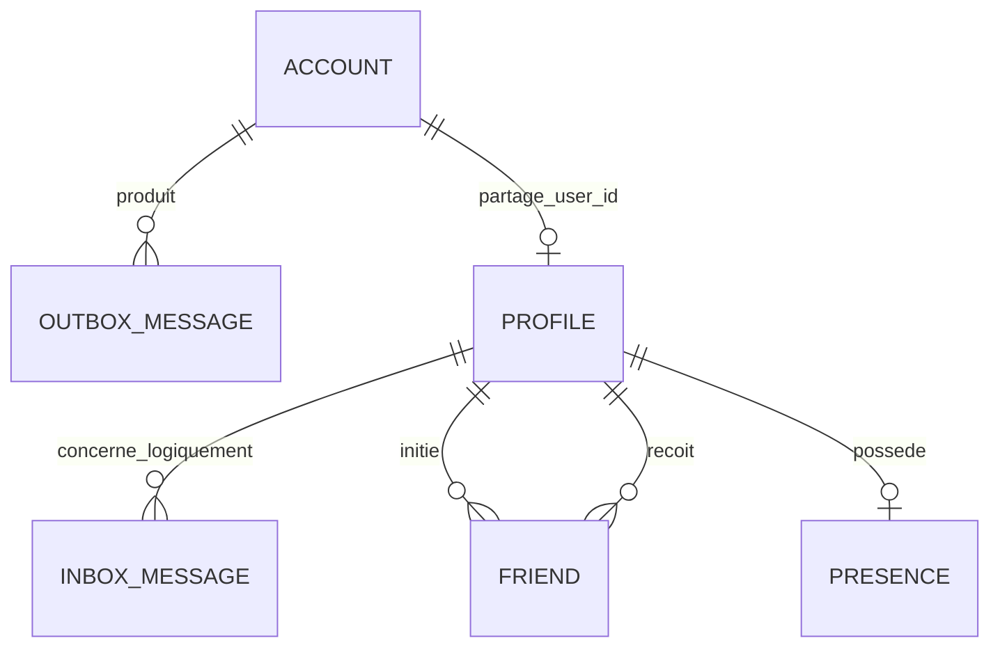
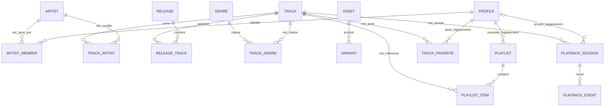

# Schéma de données de référence

État vérifié le 30 septembre 2026 sur le dépôt local. Ce fichier est la
référence courte pour reconstruire PostgreSQL depuis une installation neuve.
Il décrit les six schémas désormais matérialisés par les migrations baseline.

L'ancien [document de conception](CONCEPTION_DONNEES.md) conserve les audits,
le cours, les propositions M1/M2 et l'historique des décisions. Il ne doit plus
être utilisé seul pour déduire l'état actuel de la base.

## 1. Architecture physique retenue

Le projet utilise une seule instance PostgreSQL et une seule database par
environnement. Les services sont isolés par des schémas PostgreSQL et par des
rôles distincts.

```text
instance PostgreSQL
└── database transcendence
    ├── schema auth       → auth-service
    ├── schema users      → user-service
    ├── schema catalog    → catalog-service
    ├── schema media      → media-service
    ├── schema library    → library-service
    └── schema playback   → playback-service
```

`public` ne doit contenir aucune table applicative dans la nouvelle
installation. L'ancienne table `public.users` appartient uniquement à
l'historique de reprise et n'existe pas dans les nouvelles baselines.

Chaque service possède deux identités de connexion :

| Identité | Responsabilité |
| --- | --- |
| `<service>_migration` | possède le schéma et ses objets ; exécute uniquement les migrations du service |
| `<service>_runtime` | exécute le serveur HTTP ; reçoit uniquement les opérations DML réellement nécessaires |

Le compte administrateur de bootstrap crée les rôles et la database. Il n'est
jamais transmis aux services. Les rôles d'un service n'ont aucun droit sur les
schémas voisins.

## 2. État des six domaines

| Schéma | État | Tables réellement utilisées |
| --- | --- | --- |
| `auth` | implémenté | `accounts`, `outbox_messages` |
| `users` | implémenté | `profiles`, `inbox_messages`, `friends`, `presences` |
| `catalog` | implémenté | `artists`, `artist_members`, `tracks`, `track_artists`, `releases`, `release_artists`, `release_tracks`, `genres`, `track_genres` |
| `media` | implémenté | `assets`, `variants` |
| `library` | implémenté | `playlists`, `playlist_items`, `track_favorites` |
| `playback` | implémenté | `sessions`, `events` |

Les six migrations créent 22 tables métier. Chaque schéma possède aussi sa
table technique `_prisma_migrations`, soit 28 tables après l'installation
complète. Les handlers HTTP métier des quatre services M1 restent à brancher
ultérieurement sur ces modèles.

## 3. Modèle compatible avec le code actuel



Les traits entre `auth` et `users` sont des références logiques. Il n'existe
aucune clé étrangère SQL entre deux schémas propriétaires. Auth crée l'UUID,
puis Users réutilise exactement cet UUID comme clé de profil.

### `auth.accounts`

Source de vérité de l'identité et des secrets de connexion.

| Colonne | Type / contrainte |
| --- | --- |
| `id` | `uuid`, PK, défaut `gen_random_uuid()` |
| `email` | `text`, obligatoire, unique |
| `password_hash` | `text`, obligatoire |
| `state` | `text`, défaut `pending_profile`, valeurs `pending_profile`, `active`, `profile_failed` |
| `created_at` | `timestamptz(6)`, défaut courant |
| `updated_at` | `timestamptz(6)`, mis à jour par Prisma |

Cardinalités : un compte produit zéro à plusieurs messages d'outbox. Un compte
possède zéro ou un profil pendant le provisionnement ; un compte `active` doit
avoir exactement un profil au niveau métier.

### `auth.outbox_messages`

Commande durable envoyée à Users pour créer le profil.

| Colonne | Type / contrainte |
| --- | --- |
| `id` | `uuid`, PK |
| `type` | `text`, obligatoire |
| `aggregate_id` | `uuid`, FK vers `auth.accounts(id)`, cascade |
| `aggregate_version` | `integer`, défaut `1` |
| `payload` | `jsonb`, contient actuellement `displayName` et `username` |
| `status` | `text`, `pending`, `delivered` ou `failed` |
| `attempts` | `integer`, défaut `0` |
| `next_attempt_at` | `timestamptz(6)`, défaut courant |
| `last_error` | `text`, nullable |
| `created_at` | `timestamptz(6)`, défaut courant |
| `delivered_at` | `timestamptz(6)`, nullable |

Index : `(status, next_attempt_at)` pour le worker et `aggregate_id` pour le
suivi d'un compte.

### `users.profiles`

Source de vérité du profil public. `user_id` est fourni par Auth ; Users ne le
génère pas.

| Colonne | Type / contrainte |
| --- | --- |
| `user_id` | `uuid`, PK, référence logique vers `auth.accounts(id)` |
| `username` | `text`, obligatoire, unique, canonique `^[a-z0-9_]{3,30}$` |
| `display_name` | `text`, obligatoire |
| `bio` | `text`, nullable |
| `avatar_url` | `text`, nullable |
| `created_at` | `timestamptz(6)`, défaut courant |
| `updated_at` | `timestamptz(6)`, mis à jour par Prisma |

`bio` a été ajoutée le 28 septembre 2026. Elle est lue par `GET /me` et vaut
`null` lorsqu'elle est absente. Aucune route actuelle ne permet encore de la
modifier.

Écarts connus : la base accepte un username de 3 à 30 caractères, tandis que
`PUT /me/profile` applique encore 3 à 24 caractères. La base n'impose pas de
longueur maximale à `bio` ni de longueur à `display_name`.

### `users.inbox_messages`

Journal d'idempotence des commandes de provisionnement déjà traitées.

| Colonne | Type / contrainte |
| --- | --- |
| `id` | `uuid`, PK ; même valeur que l'événement d'outbox |
| `type` | `text`, obligatoire |
| `aggregate_id` | `uuid`, référence logique vers le profil concerné |
| `aggregate_version` | `integer`, obligatoire |
| `result` | `jsonb`, résultat durable du traitement |
| `processed_at` | `timestamptz(6)`, défaut courant |

Un profil peut être concerné par zéro à plusieurs commandes. L'absence de FK
permet d'enregistrer l'idempotence avant la création du profil dans la même
transaction.

### `users.friends`

Lien dirigé entre deux profils.

| Colonne | Type / contrainte |
| --- | --- |
| `user_id` | `uuid`, PK partielle, FK vers `profiles(user_id)`, cascade |
| `friend_id` | `uuid`, PK partielle, FK vers `profiles(user_id)`, cascade |
| `created_at` | `timestamptz(6)`, défaut courant |

Contraintes : PK `(user_id, friend_id)`, interdiction de se lier à soi-même,
index inverse sur `friend_id`.

Chaque profil possède zéro à plusieurs liens sortants et zéro à plusieurs liens
entrants. L'API représente actuellement une amitié symétrique par deux lignes
dirigées créées ou supprimées ensemble. La base seule ne garantit pas que la
ligne réciproque existe.

### `users.presences`

Dernier état de présence d'un profil.

| Colonne | Type / contrainte |
| --- | --- |
| `user_id` | `uuid`, PK et FK vers `profiles(user_id)`, cascade |
| `is_online` | `boolean`, défaut `false` |
| `last_seen_at` | `timestamptz(6)`, défaut courant |

Un profil possède zéro ou une présence ; une présence appartient exactement à
un profil. Le service considère l'utilisateur hors ligne lorsque le dernier
heartbeat date de plus de 120 secondes, même si `is_online` vaut encore vrai.

## 4. Permissions minimales déduites du code

| Rôle runtime | Table | Opérations nécessaires aujourd'hui |
| --- | --- | --- |
| `auth_runtime` | `auth.accounts` | `SELECT`, `INSERT`, `UPDATE` |
| `auth_runtime` | `auth.outbox_messages` | `SELECT`, `INSERT`, `UPDATE` |
| `users_runtime` | `users.profiles` | `SELECT`, `INSERT`, `UPDATE` |
| `users_runtime` | `users.inbox_messages` | `SELECT`, `INSERT` |
| `users_runtime` | `users.friends` | `SELECT`, `INSERT`, `DELETE` |
| `users_runtime` | `users.presences` | `SELECT`, `INSERT`, `UPDATE` |

Les rôles `catalog_runtime`, `media_runtime`, `library_runtime` et
`playback_runtime` reçoivent `SELECT`, `INSERT`, `UPDATE` et `DELETE` sur leurs
propres tables M1. Aucun rôle runtime ne reçoit de droit DDL ni d'accès à un
schéma voisin.

Chaque rôle de migration possède son schéma, peut y créer et modifier des
objets, et ne peut pas créer dans `public` ni dans le schéma d'un autre service.
La baseline de chaque service utilise son URL
`<SERVICE>_MIGRATION_DATABASE_URL` avec son propre schéma de recherche.

## 5. Modèle M1 implémenté dans PostgreSQL

Les objets ci-dessous reprennent la conception Notion et le découpage des six
services. Ils sont présents dans les schémas Prisma et dans les migrations SQL.
Les règles qui portent sur plusieurs services restent des contraintes métier à
implémenter lors du branchement des API.



### Catalogue

| Objet | Clé et propriétés structurantes | Cardinalité / règle |
| --- | --- | --- |
| `artists` | UUID ; nom, slug unique, bio, image distante | un artiste a 0..N membres et 0..N crédits |
| `artist_members` | PK `(artist_id, user_id)` ; rôle owner/editor | M:N entre profils et artistes ; `user_id` reste une référence logique |
| `tracks` | UUID ; titre, média audio distant, durée, explicite, statut | un brouillon peut avoir 0 crédit ; publier exige au moins un crédit principal et un média prêt |
| `track_artists` | PK `(track_id, artist_id, role)` ; ordre du crédit | M:N enrichi entre morceaux et artistes |
| `releases` | UUID ; titre, type, date, couverture distante, statut | une sortie brouillon peut être vide ; une sortie publiée contient au moins un morceau |
| `release_artists` | PK `(release_id, artist_id)` ; ordre | M:N enrichi entre sorties et artistes |
| `release_tracks` | UUID d'occurrence ; release, track, disque, position | M:N ; le même morceau peut apparaître plusieurs fois |
| `genres` | UUID ; nom unique | un genre classe 0..N morceaux |
| `track_genres` | PK `(track_id, genre_id)` | M:N entre morceaux et genres |

### Media

| Objet | Clé et propriétés structurantes | Cardinalité / règle |
| --- | --- | --- |
| `assets` | UUID ; uploader logique, usage, état, clé de stockage, MIME, taille, durée, checksum | une référence distante n'est utilisable que lorsque l'asset est prêt |
| `variants` | UUID ; asset, rendu, stockage, MIME, bitrate, taille | un asset possède 0..N variantes ; une variante appartient à un asset |

### Library

| Objet | Clé et propriétés structurantes | Cardinalité / règle |
| --- | --- | --- |
| `playlists` | UUID ; propriétaire logique, nom, description, visibilité, version | un profil possède 0..N playlists ; une playlist a exactement un propriétaire logique |
| `playlist_items` | UUID d'occurrence ; playlist, morceau logique, position, ajouté par | une playlist contient 0..N occurrences ; un morceau peut apparaître plusieurs fois |
| `track_favorites` | PK `(user_id, track_id)` ; date | M:N logique sans doublon entre profils et morceaux |

### Playback

| Objet | Clé et propriétés structurantes | Cardinalité / règle |
| --- | --- | --- |
| `sessions` | UUID ; utilisateur logique nullable, morceau logique, durée snapshot, temps, séquence, qualification, version de règle | un morceau a 0..N écoutes ; une écoute appartient à 0..1 utilisateur après effacement |
| `events` | PK `(session_id, sequence)` ; progression et temps reçu | une session reçoit 0..N événements ordonnés et dédupliqués |

Les références entre propriétaires (`user_id`, `track_id`, `asset_id`) restent
des UUID sans FK SQL interservice. Leur validité se contrôle par API, événement
et réconciliation. Les FK SQL restent à l'intérieur du schéma propriétaire.

## 6. Reconstruction implémentée

1. Le bootstrap crée les douze rôles, les six schémas et leurs propriétaires.
2. Chaque baseline est exécutée avec son rôle `<service>_migration`.
3. Les propriétaires de toutes les tables, y compris `_prisma_migrations`, sont
   normalisés par `database/permissions/assign-owners.sql`.
4. `database/permissions/apply-grants.sql` applique les droits runtime minimaux
   et les privilèges par défaut des prochaines migrations.
5. Les douze URL de connexion séparent migration et runtime dans Compose.
6. Il reste à planifier les contraintes métier qui ne sont pas garanties par les
   clés et les privilèges : cohérence account/profile, réciprocité des amis,
   longueur de bio, publication Catalogue et références interservices.

Le scénario jetable `tests/per/run.sh` reconstruit les six schémas depuis zéro,
rejoue les migrations, vérifie les cardinalités représentatives, les 12 rôles,
les propriétaires, les opérations autorisées et les refus interservices. Il a
été exécuté avec succès le 30 septembre 2026.

## 7. Sources vérifiées

- Dépôt : les six `services/*/prisma/schema.prisma`, les migrations Auth et
  Users, les accès Prisma dans `services/auth-service/src` et
  `services/user-service/src`, `.env.example` et `docker-compose.yml`.
- Commit courant : `9ee690b`, ajout du champ optionnel `bio` et de sa lecture
  dans le parcours profil.
- Notion : [première conception ER](https://app.notion.com/p/3c641a23495480f4a6c1dd068ada44d4),
  [définition du schéma de données](https://app.notion.com/p/3d541a234954808eaee7c65391ca0e07)
  et [groupe d'action base, tables et permissions](https://app.notion.com/p/3c741a2349548025b0b4f393b56feff9).
